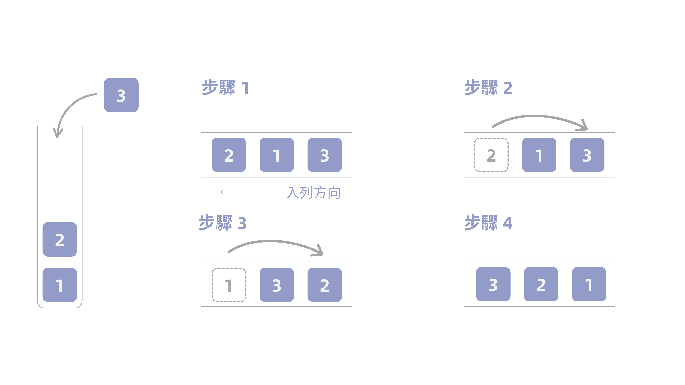

這題要求只使用**兩個佇列**實作一個後進先出的堆疊，且需要支援一般堆疊的所有操作：

1. `push(x)`：將元素 `x` 推入堆疊頂端；
2. `pop()`：移除並回傳堆疊頂端的元素；
3. `top()`：回傳堆疊頂端的元素，但不移除它；
4. `empty()`：當堆疊沒有元素時回傳 `true`，否則回傳 `false`。

佇列只能使用標準操作，也就是從尾端加入元素、查看或移除前端元素、取得大小，以及檢查是否為空。題目保證所有對 `pop` 與 `top` 的呼叫都會在堆疊非空時進行。

例如依序執行以下操作：

```
["MyStack", "push", "push", "top", "pop", "empty"]
[[],        [1],    [2],    [],    [],    []]
```

輸出為：

```
[null, null, null, 2, 2, false]
```

一開始建立空的 `MyStack`。接著依序推入 `1` 和 `2`，此時堆疊頂端是最後推入的 `2`，所以 `top()` 回傳 `2`；`pop()` 也移除並回傳 `2`。堆疊中仍有 `1`，因此 `empty()` 回傳 `false`。

## 想法

這題有兩種解法。第一個是題目指定使用兩個佇列實作堆疊，第二個則可以只用一個佇列實現，兩個實作方法在 `push` 上的時間複雜度均是 $\mathcal{O}(n)$，不過使用一個佇列比較直覺，因此以下會先以一個佇列實現的角度來分析，兩個的則是建立在使用一個佇列的方法上。

### 方法一：僅用一個佇列

假設堆疊中已有兩個元素，依序為 `1` 與 `2`，如 @fig-hi 所示。`1` 先進入堆疊，接著才是 `2`，因此 `2` 位於堆頂。

{#fig-hi fig-align="center" fig-alt="用佇列實現堆疊"}

由於佇列遵循先進先出原則，若要用它模擬堆疊的後進先出，就必須在每次加入新元素後重新排列佇列。做法很簡單：先將新元素入列，再依序從佇列前端取出原有元素，並重新加入佇列尾端。重複這個動作，直到所有舊元素都排在新元素後方。如此一來，最新加入的元素會位於佇列前端，正好對應堆疊的堆頂。

以前述堆疊為例，佇列由前端到尾端為 `[2, 1]`，現在要推入 `3`：

1. 先將 `3` 加入佇列尾端，佇列變成 `[2, 1, 3]`；
2. 取出前端的 `2`，再加入尾端，佇列變成 `[1, 3, 2]`；
3. 再取出前端的 `1`，並加入尾端，佇列便成為 `[3, 2, 1]`。

原本的兩個元素都已移到 `3` 後方，因此 `3` 現在位於佇列前端，也就是堆疊的堆頂。之後 `top()` 可直接查看前端，`pop()` 則直接取出前端元素；只有 `push` 需要搬移既有元素，因此其時間複雜度為 $\mathcal{O}(n)$，其餘操作皆為 $\mathcal{O}(1)$。

### 方法二：使用兩個佇列

誠如上述所言，方法二與方法一的核心相同，都是在新元素入列後調整元素的順序。差別在於多使用一個佇列作為輔助，將元素在兩個佇列之間搬移，讓最新加入的元素維持在佇列前端。

將第一個佇列視為主佇列，其中的元素由前端到尾端排列，前端永遠是堆頂；第二個佇列則只在 `push` 時暫時使用。假設主佇列目前由前端到尾端依序為 `[2, 1]`，代表堆疊中的 `2` 位於堆頂。現在要推入 `3` 時，可以依序執行以下步驟：

1. 先將 `3` 加入輔助佇列，此時輔助佇列為 `[3]`；
2. 依序從主佇列前端取出 `2`、`1`，並加入輔助佇列尾端，輔助佇列便成為 `[3, 2, 1]`；
3. 交換主佇列與輔助佇列的角色。交換後，主佇列為 `[3, 2, 1]`，而原本的主佇列已清空，可在下一次 `push` 時繼續作為輔助佇列使用。

如此一來，新加入的 `3` 會被放在主佇列前端，因此 `top()` 只要查看主佇列前端即可，`pop()` 則直接取出主佇列前端；兩者都符合堆疊由堆頂操作的特性。`empty()` 只需檢查主佇列是否為空。

每次 `push` 都需要搬移原本主佇列中的所有元素，因此時間複雜度為 $\mathcal{O}(n)$；`pop`、`top` 與 `empty` 則都只需常數時間 $\mathcal{O}(1)$。兩個佇列合計儲存的元素數量不會超過堆疊大小，所以空間複雜度亦為 $\mathcal{O}(n)$。
