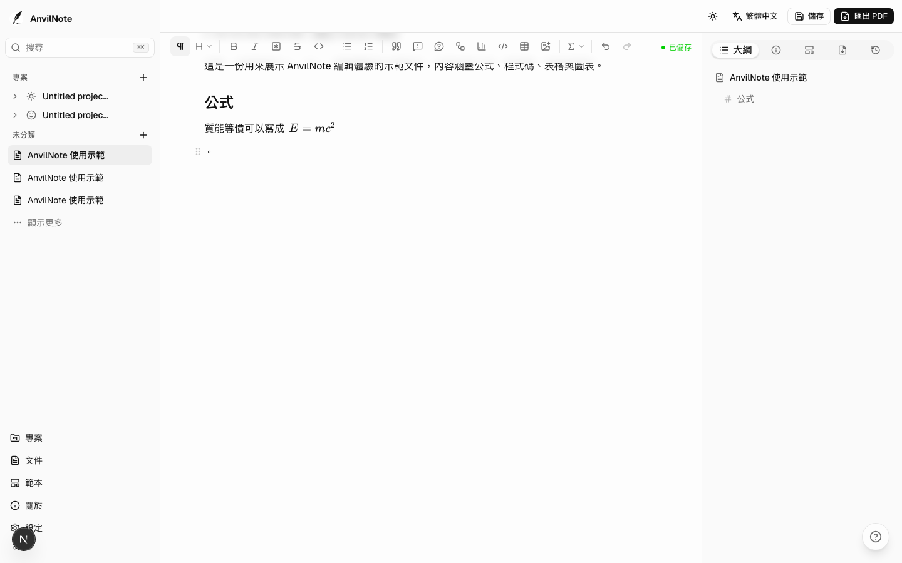
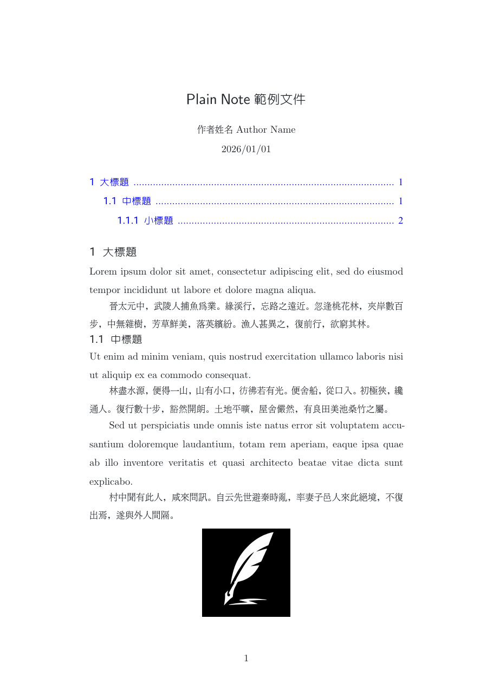
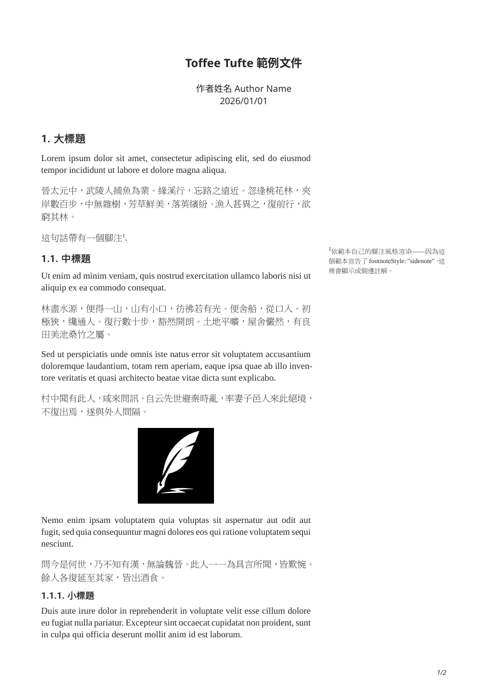
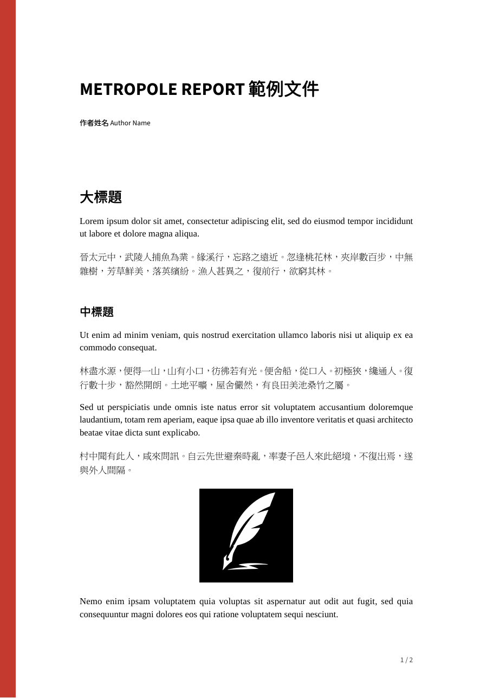
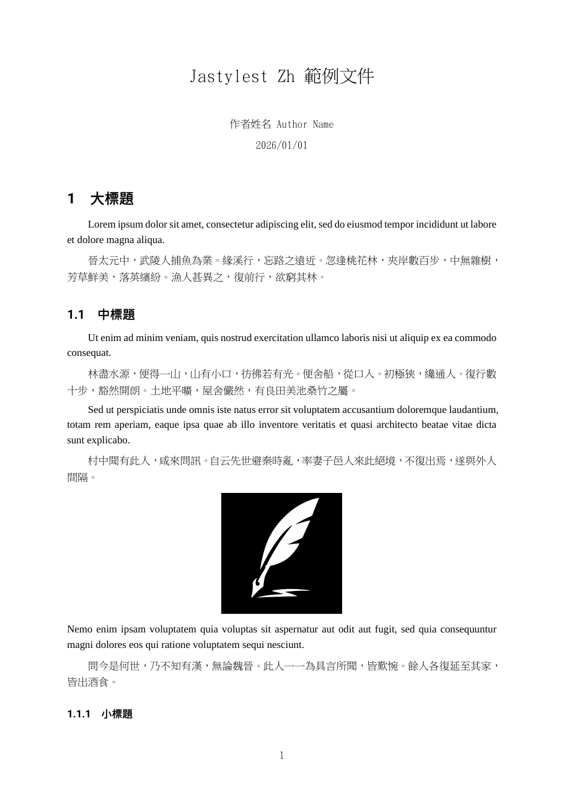
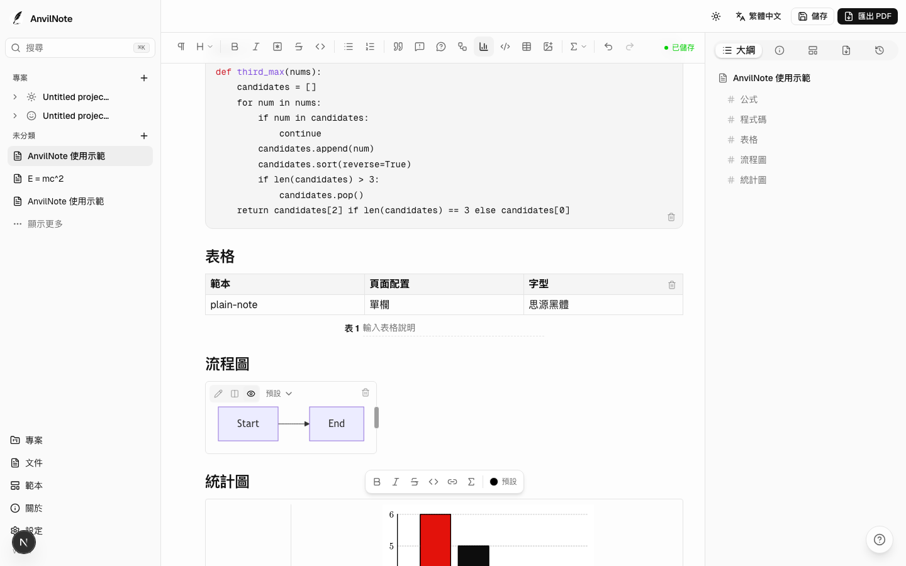

用過 Notion 整理講義或報告的人，可能都遇過同一個問題：內容明明已經寫好了，準備輸出成 PDF 時，才發現字型、頁面配置與文件格式幾乎無法調整。最後匯出的 PDF 或許能看，卻很難成為一份真正適合列印、繳交或分享的文件。

另一方面，LaTeX 與 Typst 雖然能做出漂亮而完整的排版，但對只想專心寫作的人來說，仍需要花不少時間處理語法、套件與範本。

這也是我開始製作 **AnvilNote** 的原因。

> AnvilNote 希望保留區塊式編輯器的直覺操作，同時提供接近專業排版工具的文件輸出能力。

<!-- TODO: 放置示範影片 -->

## 不只寫筆記，也要完成文件

AnvilNote 是一款跨平台的寫作與筆記工具，適合整理：

- 長篇筆記
- 課程講義與學習單
- 報告與作業
- 學術文件
- 含有公式、程式碼或圖表的技術內容

編輯方式接近 Notion，不需要直接撰寫 Typst 或 LaTeX 語法。文件完成後，可以選擇範本、字型與版面配置，再匯出成 PDF 或 DOCX。



對我來說，AnvilNote 與一般筆記工具最大的差別，在於它不只處理**內容如何撰寫**，更在意**最後呈現的文件長什麼樣子**。

## 從編輯器直接產出 PDF

AnvilNote 的 PDF 排版由 [Typst](https://typst.app/) 負責。使用者仍然可以透過一般編輯器加入標題、段落、圖片、表格、公式與程式碼，不需要接觸底層排版語法。匯出時，AnvilNote 會將內容轉換成完整的 Typst 文件，再產生 PDF。

因此，文件中的字型、標題層級、頁面邊界、註腳與圖、表說明文字，均交由範本統一管理。

<!-- TODO: 放置「編輯畫面／PDF 成品」左右對照圖 -->

目前的範本主要來自 [Typst 的開源生態系](https://typst.app/universe/)中的範本，經整理與整合後，可以直接在 AnvilNote 中使用。不同範本可以呈現完全不同的文件風格，例如一般講義、學術報告或具有側邊註記的 Tufte 版面。

```{=html}
<style>
  #template-carousel .carousel-item img {
    display: block;
    margin: 0 auto;
    max-height: 480px;
    width: auto;
    max-width: 100%;
    border: 1px solid rgba(0,0,0,0.1);
    border-radius: 8px;
  }
  #template-carousel .carousel-control-prev-icon,
  #template-carousel .carousel-control-next-icon {
    filter: invert(1) grayscale(100);
    background-color: rgba(0,0,0,0.3);
    border-radius: 50%;
    padding: 18px;
  }
</style>
<div id="template-carousel" class="carousel slide" data-bs-ride="carousel" data-bs-interval="3500" data-bs-wrap="true">
  <div class="carousel-inner">
    <div class="carousel-item active">
      
      <p class="text-center text-muted mt-2">plain-note</p>
    </div>
    <div class="carousel-item">
      
      <p class="text-center text-muted mt-2">toffee-tufte</p>
    </div>
    <div class="carousel-item">
      
      <p class="text-center text-muted mt-2">metropole-report</p>
    </div>
    <div class="carousel-item">
      
      <p class="text-center text-muted mt-2">jastylest-zh</p>
    </div>
    <div class="carousel-item">
      
      <p class="text-center text-muted mt-2">bubble</p>
    </div>
    <div class="carousel-item">
      
      <p class="text-center text-muted mt-2">mousse-notes</p>
    </div>
  </div>
  <button class="carousel-control-prev" type="button" data-bs-target="#template-carousel" data-bs-slide="prev">
    <span class="carousel-control-prev-icon" aria-hidden="true"></span>
    <span class="visually-hidden">上一個</span>
  </button>
  <button class="carousel-control-next" type="button" data-bs-target="#template-carousel" data-bs-slide="next">
    <span class="carousel-control-next-icon" aria-hidden="true"></span>
    <span class="visually-hidden">下一個</span>
  </button>
</div>
```

## 公式、程式碼與表格

許多筆記工具雖然支援公式、程式碼與表格，但匯出後的排版效果往往不夠穩定，甚至會失去原本的格式。

AnvilNote 將這些內容視為文件的一部分，而不是單純附加在文字旁邊的元素。

數學公式可以在編輯器內即時預覽，輸出 PDF 時再交由 Typst 重新排版；程式碼區塊可以指定程式語言，並套用對應的語法標示。表格則支援合併儲存格、調整列高與欄寬，讓使用者能依照內容安排版面，匯出時也會配合所選範本套用一致的樣式。



匯出成 DOCX 時，數學式會轉換成 Word 中可繼續編輯的公式物件，而不是直接貼成圖片。表格也會保留原有的結構與版面設定，方便後續在 Word 中修改。這對需要交付 Word 檔、與他人共同編輯，或配合學校與單位既有格式的人特別實用。


## 註腳、邊注與圖說

AnvilNote 支援一般頁尾註腳 (footnote)，也支援 Tufte 風格的側邊註記 (sidenote)。

同一份內容可以依照所選範本，自動決定註解要顯示在頁面底部，或排列在正文旁邊，不需要為不同版面重寫文件。

<!-- TODO: 放置一般註腳與側邊註記比較圖 -->

多張圖片也可以並排顯示，並使用共同的圖說編號，例如「圖 1(a)」與「圖 1(b)」。這類排版在報告與學術文件中很常見，但在一般區塊式筆記工具裡通常不容易處理。

## 製作圖表

除了圖片與表格，AnvilNote 也支援 Mermaid 圖表與統計圖表。

Mermaid 可以用來製作流程圖、循序圖與系統架構圖；統計圖表目前包含長條圖、折線圖、散佈圖、圓餅圖、盒鬚圖與堆疊圖等類型。

這些圖表會以向量 SVG 放入文件中，因此即使放大或列印，也能維持清楚的線條與文字。


## 毋需網路

AnvilNote 採用離線優先設計，文件預設儲存在自己的裝置中。

桌面版已經包含執行時需要的 Typst、字型與相關套件。安裝完成後，不需要另外設定 Node.js、Typst 或其他開發工具，也不必依賴雲端服務才能編輯與輸出文件。

這不代表 AnvilNote 永遠不會提供同步或備份功能，而是希望即使沒有帳號、沒有網路，核心的寫作與匯出功能仍然可以正常使用。

## 目前仍在開發中的功能

AnvilNote 還在持續開發，接下來預計加入：

- 文件之間的雙向連結與反向連結
- 將多篇文件合併成一本書
- 自動產生目錄與連續頁碼
- 雙軸圖、組合圖、直方圖與熱力圖
- 更多文件範本與字型選項

這些功能目前仍在設計或開發階段，實際內容可能會隨著測試結果調整。

## 下載與原始碼

::: {.callout-note}
桌面版目前為 `v0.1.16` 版，其餘子專案陸續準備公開中。
:::

AnvilNote 是一個開源專案。

桌面版支援 macOS、Windows 與 Linux，可以從 [GitHub Releases](https://github.com/AnvilNote/anvilnote-desktop/releases/latest) 下載。

相關連結：

- [AnvilNote GitHub](https://github.com/AnvilNote)
- [主專案與 Roadmap](https://github.com/AnvilNote/anvilnote)
- [桌面版原始碼](https://github.com/AnvilNote/anvilnote-desktop)

如果你平常會使用 Notion、Obsidian、LaTeX 或 Typst 製作講義、報告與筆記，也歡迎實際試用，並將遇到的問題或建議提交到 GitHub。
