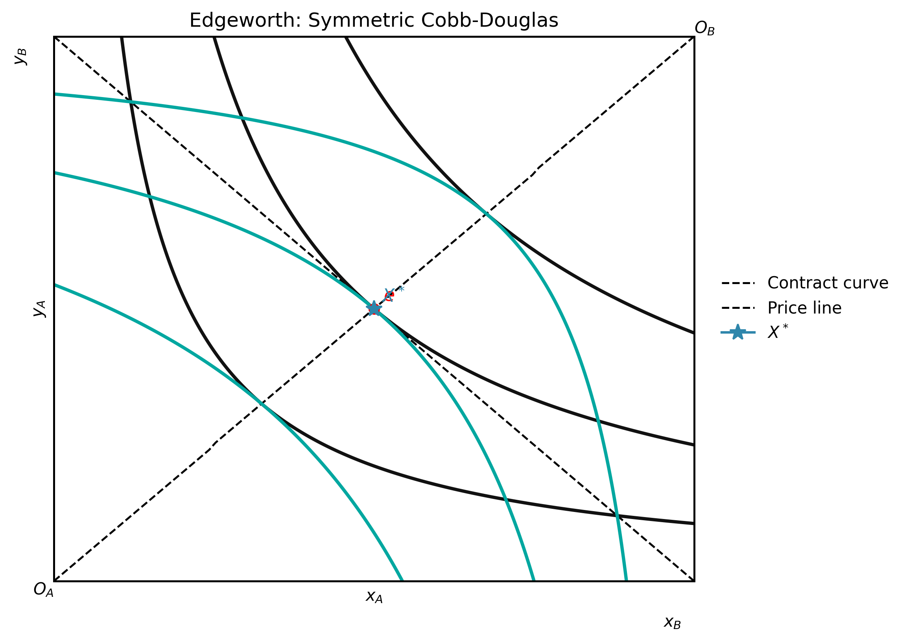

## 專案簡介

**econ-viz** 是我自己開發的 Python 套件，專門用來繪製個體經濟學的教學圖形。只要告訴它效用函數、價格和所得，它就會自動求解均衡點，畫出完整的無異曲線地圖、預算線與均衡圖，並可匯出為 PNG、PDF 或 SVG。

這個套件的出發點很簡單——用 matplotlib 從頭畫這些圖太繁瑣了，每次都要手動算等高線、算切點、設格式。我希望有一個工具讓我只需要描述「模型長什麼樣」，剩下的事情交給套件處理。

::: {.callout-note}
目前版本：**v1.4.0** ・ 測試覆蓋率：**99%** ・ 測試數量：**235**
:::

## 主要功能

**八種內建效用模型**

涵蓋個體經濟學常用的偏好類型：

| 模型 | 類別 |
| :--- | :--- |
| Cobb-Douglas | `CobbDouglas(alpha, beta)` |
| Leontief（完全互補） | `Leontief(a, b)` |
| 完全替代 | `PerfectSubstitutes(a, b)` |
| CES | `CES(alpha, rho)` |
| Quasi-Linear | `QuasiLinear(alpha)` |
| Stone-Geary | `StoneGeary(alpha, beta, x0, y0)` |
| Translog | `Translog(alpha, beta, gamma)` |
| Satiation | `Satiation(x_sat, y_sat)` |

**自動均衡求解**

`solve()` 使用 SLSQP 最佳化，能處理內部解、角點解、Leontief 扭折解，並回傳結構化的 `Equilibrium` 物件（含 `x`、`y`、`utility`、`bundle_type` 欄位）。

**分析工具**

- `comparative_statics()` — 六個馬歇爾需求偏導數的數值估計
- `slutsky_matrix()` — 二財 Slutsky 替代矩陣
- `HomogeneityAnalyzer` — 齊次性分析、Euler 定理驗證、需求的零次齊次性檢定

**多面板圖形**

`Figure` 搭配 `Layout` 列舉（並列、堆疊、格狀），可組合多個 `Canvas` 到同一張圖，適合做「價格變動前後比較」的教學示意圖。

**需求曲線圖**

`PricePath` / `IncomePath` + `DemandDiagram`：自動連結商品空間的均衡軌跡與馬歇爾需求曲線，一鍵生成價格消費曲線（PCC）/所得消費曲線（ICC）教學圖。

**LaTeX 解析器**

直接輸入 LaTeX 算式，例如 `x^{0.4} y^{0.6}`，套件會自動解析並回傳對應的模型物件。

**動畫輸出**

`Animator` 支援參數掃描、價格掃描、所得掃描，輸出為 GIF，適合嵌入教材或簡報。

**互動式 Widget**

在 Jupyter Notebook 中使用 `WidgetViewer`，可即時拖動參數滑桿或直接輸入數值，觀察均衡點如何變化。

## 安裝方式

```bash
pip install econ-viz
```

需要 Python 3.10 以上。依賴套件：`numpy`、`matplotlib`、`scipy`、`sympy`。

## 快速開始

### 最小範例

```python
from econ_viz import Canvas, levels, solve
from econ_viz.models import CobbDouglas

model = CobbDouglas(alpha=0.5, beta=0.5)
eq    = solve(model, px=2.0, py=3.0, income=30.0)
lvls  = levels.around(eq.utility, n=5)

cvs = Canvas(x_max=20, y_max=15, x_label="x", y_label="y",
             title=r"Cobb-Douglas $x^{0.5} y^{0.5}$")
cvs.add_utility(model, levels=lvls)
cvs.add_budget(2.0, 3.0, 30.0, fill=True)
cvs.add_equilibrium(eq, show_ray=True)
cvs.save("cobb_douglas.png")
```

{width="50%"}

### LaTeX 解析

```python
from econ_viz import parse_latex, Canvas, levels, solve

model = parse_latex(r"x^{0.4} y^{0.6}")
eq    = solve(model, px=2.0, py=3.0, income=30.0)
lvls  = levels.around(eq.utility, n=5)

Canvas(x_max=20, y_max=15) \
    .add_utility(model, levels=lvls) \
    .add_budget(2.0, 3.0, 30.0) \
    .add_equilibrium(eq) \
    .save("figure.png")
```

### 需求曲線圖

```python
from econ_viz import DemandDiagram, LinearBudget, PricePath
from econ_viz.models import CobbDouglas

model  = CobbDouglas(alpha=0.5, beta=0.5)
budget = LinearBudget(px=2.0, py=2.0, income=40.0)
path   = PricePath(model, budget=budget, price="px",
                   price_range=(0.8, 6.0), n=40)

fig = DemandDiagram(path, title="Demand: Cobb-Douglas")
fig.add_marshallian_panel(price_markers=[1.5, 4.0])
fig.save("demand.png")
```

{width="50%"}

### Slutsky 矩陣

```python
from econ_viz import slutsky_matrix
from econ_viz.models import CobbDouglas

S = slutsky_matrix(CobbDouglas(alpha=0.4, beta=0.6),
                   px=2.0, py=3.0, income=60.0)
print(S.s_xx, S.s_xy)
print(S.s_yx, S.s_yy)
```

### Edgeworth Box

```python
from econ_viz import EdgeworthBox, EquilibriumFocusConfig
from econ_viz.models import CobbDouglas

box = EdgeworthBox(
    CobbDouglas(alpha=0.5, beta=0.5),
    CobbDouglas(alpha=0.4, beta=0.6),
    total_x=10.0,
    total_y=8.0,
    title="Edgeworth Box",
)
(
    box.add_endowment(4.0, 3.0)
       .add_contract_curve(n=100)
       .add_core()
       .add_price_line(px=1.5, py=1.0)
       .add_walrasian_equilibrium(px=1.5, py=1.0)
       .save("edgeworth.png")
)
```

{width="50%"}

## CLI

```bash
# 列出所有支援的模型
econ-viz models

# 繪圖並儲存
econ-viz plot --model cobb-douglas --alpha 0.5 --beta 0.5 \
              --px 2 --py 3 --income 30 \
              --fill --show-ray \
              --output cobb_douglas.png

# 輸出馬歇爾需求封閉解 LaTeX
econ-viz solve-tex --model cobb-douglas --symbolic-params
```

## 連結

- [官方文件](https://econ-viz.org)
- [GitHub](https://github.com/EconViz/econ-viz)
- [PyPI](https://pypi.org/project/econ-viz/)
