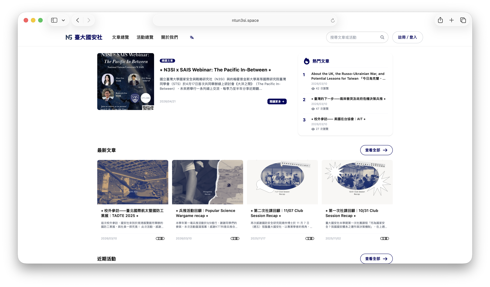
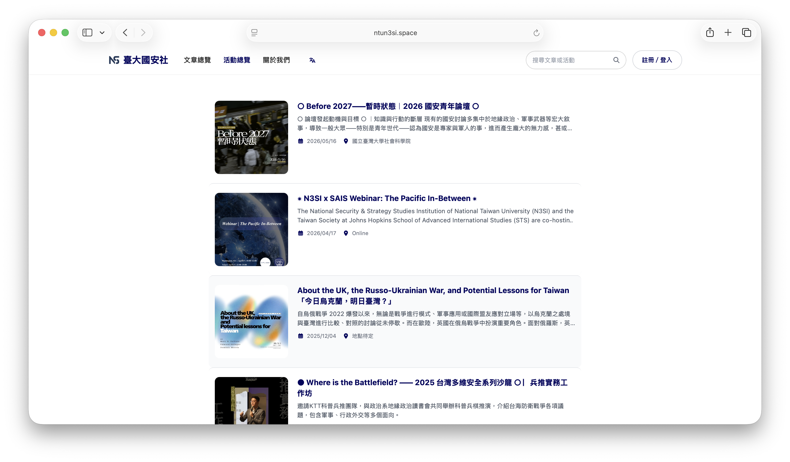
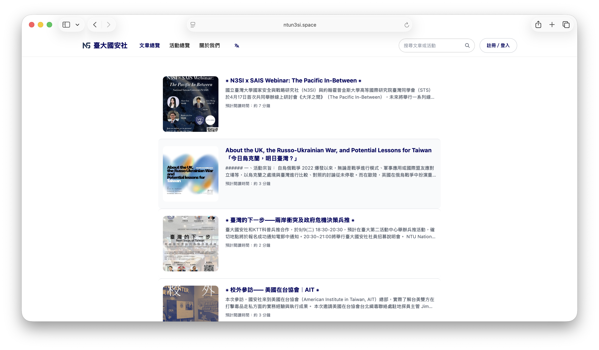

 

## 關於這個專案

創立於 2023 年的[臺大國安社](https://ntun3si.space/)，過去的社務管理相當分散：報名仰賴 Google 表單、公告透過 LINE 群發布、出席紀錄則以 Excel 維護。受現任社長邀請，我開始協助整合社團的行政流程與數位工具。

## 功能

### 活動與報名

建立活動時可以設定：

| 欄位 | 說明 |
| :--- | :--- |
| 活動名稱、時間、地點 | 基本資訊 |
| 報名截止時間 | 過期自動關閉報名入口 |
| 人數上限 | 額滿後自動轉候補 |
| 客製化表單欄位 | 每場活動可自訂要收哪些資料 |

- 報名送出後，幹部在後台逐筆審核，可將每筆標記為**通過**、**候補**或**拒絕**，狀態變更會通知社員
- 社員要修改已送出的報名得走 `ChangeRequest` 流程，幹部審過才寫入，審核期間原始資料不動
- 現場簽到用 QR Code check-in，每個報名者有專屬碼，掃了馬上更新出席狀態，不用人工對名單

### 帳號與登入

- **本地帳密**：密碼用 bcryptjs 雜湊，不存明文
- **第三方 OAuth**：Google 登入，Passport.js 處理授權

登入後發 JWT，前端用 token 維持狀態。每個帳號有自己的頁面，可以查：

- 所有報名紀錄及目前審核狀態
- 歷史出席紀錄

### 內容管理

**文章**

幹部在後台寫文章，存成草稿或直接發布。內容支援 Markdown，`marked` 解析後渲染到前台。兩種狀態：

- `draft`：草稿，僅後台可見
- `published`：發布，顯示於首頁公告區

**幹部頁面**

幹部的基本資料（姓名、職稱、任期、照片）在後台管，前台幹部介紹頁直接拉這份資料。照片傳到 AWS S3，HEIC 會自動轉，iPhone 拍的不用另外處理。

## 網站一覽

{#fig-home width="75%" fig-align="center"}

深色系為主，進頁面先看到社團名稱跟一句話介紹，往下滑會依序出現近期活動、最新文章、社團簡介。上方導覽列固定不動，不用每次都滑回頂端。整體偏素，沒放什麼多餘的東西。

{#fig-events width="75%" fig-align="center"}

卡片排列，每張顯示活動名稱、時間、地點跟截止日，報名中、額滿、已截止都有各自的標示，不用點進去才知道狀態。進活動頁面後可以看完整說明和表單欄位，幹部在後台更新資料，前台馬上反映。

{#fig-articles width="75%" fig-align="center"}

所有發布的文章和公告都在這裡，按時間排，最新的在上面，每篇有標題、摘要跟日期預覽。內文吃 Markdown，標題、粗體、引用、code block 都沒問題，適合放活動後記、政策短評或社內公告。

## 技術架構

::: {style="width: fit-content; margin: auto;"}
| 層級 | 技術 |
| :--- | :--- |
| 前端 | React 18、Vite、Tailwind CSS |
| 後端 | Node.js、Express.js |
| 資料庫 | MongoDB（Mongoose） |
| 認證 | Passport.js（Google OAuth）、JWT、bcryptjs |
| 檔案儲存 | AWS S3（Multer） |
| Email | Nodemailer |
| 排程 | node-cron |
| 驗證 | Zod |
| 部署 | Docker、Render |
:::
