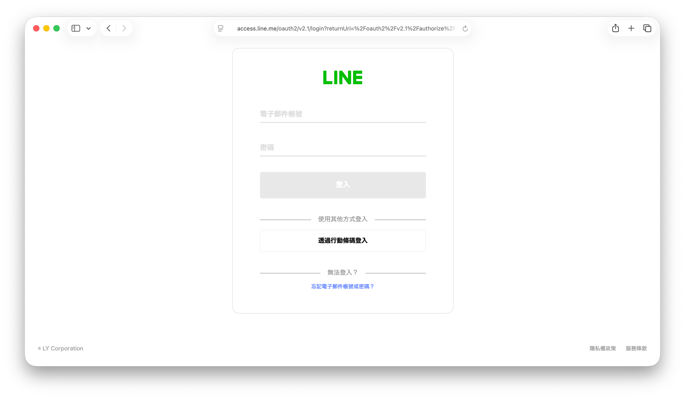

現在 AI 製圖很方便，隨手讓 AI 做個圖是幾分鐘的事。但你有沒有想過，可以把這些圖變成傳達情感的方式呢？

今天照片就要來教大家手把手從零開始，建立貼圖/表情貼，到裁切，最後上架你的專屬 Line 貼圖/表情貼！

## AI 工具

開始之前，需要先準備好我們的 AI 小幫手，常見的生圖工具有 ChatGPT（OpenAI）、Midjourney、Google Gemini、Stable Diffusion 等等，各家風格與使用方式都不太一樣，挑一個順手的就好。我自己個人比較喜歡用 OpenAI 來生圖，因此以下教學都會使用 ChatGPT 進行教學。

## 註冊 Line Creator

為了要上架我們做好的精美貼圖，我們需要到 [LINE Creators Market](https://creator.line.me/zh-hant/) 註冊，進到首頁後點擊畫面正中間的**請點此註冊**：

<figure><figcaption>LINE Creators Market 首頁</figcaption></figure>

接著會跳轉到 LINE 的登入頁面，輸入你的 LINE 帳號密碼登入即可（也可以用行動條碼掃描登入）：

<figure><figcaption>LINE 登入頁面</figcaption></figure>

首次登入後，需要填寫一些基本資訊才能建立創作者帳號，包含：

- 申請人姓名（須以日文或英文填寫）
- 姓名或店名
- 電話號碼
- 地址（須以日文或英文填寫，可用[郵局中文地址英譯](https://www.post.gov.tw/post/internet/Postal/index.jsp?ID=207)服務）

填完並送出後，創作者帳號就建立完成了。

先說明一下，上傳做好的圖有兩種方式：

1. 直接在 Line Creator 頁面上上傳圖片
2. 透過 [LINE 拍貼](https://apps.apple.com/tw/app/line%E6%8B%8D%E8%B2%BC/id1239684967)上傳圖片，但僅限貼圖，不支援表情貼的上傳

個人還是建議在 Line Creator 頁面上傳貼圖，因為表情貼的審核雖然可以在 Line 官方帳號看到申請進度，但是無法在 LINE 拍貼 App 看到。

## 生圖囉～

以下會介紹兩種方式，第一種是直接在網頁跟 ChatGPT 進行對話，第二種則是在電腦的終端機透過 Codex 生圖。

### ChatGPT 網頁版

首先我們打開瀏覽器後進入 [ChatGPT](https://chatgpt.com/)，接著我們可以輸入以下的提示詞：

如果有想要根據特定的圖片生成，則個案輸入以下的提示詞：

不過 ChatGPT 網頁版有時候會呆呆的，會突然跟你說只能生成特定張數的圖，或是批次輸出時，風格、文字樣式、人物形象等前後不一

### Codex 終端機 CLI
