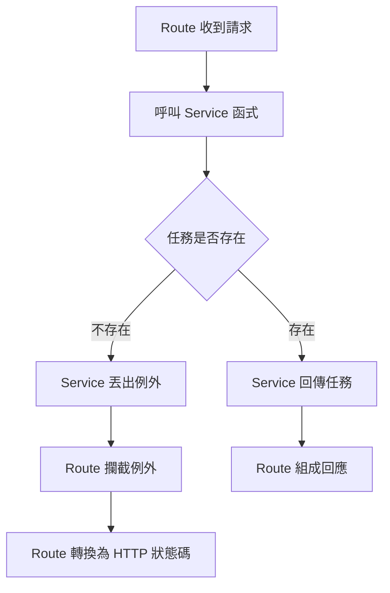
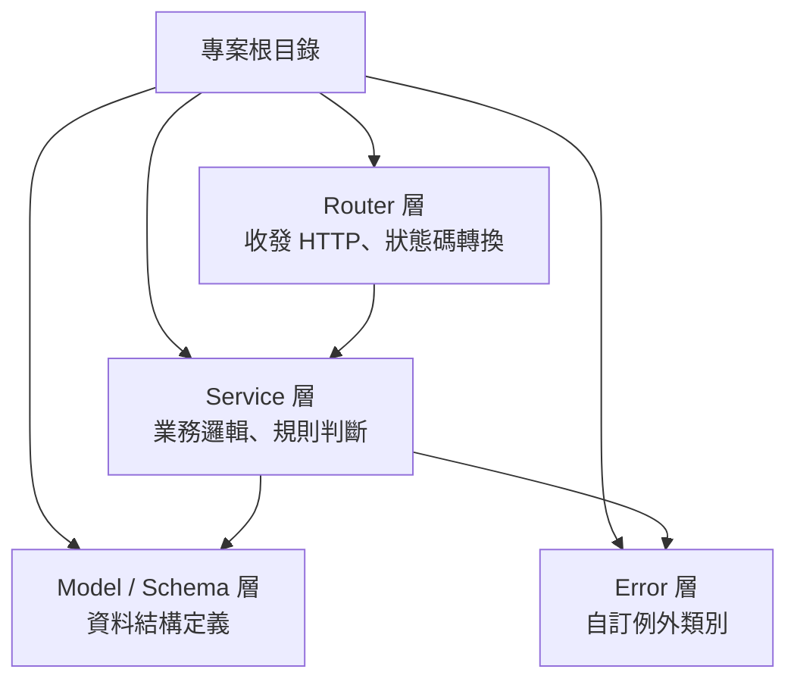

雖然在前面的文章已經完成 Todo App 所需要的內容了，但是有個問題：隨著功能越寫越多，`main.py` 裡的每一支路由，做的事情也越來越多——收請求、驗證資料、判斷任務存不存在、直接呼叫資料庫、組出回應，全部擠在同一個函式裡。

這樣的寫法在功能少的時候沒什麼問題，但功能變多，函式也會相對變長。一旦變長，就會出現幾個困擾：

- 業務邏輯沒辦法脫離框架單獨測試
- 想在別處重複使用同一段判斷得整段複製貼上
- 路由到底在處理 HTTP 還是業務規則也越來越分不清楚

這篇要做的事情，就是把這些擠在一起的職責拆開：路由只負責收發 HTTP，商業邏輯搬進獨立的 `service` 層，讓兩邊各自負責各自的事。若要用一句話概括目的，就是**避免牽一髮而動全身**！

## 分層設計 

在把路由與業務邏輯拆開之前，應該先確立這兩層各自該負責什麼、不該碰什麼。

### 分層職責 

首先我們用一張表釐清兩層的界線，避免職責在往後開發時又悄悄混回同一支函式裡。

| 層 | 負責 | 不負責 |
|---|---|---|
| `Route` | 收發 HTTP、狀態碼轉換 | 業務規則判斷、直接操作資料庫 |
| `Service` | 業務邏輯、規則判斷 | HTTP 相關 |


### 錯誤處理歸屬 

分層完畢後，有另一個更加關鍵的問題：找不到任務算業務判斷還是 HTTP 問題？且這條界線決定例外該丟在哪一層？

一個合理的設計是，`Service` 層只丟純語言的例外處理，不套用任何框架；`Route` 層負責接住例外，轉換成對應的 HTTP 狀態碼。



## 程式碼實作

資料夾結構遵循以下分層邏輯：



### Services 層

在 Services 層，我們放商業邏輯，以及配套的例外類別。為了更好地去將功能拆分開來，例外類別特別獨立成 `errors/`：

先建立 `errors` 資料夾：

```bash
mkdir errors
touch errors/__init__.py errors/task_errors.py
```

接著在 `errors/task_errors.py` 中定義錯誤類別：

```python
class TaskNotFoundError(Exception):
    pass

class EmptyUpdateError(Exception):
    pass
```

然後在 `errors/__init__.py` 匯出錯誤類別：

```python
from errors.task_errors import TaskNotFoundError, EmptyUpdateError

__all__ = ["TaskNotFoundError", "EmptyUpdateError"]
```

接著是 `services/task_service.py`，把原本塞在路由裡的資料庫操作全都搬進來，並對應五支路由各自的商業邏輯：

```python
from uuid import UUID

from models import Task
from schemas import TaskCreate, TaskUpdate
from sqlalchemy.orm import Session

from errors import EmptyUpdateError, TaskNotFoundError

# 建立任務
def create_task(db: Session, dto: TaskCreate) -> Task:
    new_task = Task(**dto.model_dump())
    db.add(new_task)
    db.commit()
    db.refresh(new_task)
    return new_task

# 查詢任務列表
def get_tasks(
    db: Session, page: int, page_size: int, completed: bool | None, search: str | None
) -> tuple[list[Task], int]:
    query = db.query(Task)

    # 根據是否已完成限縮查詢範圍
    if completed is not None:
        query = query.filter(Task.completed == completed)

    # 根據是否有關鍵字限縮查詢範圍
    if search is not None:
        query = query.filter(Task.title.ilike(f"%{search}%"))

    # 總任務數
    total = query.count()

    # 任務列表
    tasks = (
        query.order_by(Task.created_at.desc())
        .offset((page - 1) * page_size)
        .limit(page_size)
        .all()
    )

    return tasks, total

# 查詢任務
def get_task(db: Session, task_id: UUID) -> Task:
    task = db.query(Task).filter(Task.id == task_id).first()
    if task is None:
        raise TaskNotFoundError
    return task

# 更新任務
def update_task(db: Session, task_id: UUID, dto: TaskUpdate) -> Task:
    task = db.query(Task).filter(Task.id == task_id).first()
    if task is None:
        raise TaskNotFoundError

    # 取得更新資料
    update_data = dto.model_dump(exclude_unset=True)
    if not update_data:
        raise EmptyUpdateError

    # 替換任務資料
    for key, value in update_data.items():
        setattr(task, key, value)

    db.commit()
    db.refresh(task)
    return task

# 刪除任務
def delete_task(db: Session, task_id: UUID) -> None:
    task = db.query(Task).filter(Task.id == task_id).first()

    if task is None:
        raise TaskNotFoundError

    db.delete(task)
    db.commit()
```

同理，在 `services/__init__.py` 匯出方法：

```python
from services.task_service import create_task, get_tasks, get_task, update_task, delete_task

__all__ = ["create_task", "get_tasks", "get_task", "update_task", "delete_task"]
```

!!! info "筆記"
    `Service` 層只丟純 Python 例外（`TaskNotFoundError`、`EmptyUpdateError`），不 import 任何 FastAPI 相關的東西，也不知道自己會被 HTTP 呼叫。`get_tasks` 回傳的是純 `(tasks, total)` tuple，而不是組好的**回應封包**（response envelope，指 API 回應外層再包一層 metadata，如 `page`/`total`/`data` 的結構）——組裝回應封包是 `route` 的事，不是 `service` 的事。


### Routers 層

Service 層完成後，`main.py` 也不該直接定義路由——那一樣是職責沒拆乾淨。改用 FastAPI 的 `APIRouter`，讓 `main.py` 只剩 app 組裝。

```bash
mkdir routers
touch routers/__init__.py routers/task_router.py
```

在寫路由之前，需要將 `database.py` 補上缺少的 `get_db`：

```python
def get_db():
    db = SessionLocal()
    try:
        yield db
    finally:
        db.close()
```

在 `routers/task_router.py`，我們需要呼叫 service，接住例外轉成對應的 HTTP 狀態碼，回應封包的組裝也在這裡完成：

```python
from uuid import UUID

from fastapi import APIRouter, Depends, HTTPException, Query
from sqlalchemy.orm import Session

from database import get_db
from schemas import TaskCreate, TaskUpdate, TaskResponse, TaskListResponse
from services import create_task, get_tasks, get_task, update_task, delete_task
from errors import TaskNotFoundError, EmptyUpdateError

router = APIRouter(prefix="/tasks", tags=["tasks"])

# 建立任務
@router.post("", response_model=TaskResponse, status_code=201)
def create(task_data: TaskCreate, db: Session = Depends(get_db)):
    return create_task(db, task_data)

# 查詢任務列表
@router.get("", response_model=TaskListResponse)
def get_all(
    page: int = Query(1, ge=1),
    page_size: int = Query(20, ge=1, le=100),
    completed: bool | None = Query(None),
    search: str | None = Query(None),
    db: Session = Depends(get_db),
):
    tasks, total = get_tasks(db, page, page_size, completed, search)
    return TaskListResponse(page=page, page_size=page_size, total=total, data=tasks)

# 查詢任務
@router.get("/{task_id}", response_model=TaskResponse)
def get(task_id: UUID, db: Session = Depends(get_db)):
    try:
        return get_task(db, task_id)
    except TaskNotFoundError:
        raise HTTPException(status_code=404, detail="找不到該任務")

# 更新任務
@router.patch("/{task_id}", response_model=TaskResponse)
def update(task_id: UUID, update_data: TaskUpdate, db: Session = Depends(get_db)):
    try:
        return update_task(db, task_id, update_data)
    except TaskNotFoundError:
        raise HTTPException(status_code=404, detail="找不到該任務")
    except EmptyUpdateError:
        raise HTTPException(status_code=400, detail="更新資料為空")

# 刪除任務
@router.delete("/{task_id}", status_code=204)
def delete(task_id: UUID, db: Session = Depends(get_db)):
    try:
        return delete_task(db, task_id)
    except TaskNotFoundError:
        raise HTTPException(status_code=404, detail="找不到該任務")
```

### 應用程式進入點

Router 掛好後，主程式應該只保留 app 組裝，不會再定義任何路由邏輯！

`main.py` 最終只剩 app 組裝：

```python
from fastapi import FastAPI

from routers.task_router import router as task_router

app = FastAPI()
app.include_router(task_router)
```
