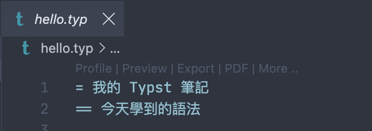

In the [previous post](day01-intro-and-install-en.html), we got the environment ready — whether that meant installing the CLI locally with the VS Code extension, or writing directly in typst.app. This post is where we actually write our first Typst document.

Besides walking through the first compile, this post also covers the difference between the compile and watch modes and when to use each; finally, we'll quickly go over the most commonly used basic syntax — headings, bold/italic text, and lists — so the first document isn't just plain text, but something with a bit of actual formatting. These syntax elements will each get a deeper dive in later posts; the goal here is simply to build the habit of **write, compile, check the result**!

## Writing Your First Typst Document

A Typst file is essentially a plain text file with a `.typ` extension — no extra complicated setup needed, just open a new file and start writing.

First, create a folder named `hello-typst/` in VS Code or any editor. Once created, create a `hello.typ` file inside it:

```
hello-typst/
└── hello.typ
```

### Headings

Typst's heading syntax is quite similar to Markdown's, except it uses an equals sign `=` instead of `#`. The number of equals signs indicates the level — one `=` is a level-1 heading, two `==` is a level-2 heading, and so on.

| Syntax | Level |
| --- | --- |
| `=` | Level 1 heading |
| `==` | Level 2 heading |
| `===` | Level 3 heading |


Now let's actually type the following into `hello.typ`:

```typst
= My Typst Notes
== Basic Syntax
=== Heading Syntax
```

### Bold, Italic, and Other Text Styles

To emphasize text, wrap the part you want bolded with asterisks `*`, and wrap italics with underscores `_`. The two can also be stacked together[^1]:

```typst
This is *bold text*, this is _italic text_, and you can also apply _*both at once*_.
```

### Lists

Unordered lists start with a hyphen `-`, and ordered lists start with a plus sign `+` — Typst automatically numbers ordered lists for you, so you don't need to maintain the numbers by hand. Indenting one level creates a nested list[^2]:

```typst
- Apple
- Banana
- Orange

+ Step one
+ Step two
+ Step three
```

### A Complete Document

Let's combine the headings, bold/italic text, and list syntax we just learned, and turn `hello.typ` into a note with a bit more actual content:

```typst
= My Typst Notes
== What I Learned Today

Typst is a modern typesetting system. Its syntax is much more concise than *LaTeX*, while still offering powerful layout capabilities — great for writing papers, resumes, or reports.

=== Key Takeaways From This Post

- Heading syntax: `=` determines the level
- Text styles: `*bold*` and `_italic_`
- List syntax: `-` for unordered, `+` for ordered

=== Next Steps

+ Learn the compile commands
+ Practice more basic syntax
+ Try typesetting a resume
```

## Compiling and Previewing

Once `hello.typ` is written, the next step is turning it into a readable, typeset result!

The Typst CLI offers two ways to do this: one runs a single compile and produces a PDF, then stops; the other starts watch mode, which automatically recompiles whenever you save the file, so you can see the update live in your editor or browser — great for adjusting layout as you go[^3].


#### Compile Mode

The most direct way to compile is to switch your terminal to the `hello-typst/` folder and run:

```bash
typst compile hello.typ
```

Once the command finishes, you'll find a new `hello.pdf` in the folder, containing the typeset result — open it with any PDF reader. If you don't specify an output filename, Typst uses the source file's name and writes the output to the same folder. Opening it, you'll see the note we put together earlier, with the heading, bold/italic text, and list all laid out as written:

<figure><figcaption>hello.pdf compile output</figcaption></figure>

If you're using VS Code with the Tinymist extension, you don't even need to switch to the terminal to run a command: once you open a `.typ` file, a toolbar automatically appears above the editor with built-in Preview, Export, and other features — a couple of clicks and you can export straight to PDF:

<figure><figcaption>Tinymist editor toolbar</figcaption></figure>

#### Watch Mode

Compile mode requires manually rerunning the command every time. If you want to tweak the layout while seeing the actual result update as you go, `watch` is the better fit:

```bash
typst watch hello.typ
```

After running the command, the terminal stays open and keeps watching — it doesn't exit right away. From here, just save the file, and Typst automatically detects the change and recompiles, with `hello.pdf` updating right along with it. Open `hello.pdf` with a PDF reader that supports auto-refresh (such as VS Code's built-in PDF view, or a third-party reader like [Skim](https://skim-app.sourceforge.io/)), change a character and save, and the view updates almost instantly. To stop watching, go back to the terminal and press `Ctrl + C`.

```
watching hello.typ
writing to hello.pdf

[16:36:40] compiling ...
watching hello.typ
writing to hello.pdf

[16:36:40] compiled successfully in 393.02 ms
```

With the Tinymist extension, the experience is even more direct: click Preview in the toolbar, and VS Code opens a built-in preview tab that updates live on its own — no separate watch command needed, and no switching to an external PDF reader.


## Summary

This post finally got us from zero to writing our first real Typst document: we created `hello.typ`, practiced the three most commonly used pieces of basic syntax — headings, bold/italic text, and lists — combined them into a note with some actual content, and turned it into a PDF using both `typst compile` and `typst watch`. The **write, compile, check the result** loop will run through the whole series; next up, we'll keep unpacking Typst's syntax piece by piece, comparing it step by step with LaTeX and Markdown!

See you next time~

Code for this post: [day02-getting-started](https://github.com/yueswater/typst-ironman-2026/tree/main/day02-getting-started)

[^1]: Unlike Markdown, where bold and italic usually use double symbols (like `**bold**`, `__italic__`), Typst achieves the same effect with just a single symbol (`*bold*`, `_italic_`).
[^2]: Markdown's unordered lists can start with `-`, `*`, or `+`, and ordered lists use a number followed by a period (like `1.`). Typst's unordered lists always use `-`, and ordered lists use `+` for automatic numbering, but also support manually specifying numbers with a number and period, just like Markdown.
[^3]: LaTeX typically needs several rounds of compilation — for example, running `pdflatex` first, then `bibtex` or `biber` to handle the bibliography, then running `pdflatex` once or twice more so cross-references, the table of contents, and bibliography numbering come out correct — and every content change means rerunning the whole cycle, which takes a while. Typst's watch mode only needs one command; after that, saving triggers an automatic incremental recompile with a live-updating preview, with no need to manually rerun the whole compilation chain.
