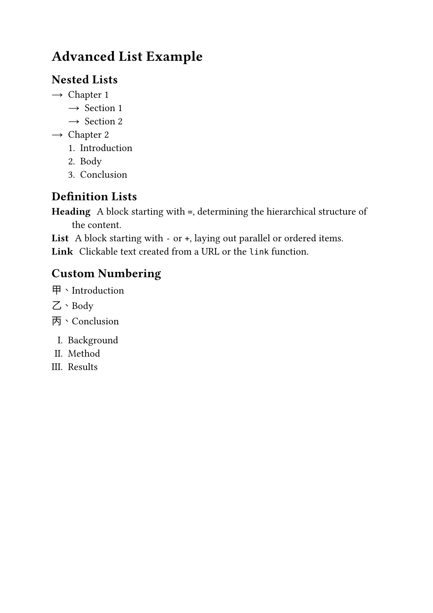
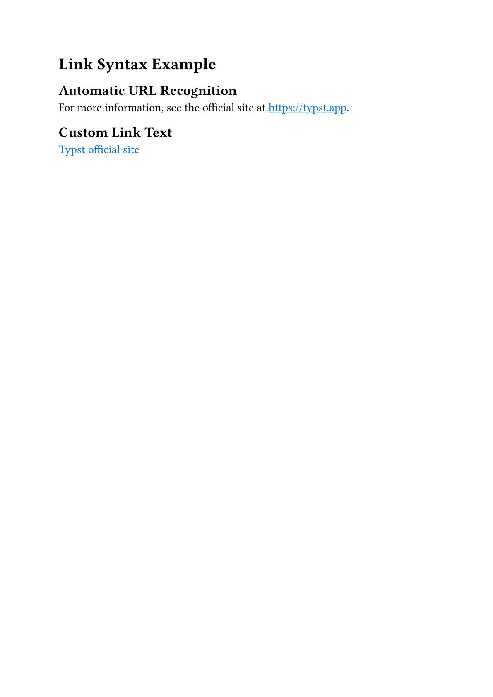
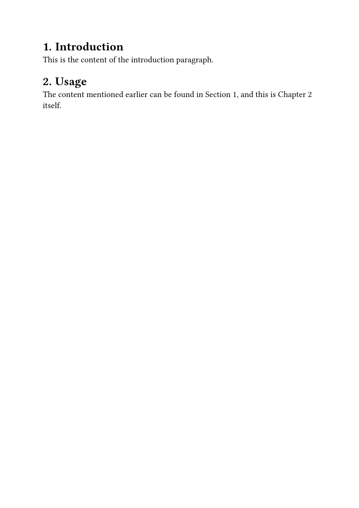
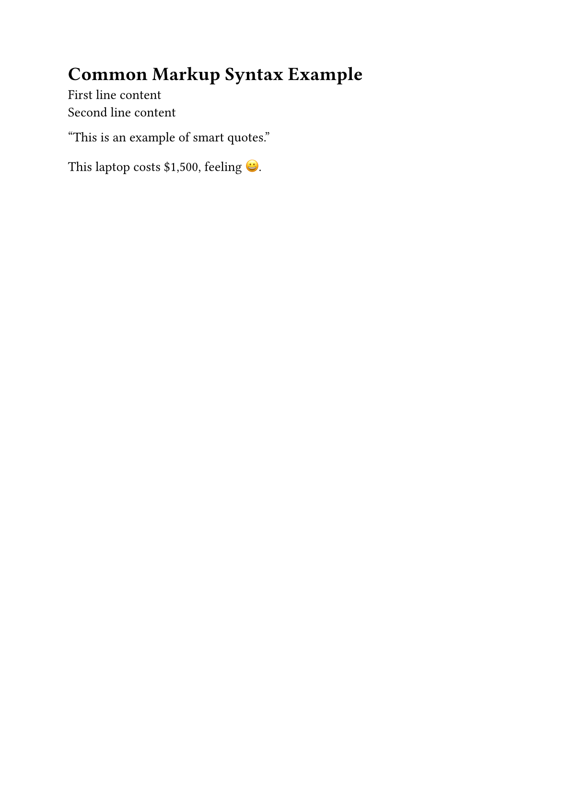

In the [previous post](/articles/typst/day03-text-formatting-en/), we practiced text decorations like underline, strikethrough, and superscript/subscript, and learned to customize font, size, and color with the `text` function. This post changes direction: we'll circle back and round out list syntax, then add link syntax and label references — important pieces you'll run into constantly when writing documents, but that we haven't covered yet.

## Advanced Lists: Nested and Definition Lists

We've already covered unordered lists (`-`) and ordered lists (`+`). But when you need to explain something in more detail, nested lists and definition lists come in handy.

### Nested Lists

Indent a list item a few extra spaces and you get a nested list. `-` and `+` can even be mixed across different levels — the whole list doesn't have to use the same marker throughout:

```typst
- Chapter 1
  - Section 1
  - Section 2
- Chapter 2
  + Introduction
  + Body
  + Conclusion
```

Keep the outer level as an unordered list, and switch the inner level to an ordered list wherever you want to emphasize sequence — the two syntaxes mix freely.

### Definition Lists

Swap the marker for a slash `/`, followed by a term, a colon, and its explanation, and you get a definition list — great for organizing term definitions, like a quick summary of the list syntax covered in this post:

```typst
/ Heading: A block starting with `=`, determining the hierarchical structure of the content.
/ List: A block starting with `-` or `+`, laying out parallel or ordered items.
/ Link: Clickable text created from a URL or the `link` function.
```

Unlike the previous two list types, each definition list item naturally splits into a **term** field and an **explanation** field, saving you the trouble of aligning things manually.

### Customizing Numbering Styles

By default, ordered lists number items with Arabic numerals followed by a period. If you want a style like `(1)`, `1)`, `a)`, or Roman numerals instead, use `#set enum` with the `numbering` parameter, which applies to every `+` list that follows:

```typst
#set enum(numbering: "(1)")

+ Step one
+ Step two
+ Step three
```

`numbering` takes a numbering pattern string. Inside it, `1`, `a`, and `i` stand for Arabic numerals, letters, and Roman numerals respectively, while every other character (like parentheses or periods) is kept as-is. So `"(1)"` prints `(1)`, `(2)`, `(3)`, and `"a)"` prints `a)`, `b)`, `c)`.

Typst's built-in Chinese numeral styles only cover the plain lowercase form (一, 二, 三...) and the formal uppercase form (壹, 貳, 參...) — there's no built-in option for the **Heavenly Stems** (天干: 甲, 乙, 丙, 丁...), a traditional ordinal sequence still used today for things like exam versions or contract clauses. If you want that style, `numbering` needs to take a function instead, where you define your own lookup table:

```typst
#set enum(numbering: n => {
  let 天干 = ("甲", "乙", "丙", "丁", "戊")
  天干.at(n - 1) + "、"
})

+ Step one
+ Step two
+ Step three
```

The function receives the current number (starting from 1), looks up the matching character in the array, and whatever it returns becomes that item's numbering text.

### Customizing List Markers

Unordered list markers can be swapped too. Use `#set list` with the `marker` parameter, and put in any content to replace the default bullet:

```typst
#set list(marker: [→])

- Item one
- Item two
- Item three
```

If you want a different marker at each nesting level, `marker` can take an array instead — it's applied in order by nesting depth, and cycles back around automatically if there aren't enough markers for every level:

```typst
#set list(marker: ([•], [‣], [–]))

- Level one
  - Level two
    - Level three
```

### Full Example

With these tools in hand, let's put nested lists, definition lists, and custom numbering and markers together in one document:

```typst
#set text(font: ("Libertinus Serif", "PingFang TC"), size: 14pt)
#set list(marker: [→])

= Advanced List Example

== Nested Lists

- Chapter 1
  - Section 1
  - Section 2
- Chapter 2
  + Introduction
  + Body
  + Conclusion

== Definition Lists

/ Heading: A block starting with `=`, determining the hierarchical structure of the content.
/ List: A block starting with `-` or `+`, laying out parallel or ordered items.
/ Link: Clickable text created from a URL or the `link` function.

== Custom Numbering

#[
  #set enum(numbering: n => {
    let 天干 = ("甲", "乙", "丙", "丁", "戊")
    天干.at(n - 1) + "、"
  })
  + Introduction
  + Body
  + Conclusion
]

#[
  #set enum(numbering: "I.")
  + Background
  + Method
  + Results
]
```

After compiling with `typst compile`, here's the result:

<figure><figcaption>Advanced list example output</figcaption></figure>

## Link Syntax

Documents often need to reference external sources or websites. Typst makes this intuitive: a URL becomes a clickable link automatically, with no extra wrapping needed, and there's a dedicated function for when you want to customize the display text.

### Automatic URL Recognition

As long as a piece of text starts with `http://` or `https://`, Typst automatically recognizes it as a clickable link — no extra syntax required:

```typst
For more information, see the official site at https://typst.app.
```

In the compiled PDF, that URL becomes a hyperlink you can click to open the page directly.

### Custom Link Text

If you don't want the raw URL to show and would rather display a piece of descriptive text instead, use the `link` function: put the URL in the parentheses as the target, and the content in the square brackets that follows is what actually gets displayed:

```typst
#link("https://typst.app")[Typst official site]
```

Besides a URL, the first argument to `link` can also take a label (`<label>`), used to link to a specific location inside the document — we'll get to that in the next section.

### Customizing Link Style

By default, Typst links look exactly like regular text — no automatic color change or underline. If you want links to be recognizable at a glance, the way browsers usually render them, you can use a `show` rule to apply a style uniformly, instead of setting it on every link individually:

```typst
#show link: it => underline(text(fill: blue, it))
```

Put this at the very top of the document, and every `link` function call or auto-detected URL after it turns blue and underlined! The `it` that the `show` rule receives is the original link content — first `text` recolors it, then `underline` wraps it to add the underline.

### Full Example

```typst
#set text(font: ("Libertinus Serif", "PingFang TC"), size: 14pt)
#show link: it => underline(text(fill: blue, it))

= Link Syntax Example

== Automatic URL Recognition

For more information, see the official site at https://typst.app.

== Custom Link Text

#link("https://typst.app")[Typst official site]
```

After compiling, here's the result:

<figure><figcaption>Link syntax example output</figcaption></figure>

## Labels and References

The links so far have all pointed outside the document. If you want to cross-reference within the document itself — something like **see Section X for details** — you need labels and references, which let Typst automatically compute the numbering and generate the link, instead of you maintaining it by hand.

### Labeling an Element

Add `<name>` right after a "referenceable element" — headings, figures, equations — and that attaches a label to it:

```typst
= Introduction <intro>
```

The label name is purely an internal identifier — it never shows up in the document — and afterward you can use that name to point content elsewhere back to where the label sits.

### Referencing a Label

Use `@name` in your text to reference the matching label, and Typst automatically generates "section name + number" text, with a hyperlink attached:

```typst
#set heading(numbering: "1.")

= Introduction <intro>

This is body text — the content mentioned earlier can be found in @intro.
```

One thing to watch out for: headings need `#set heading(numbering: "1.")` turned on first, or compilation fails outright with `cannot reference heading without numbering` — without numbering, Typst has no number to fill into the reference.

By default, `@intro` renders as `Section 1`. If you want different wording, add square brackets after the reference to supply custom text:

```typst
This is body text — the content mentioned earlier can be found in @intro[Chapter].
```

This prints **Chapter 1** instead of the default `Section 1`.

### Full Example

Here's a complete document example:

```typst
#set text(font: ("Libertinus Serif", "PingFang TC"), size: 14pt)
#set heading(numbering: "1.")

= Introduction <intro>

This is the content of the introduction paragraph.

= Usage <usage>

The content mentioned earlier can be found in @intro, and this is @usage[Chapter] itself.
```

After compiling with `typst compile`, here's the result:

<figure><figcaption>Label and reference example output</figcaption></figure>

## Other Common Markup Syntax

To wrap up, here are a few small but nearly universal pieces of syntax: manual line breaks, automatic quote conversion, and how to escape special characters when you need to.

### Line Break Syntax

If you want to force a line break within the same paragraph without the extra spacing a blank line would add, put a backslash `\` at the end of the line:

```typst
First line content\
Second line content
```

Unlike the paragraph break you get from pressing Enter twice, `\` only breaks the line — it doesn't add any extra spacing between paragraphs.

### Smart Quotes

Type a plain straight quote `'` or `"`, and Typst automatically converts it to the correctly directional smart quote based on context — you don't have to switch between opening and closing quotes yourself:

```typst
"This is a quoted sentence."
```

If you don't want this automatic conversion, you can turn it off for the whole document:

```typst
#set smartquote(enabled: false)
```

### Escaping Special Characters

Quite a few characters carry special meaning in Typst syntax — `*`, `_`, `#`, `$`, and more. If you just want to display the symbol itself, put a backslash `\` in front of it to escape it:

```typst
This laptop costs \$1,500.
```

For rarer symbols, you can also use Unicode escape syntax and type the hex code point directly:

```typst
Feeling \u{1f600} today.
```

If you're not sure what code point a symbol maps to, search by name or appearance at [SYMBL](https://symbl.cc/), then paste the code point straight into `\u{}`.

### Full Example

```typst
#set text(font: ("Libertinus Serif", "PingFang TC"), size: 14pt)

= Common Markup Syntax Example

First line content\
Second line content

"This is an example of smart quotes."

This laptop costs \$1,500, feeling \u{1f600}.
```

After compiling with `typst compile`, here's the result:

<figure><figcaption>Common markup syntax example output</figcaption></figure>

## Summary

This post covered nested and definition lists, plus customizing numbering styles and markers with `#set enum` and `#set list`; then rounded out link syntax — automatic URL recognition, custom display text with the `link` function, and applying a uniform link style with a `show` rule; labels and references let you cross-reference within a document without maintaining section numbers by hand; and finally wrapped up with a few easy-to-overlook essentials: line breaks, smart quotes, and escaping special characters.

Next up, we're moving into code blocks and math formulas — another major strength of Typst besides layout.

See you next time~

Code for this post: [day04-lists-and-links](https://github.com/yueswater/typst-ironman-2026/tree/main/day04-lists-and-links)
