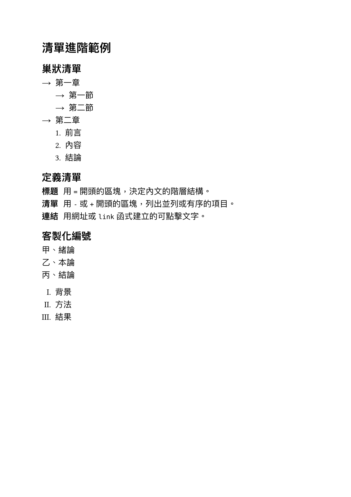

[上一篇](/articles/typst/day03-text-formatting/)練了底線、刪除線、上標下標這些文字裝飾，也學會用 `text` 函式客製化字型、字級與顏色。這篇要換個方向，回頭把清單語法補完，再補上連結、標籤引用這些寫文件時常會遇到，但前面還沒提過的重要語法。

## 清單進階：巢狀與定義清單

無序清單 `-` 跟有序清單 `+` 前面已經提過，不過當我們想要更細緻地說明一些內容時，就需要用到巢狀清單與定義清單。

### 巢狀清單

清單項目前面多縮排幾格，就能做出巢狀清單，而且 `-` 與 `+` 可以在不同層級混用，不用整份清單從頭到尾都用同一種符號：

```typst
- 第一章
  - 第一節
  - 第二節
- 第二章
  + 前言
  + 內容
  + 結論
```

外層維持無序清單即可，內層想強調先後順序，就換成有序清單，兩種語法可以混用。

### 定義清單

清單項目前面換成斜線 `/`，接著寫詞語、冒號、說明文字，就會變成定義清單，很適合用來整理名詞解釋，像是幫這篇提過的幾種清單語法做個小總結：

```typst
/ 標題: 用 `=` 開頭的區塊，決定內文的階層結構。
/ 清單: 用 `-` 或 `+` 開頭的區塊，列出並列或有序的項目。
/ 連結: 用網址或 `link` 函式建立的可點擊文字。
```

跟前面兩種清單不一樣的是，定義清單每一項天生就分成**定義名稱**與**說明**兩個欄位，省去自己額外排版對齊的時間。

### 客製化編號樣式

有序清單預設用阿拉伯數字加句點編號，但如果想換成 `(1)`、`1)`、`a)`、羅馬數字這類樣式，可以用 `#set enum` 搭配 `numbering` 參數，一次套用到後面所有 `+` 清單：

```typst
#set enum(numbering: "(1)")

+ 第一步
+ 第二步
+ 第三步
```

`numbering` 接受的是一組編號樣式字串，裡面的 `1`、`a`、`i` 分別代表阿拉伯數字、字母、羅馬數字，其餘字元（像括號、句點）則原封不動保留，所以 `"(1)"` 會印出 `(1)`、`(2)`、`(3)`，`"a)"` 則會印出 `a)`、`b)`、`c)`。

Typst 內建的中文數字符號只有中文數字的小寫**一**跟大寫**壹**，沒有天干甲乙丙丁，如果想要甲乙丙丁這種編號，`numbering` 要改傳一個函式，自己定義對照表：

```typst
#set enum(numbering: n => {
  let 天干 = ("甲", "乙", "丙", "丁", "戊")
  天干.at(n - 1) + "、"
})

+ 第一步
+ 第二步
+ 第三步
```

函式會收到目前的編號（從 1 開始），拿它去陣列裡查對應的字，回傳的內容就是這一項的編號文字。

### 客製化清單符號

無序清單的符號一樣可以換，用 `#set list` 搭配 `marker` 參數，放進任何內容取代預設的圓點：

```typst
#set list(marker: [→])

- 第一項
- 第二項
- 第三項
```

如果巢狀清單想要每層用不同符號，`marker` 可以放一個陣列，依巢狀深度輪流套用，符號數量不夠時會自動循環使用：

```typst
#set list(marker: ([•], [‣], [–]))

- 第一層
  - 第二層
    - 第三層
```

### 完整範例

有了上述工具後，我們可以把巢狀清單、定義清單、客製化編號與符號寫在文件上試試看：

```typst
#set text(
    font: ("Libertinus Serif", "PingFang TC"),
    size: 14pt
)
#set list(marker: [→])

= 清單進階範例

== 巢狀清單

- 第一章
  - 第一節
  - 第二節
- 第二章
  + 前言
  + 內容
  + 結論

== 定義清單

/ 標題: 用 `=` 開頭的區塊，決定內文的階層結構。
/ 清單: 用 `-` 或 `+` 開頭的區塊，列出並列或有序的項目。
/ 連結: 用網址或 `link` 函式建立的可點擊文字。

== 客製化編號

#[
  #set enum(numbering: n => {
    let 天干 = ("甲", "乙", "丙", "丁", "戊")
    天干.at(n - 1) + "、"
  })
  + 緒論
  + 本論
  + 結論
]

#[
  #set enum(numbering: "I.")
  + 背景
  + 方法
  + 結果
]
```

用 `typst compile` 編譯後，結果如下：

<figure><figcaption>清單進階範例輸出</figcaption></figure>

## 連結語法

寫文件常常需要附上參考資料或外部網站，Typst 對這件事處理得很直覺，網址不用額外包裝就能自動變成連結，想客製化顯示文字時也有對應的函式可以用。

### 自動辨識網址連結

只要文字是用 `http://` 或 `https://` 開頭，Typst 就會自動辨識成可點擊的連結，不需要額外語法：

```typst
更多資訊請參考 https://typst.app 官方網站。
```

編譯出來的 PDF 裡，這段網址會直接變成超連結，點下去可以開啟對應頁面。

### 自訂連結文字

如果不想讓網址本身顯示出來，想換成一段說明文字，可以用 `link` 函式，把網址放進括號當目標，後面方括號裡的內容則是實際顯示的文字：

```typst
#link("https://typst.app")[Typst 官方網站]
```

`link` 函式的第一個參數除了網址，也可以放標籤（`<label>`），用來連到文件內部的某個位置，這部分留到下一節再介紹。

### 客製化連結樣式

Typst 預設的連結跟一般文字長得一模一樣，不會自動變色或加底線。如果想比照瀏覽器習慣，讓連結一眼就能看出來，可以用 `show` 規則統一套用樣式，不用每個連結分別設定：

```typst
#show link: it => underline(text(fill: blue, it))
```

將設定放在文件最前面，後面所有 `link` 函式或自動辨識出來的網址，就會統一變成藍色加底線了！`show` 規則接收到的 `it` 就是原本的連結內容，先用 `text` 換色，再用 `underline` 包一層加底線。

### 完整範例

```typst
#set text(
    font: ("Libertinus Serif", "PingFang TC"),
    size: 14pt
)
#show link: it => underline(text(fill: blue, it))

= 連結語法範例

== 自動辨識網址連結

更多資訊請參考 https://typst.app 官方網站。

== 自訂連結文字

#link("https://typst.app")[Typst 官方網站]
```

編譯後，結果如下：

<figure><figcaption>連結語法範例輸出</figcaption></figure>

## 標籤與引用

前面的連結都是連到文件外部，如果想在文件內部做交互參照，像是**詳見第 X 節**這種寫法，就需要用到標籤與引用，讓 Typst 自動幫忙算編號、產生連結，不用自己手動維護。

### 元素加標籤

在標題、圖片、公式這類「可被引用的元素」後面加上 `<名稱>`，就會幫這個元素貼上一個標籤：

```typst
= 介紹 <intro>
```

標籤名稱只是內部代號，不會顯示在文件上，之後就能用這個名稱把其他地方的內容定位到標籤所在位置。

### 引用標籤

在文字裡用 `@名稱` 就能引用對應的標籤，Typst 會自動產生「章節名稱＋編號」的文字，並且加上超連結：

```typst
#set heading(numbering: "1.")

= 介紹 <intro>

這是內文，前面提到的內容可以在 @intro 找到。
```

要注意的是，標題得先用 `#set heading(numbering: "1.")` 打開編號功能，不然編譯會直接報錯：`cannot reference heading without numbering`——沒有編號，Typst 就不知道要在引用裡填什麼數字。

預設情況下 `@intro` 顯示出來會是英文的 `Section 1`，如果想要顯示中文字，可以在引用後面加方括號，自訂補充文字：

```typst
這是內文，前面提到的內容可以在 @intro[章] 找到。
```

這樣就會印出**章 1**，而不是預設的 `Section 1`。

### 完整範例

以下是實際的文件範例：

```typst
#set text(
    font: ("Libertinus Serif", "PingFang TC"),
    size: 14pt
)
#set heading(numbering: "1.")

= 介紹 <intro>

這是介紹段落的內容。

= 使用方式 <usage>

前面提到的內容可以在 @intro 找到，這裡則是 @usage[章] 本身。
```

用 `typst compile` 編譯後，結果如下：

<figure><figcaption>標籤與引用範例輸出</figcaption></figure>

## 其他常用標記語法

最後補上幾個雖然小、但幾乎每份文件都會用到的語法：手動換行、引號的自動轉換，還有遇到特殊符號時該怎麼跳脫。

### 換行語法

同一段落裡想強制換行，又不想因為空行而多出一段段落間距，可以在行尾加反斜線 `\`：

```typst
第一行內容\
第二行內容
```

跟按兩次 Enter 產生的段落換行不同，`\` 只換行，不會多出段落之間的額外間距。

### 智慧引號

直接打半形引號 `'` 或 `"`，Typst 會自動依前後文轉換成對應方向的智慧引號，不用自己切換左右引號：

```typst
"這是一段引言。"
```

如果不想要這個自動轉換，可以整份文件關掉：

```typst
#set smartquote(enabled: false)
```

### 逃脫特殊字元

Typst 語法裡不少字元帶著特殊意義，像 `*`、`_`、`#`、`$`，如果只是想單純顯示這些符號本身，在前面加反斜線 `\` 就能跳脫：

```typst
這台筆電售價 \$1,500。
```

比較少見的符號想插入，也可以用 Unicode 跳脫語法，直接打十六進位碼位：

```typst
今天心情 \u{1f600}
```

不確定符號對應的碼位時，可以到 [SYMBL](https://symbl.cc/) 用名稱或外觀搜尋，找到碼位後直接貼進 `\u{}` 裡就能用。

### 完整範例

```typst
#set text(
    font: ("Libertinus Serif", "PingFang TC"),
    size: 14pt
)

= 常用標記語法範例

第一行內容\
第二行內容

"這是一段智慧引號的範例。"

這台筆電售價 \$1,500，心情 \u{1f600}。
```

用 `typst compile` 編譯後，結果如下：

<figure><figcaption>常用標記語法範例輸出</figcaption></figure>

## 小結

這篇我們提到了巢狀清單、定義清單，還有用 `#set enum` 跟 `#set list` 客製化編號樣式與符號；接著補上連結語法，網址自動辨識、`link` 函式自訂顯示文字，再用 `show` 規則統一調整連結樣式；標籤與引用則讓文件內部可以互相參照，不用自己手動維護章節編號；最後收了換行、智慧引號、跳脫特殊字元這幾個容易忽略的小語法。

下一篇要進到程式碼區塊跟數學公式，這是 Typst 除了排版以外，另一個很吃重的能力！

我們下次見囉～

本篇程式碼：[day04-lists-and-links](https://github.com/yueswater/typst-ironman-2026/tree/main/day04-lists-and-links)
