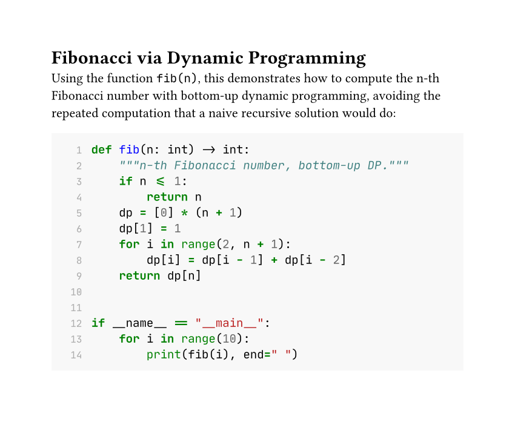
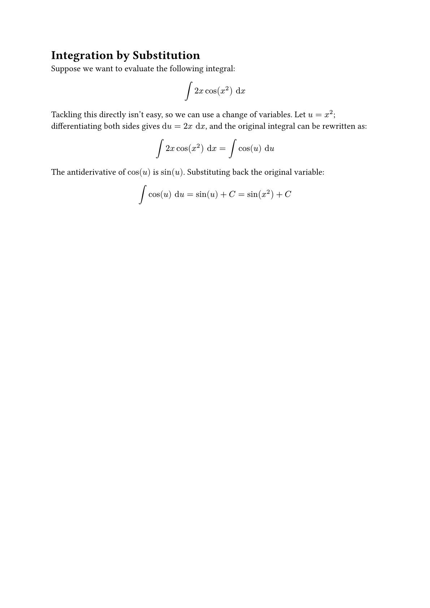

In the [previous post](/articles/typst/day04-lists-and-links-en/), we covered advanced list syntax, along with links, label references, and a few everyday bits of markup like line breaks and smart quotes. This post moves on to two more features you'll use constantly: code blocks, and ~~the one everyone's been waiting for (or just me)~~ math formulas.

For code blocks, we'll cover the difference between inline and block code, and show how to turn on syntax highlighting and switch themes. For math formulas, we'll start with the basics — inline formulas, standalone formulas, and the rule for whether text in math mode gets read as a variable or a symbol — leaving deeper symbol, fraction, and matrix coverage for a dedicated math post later. The goal here is simply to get your Typst document to the point where it **can show code snippets and typeset math**.

## Code Blocks

Writing a document sometimes means pasting in a code snippet. Typst has built-in syntax for both inline and block code, and block code even gets automatic syntax highlighting — no extra package needed.

### Inline Code

Wrap text in a pair of backticks `` ` `` and it becomes inline code — the content inside is displayed exactly as plain text and won't be interpreted as markup syntax:

```typst
This is inline `let x = 1` code.
```

### Block Code and Syntax Highlighting

Three (or more) backticks[^1] with an actual line break inside become a standalone block of code. Write a language identifier immediately after the opening backticks (no space allowed), and Typst automatically applies syntax highlighting for that language:

````typst
```python
def hello():
    print("hi")
```
````

The language identifier supports most common programming languages, plus three special ones for Typst itself: `typ` (markup syntax), `typc` (code syntax), and `typm` (math syntax) — handy for showing off Typst's own syntax. In fact, every example so far in this post has been highlighted using the `typst` identifier.

Here's a rundown of some commonly used language identifiers[^2]:

| Language | Code | Language | Code |
| --- | --- | --- | --- |
| Python | `python` | JavaScript | `javascript` |
| TypeScript | `typescript` | Java | `java` |
| C | `c` | C++ | `cpp` |
| Go | `go` | Rust | `rust` |
| Ruby | `ruby` | PHP | `php` |
| HTML | `html` | CSS | `css` |
| JSON | `json` | YAML | `yaml` |
| Bash | `bash` | SQL | `sql` |

### Customizing Code Style

Behind the scenes, code blocks map to the [`raw` function](https://typst.app/docs/reference/text/raw/), so you can use a `show` rule to adjust their style uniformly.

#### Changing the Font

The most basic need is switching to a monospaced coding font. Popular free choices include [Cascadia Code](https://github.com/microsoft/cascadia-code), [JetBrains Mono](https://www.jetbrains.com/lp/mono/), [Fira Code](https://github.com/tonsky/FiraCode), and [Source Code Pro](https://github.com/adobe-fonts/source-code-pro) — the author's own go-to is JetBrains Mono:

```typst
#show raw: set text(font: "JetBrains Mono")
```

#### Background Color

To make a code block look more like an editor, you can give it a background color. Here we use `raw.where(block: true)` to select only block code (inline code is unaffected), then wrap it in a `block`:

```typst
#show raw.where(block: true): it => block(
  fill: luma(240),
  inset: 10pt,
  it,
)
```

#### Showing Line Numbers

`raw` has no built-in line-number parameter, but you can apply a `show` rule to `raw.line` (each line inside a code block) to build your own line numbers:

```typst
#show raw.line: it => {
  box(width: 2em, align(right, text(fill: gray, str(it.number))))
  h(1em)
  it.body
}
```

`it.number` is that line's number (starting from 1), and `it.body` is that line's content with syntax highlighting already applied. Placing the two side by side gives you a line-number-plus-code effect, and it stacks fine with the background-color rule from before.

#### Switching the Color Theme

If you want to swap out the syntax-highlighting colors entirely, use the `raw` function's `theme` parameter to load a `.tmTheme` theme file. Plenty of ready-made themes are available online — take [Dracula](https://github.com/dracula/sublime), a dark theme supported by many editors, as an example. Download its `Dracula.tmTheme`, drop it in your project folder at the same level as your main Typst file, and you can reference it directly:

```typst
#set raw(theme: "Dracula.tmTheme")

#show raw.where(block: true): it => block(
  fill: rgb("#282a36"),
  inset: 10pt,
  it,
)
```

After switching to a dark theme, remember to also change the code block's background to a matching dark color (here we use Dracula's official background color, `#282a36`) — otherwise the highlighted colors will clash with the original white background and become hard to read.

### Full Example

Let's put inline code, syntax highlighting, fonts, background color, line numbers[^3], and a custom theme all together, with a Python example computing Fibonacci numbers via dynamic programming. The color scheme mimics the default style of LaTeX's `minted` package (light gray background, green keywords, blue function names):

````typst
#set text(font: ("Libertinus Serif", "PingFang TC"), size: 11pt)
#show raw: set text(font: "JetBrains Mono", size: 9.5pt)
#set raw(theme: "minted-default.tmTheme")
#show raw.where(block: true): it => {
  show raw.line: line => {
    box(width: 1.6em, align(right, text(fill: gray, size: 8pt, str(line.number))))
    h(0.8em)
    line.body
  }
  block(
    fill: rgb("#f8f8f8"),
    inset: 10pt,
    width: 100%,
    it,
  )
}

= Fibonacci via Dynamic Programming

Using the function `fib(n)`, this demonstrates how to compute the n-th Fibonacci number with bottom-up dynamic programming, avoiding the repeated computation that a naive recursive solution would do:

```python
def fib(n: int) -> int:
    """n-th Fibonacci number, bottom-up DP."""
    if n <= 1:
        return n
    dp = [0] * (n + 1)
    dp[1] = 1
    for i in range(2, n + 1):
        dp[i] = dp[i - 1] + dp[i - 2]
    return dp[n]


if __name__ == "__main__":
    for i in range(10):
        print(fib(i), end=" ")
```
````

After compiling with `typst compile`, here's the result:

<figure><figcaption>Fibonacci dynamic-programming example output</figcaption></figure>

## An Introduction to Math Formulas

Typst uses a pair of `$` symbols to enter math mode, and content inside is typeset according to mathematical formatting rules — no need to load extra `ams`-style packages the way you would in LaTeX.

### Inline and Standalone Formulas

Whether there's a space between `$` and the content determines whether the formula stays inline within the paragraph or breaks out onto its own line.

```typst
The Pythagorean theorem can be written as $x^2 + y^2 = z^2$.
```

If you leave a space on each side between `$` and the content, it becomes a standalone formula — automatically centered on its own line, which suits formulas important enough to want emphasized:

```typst
$ x^2 + y^2 = z^2 $
```

But the more recommended style is

```typst
$
    x^2 + y^2 = z^2
$
```

which avoids any confusion with the body text.

### Variable Rules

Text in math mode follows a different set of interpretation rules from ordinary paragraphs: a **single letter** is always shown as an italic variable, like `$ x $` or `$ y $`. But **two or more letters** are treated as one complete identifier — Typst looks for a matching built-in symbol or variable, and if it can't find one, compilation fails outright:

```typst
$ xy $
```

This fails to compile, with the error `unknown variable: xy` — because Typst looks up `xy` as a single name, not as "x times y". If you want the two letters to be separate variables (to get the effect of "x times y"), leave a space between them:

```typst
$ x y $
```

If you simply want to display the letters `xy` themselves (not as a math symbol), wrap them in quotes so Typst treats them as plain text — they'll render upright, not italicized:

```typst
$ "xy" $
```

Names like `pi` and `alpha` are multiple letters too, but since they're built-in Typst symbol names, you can use them directly — they're automatically converted into the corresponding Greek letters, $\pi$ and $\alpha$.

### Common Math Symbols

Besides Greek letters like $\pi$ and $\alpha$, Typst also has a large built-in set of operators, arrows, and relational symbols — just type the name to use them, no need to memorize the Unicode code point behind each one:

| Symbol | Name | Symbol | Name |
| --- | --- | --- | --- |
| $\pi$ | `pi` | $\sum$ | `sum` |
| $\infty$ | `infinity` | $\int$ | `integral` |
| $\leq$ | `lt.eq` | $\geq$ | `gt.eq` |
| $\to$ | `arrow.r` | $\approx$ | `approx` |

```typst
$ pi approx 3.14, quad sum_(i=1)^n i = (n(n+1)) / 2 $
```

For the full symbol list, check the [official reference](https://typst.app/docs/reference/symbols/sym/) — there are far more than you'd ever use at once. Deeper symbol usage and layout techniques are saved for a dedicated math post later on.

### Full Example

Let's put inline formulas, standalone formulas, variable rules, and common symbols together, with an example of integration by substitution:

```typst
#set text(font: ("Libertinus Serif", "PingFang TC"), size: 12pt)

= Integration by Substitution

Suppose we want to evaluate the following integral:

$
  integral 2x cos(x^2) "d"x
$

Tackling this directly isn't easy, so we can use a change of variables. Let $u = x^2$, differentiating both sides gives $"d"u = 2x "d"x$, and the original integral can be rewritten as:

$
  integral 2x cos(x^2) "d"x = integral cos(u) "d"u
$

The antiderivative of $cos(u)$ is $sin(u)$. Substituting back the original variable:

$
  integral cos(u) "d"u = sin(u) + C = sin(x^2) + C
$
```

After compiling with `typst compile`, here's the result:

<figure><figcaption>Integration-by-substitution example output</figcaption></figure>

## Summary

This post rounded out two commonly used pieces of markup: code blocks and math formulas. We covered the difference between inline and block code, how to turn on syntax highlighting for block code, and several ways to customize `raw` — changing the font, adding a background color, showing line numbers, and switching the color theme. For math formulas, we went from the distinction between inline and standalone formulas, through the interpretation rules for single-letter versus multi-letter text in math mode, to the usage of a few common symbols. Deeper symbols, fractions, and matrices are saved for a dedicated math post later on.

Next up, we'll move into page and layout settings, tackling the basics you can't avoid when typesetting — paper size, margins, and columns!

See you next time~

Code for this post: [day05-markup-code-math](https://github.com/yueswater/typst-ironman-2026/tree/main/day05-markup-code-math)

[^1]: Syntactically, three or more backticks are all valid — four or five can technically open a block too — but in practice almost nobody writes it that way; stick with three. The one common exception is exactly what this post does: when you need to show an example of "how to write a triple-backtick block", you need extra backticks to wrap around it.
[^2]: Typst doesn't publish a complete list of supported languages — what's listed above is just a common subset. For a language not in the table, the most reliable way to check is to just compile and see: if the colors change, the identifier is correct; if it stays plain black text, there's no match, so try a different identifier.
[^3]: Here, the `show raw.line` rule that adds line numbers to block code is nested inside `raw.where(block: true)` rather than written at the top level — because the line-number rule actually applies to inline code too. If it were placed at the top level, even inline code like `` `fib(n)` `` would end up with a stray line number in front of it; nesting it inside the block-only rule is what limits the effect to block code only.
