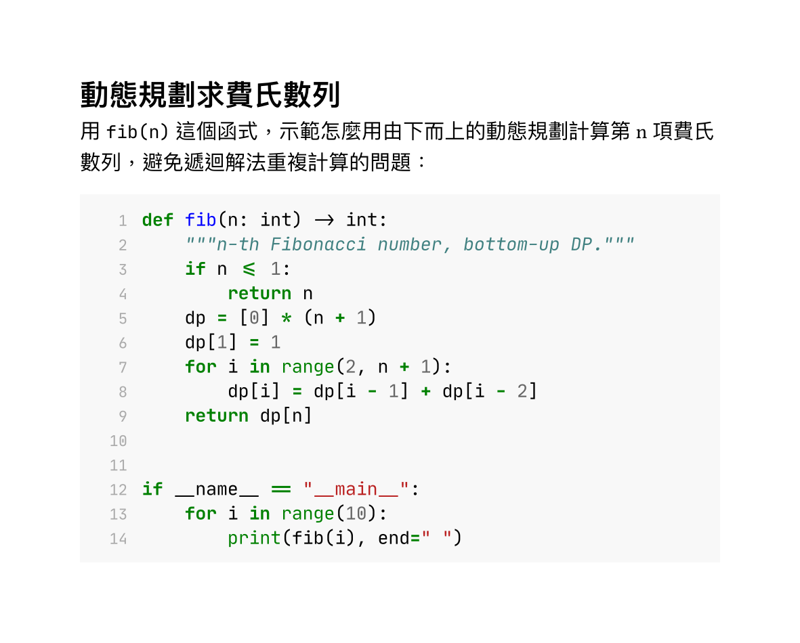
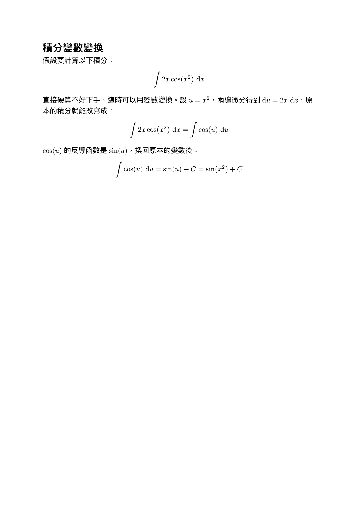

[上一篇](/articles/typst/day04-lists-and-links/)講解了清單的進階用法，也補上連結、標籤引用，還有換行、智慧引號等幾個常用小語法。這篇要進到另外兩個很常用到的功能：程式碼區塊，還有~~眾所期待的（只有我覺得）~~ 數學公式。

程式碼區塊的部分，會講行內程式碼跟區塊程式碼的差異，也會示範怎麼開語法高亮、換主題；數學公式則先從最基本的行內公式、獨立公式，以及數學模式裡文字被解讀成變數還是符號的規則講起，更深入的符號、分數、矩陣留到後面數學專題的文章再展開。目標是先讓手上的 Typst 文件**能展示程式碼片段、也能排數學式**。

## 程式碼區塊

有時寫文件時難免要貼程式碼片段，Typst 內建了行內、區塊兩種程式碼語法，而且區塊程式碼還能自動套語法高亮，不用自己額外裝套件。

### 行內程式碼

用一組反引號 `` ` `` 把文字包起來，就會變成行內程式碼，裡面的內容會被當成純文字照樣顯示，不會被解讀成 markup 語法：

```typst
這是行內 `let x = 1` 程式碼。
```

### 區塊程式碼與語法高亮

三個（以上）反引號[^1]中間如果有真正換行，就會變成獨立一塊的區塊程式碼；開頭反引號後面緊接著寫語言代號（不能有空格），Typst 就會自動套用對應語言的語法高亮：

````typst
```python
def hello():
    print("hi")
```
````

語言代號支援大部分常見程式語言，另外還有三個給 Typst 自己用的代號：`typ`（markup 語法）、`typc`（code 語法）、`typm`（math 語法），拿來展示 Typst 語法本身時很好用——這篇前面所有的範例，其實都是用 `typst` 這個代號高亮的。

以下整理幾個比較常用的語言代號[^2]：

| 語言 | 代碼 | 語言 | 代碼 |
| --- | --- | --- | --- |
| Python | `python` | JavaScript | `javascript` |
| TypeScript | `typescript` | Java | `java` |
| C | `c` | C++ | `cpp` |
| Go | `go` | Rust | `rust` |
| Ruby | `ruby` | PHP | `php` |
| HTML | `html` | CSS | `css` |
| JSON | `json` | YAML | `yaml` |
| Bash | `bash` | SQL | `sql` |

### 客製化程式碼樣式

程式碼區塊背後對應的是 [`raw` 函式](https://typst.app/docs/reference/text/raw/)，可以用 `show` 規則統一調整樣式。

#### 換字型

最基本的需求是換成等寬程式碼字型，常見的免費選擇有 [Cascadia Code](https://github.com/microsoft/cascadia-code)、[JetBrains Mono](https://www.jetbrains.com/lp/mono/)、[Fira Code](https://github.com/tonsky/FiraCode)、[Source Code Pro](https://github.com/adobe-fonts/source-code-pro) 這幾款，筆者自己習慣用 JetBrains Mono：

```typst
#show raw: set text(font: "JetBrains Mono")
```

#### 背景色

想讓程式碼區塊看起來更像編輯器，可以幫它加背景色。這裡要用 `raw.where(block: true)` 只挑出區塊程式碼（行內程式碼不受影響），再用 `block` 包一層：

```typst
#show raw.where(block: true): it => block(
  fill: luma(240),
  inset: 10pt,
  it,
)
```

#### 顯示行號

`raw` 本身沒有內建的行號參數，但可以對 `raw.line`（區塊程式碼裡的每一行）下 `show` 規則，自己組出行號：

```typst
#show raw.line: it => {
  box(width: 2em, align(right, text(fill: gray, str(it.number))))
  h(1em)
  it.body
}
```

`it.number` 是這一行的行號（從 1 開始），`it.body` 則是這一行已經套用語法高亮的內容，兩者排在一起就是行號搭配程式碼的效果，跟前面加背景色的規則疊在一起也不衝突。

#### 換配色主題

如果想連語法高亮的配色都換掉，可以用 `raw` 函式的 `theme` 參數，載入一份 `.tmTheme` 格式的主題檔案。網路上有不少現成主題可以抓，例如很多編輯器都有支援的暗色主題 [Dracula](https://github.com/dracula/sublime)，把它的 `Dracula.tmTheme` 下載下來放進專案資料夾，並與主要 Typst 檔案同一層級，就能直接指定：

```typst
#set raw(theme: "Dracula.tmTheme")

#show raw.where(block: true): it => block(
  fill: rgb("#282a36"),
  inset: 10pt,
  it,
)
```

換成暗色主題後，程式碼區塊的背景也要記得跟著換成對應的深色（此處使用 Dracula 官方的背景色 `#282a36`），不然語法高亮的顏色會跟原本的白底衝突，反而看不清楚。

### 實作範例

把行內程式碼、語法高亮、字型、背景色、行號[^3]、客製化主題全部兜在一起，寫一份「用動態規劃求費氏數列」的 Python 範例，主題配色仿照 LaTeX `minted` 套件的預設樣式（淺灰底、綠色關鍵字、藍色函式名稱）：

````typst
#set text(
    font: ("Libertinus Serif", "PingFang TC"),
    size: 11pt
)
#show raw: set text(
    font: "JetBrains Mono",
    size: 9.5pt
)
#set raw(theme: "minted-default.tmTheme")
#show raw.where(block: true): it => {
  show raw.line: line => {
    box(width: 1.6em, align(right, text(fill: gray, size: 8pt, str(line.number))))
    h(0.8em)
    line.body
  }
  block(
    fill: rgb("#f8f8f8"),
    inset: 10pt,
    width: 100%,
    it,
  )
}

= 動態規劃求費氏數列

用 `fib(n)` 這個函式，示範怎麼用由下而上的動態規劃計算第 n 項費氏數列，避免遞迴解法重複計算的問題：

```python
def fib(n: int) -> int:
    """n-th Fibonacci number, bottom-up DP."""
    if n <= 1:
        return n
    dp = [0] * (n + 1)
    dp[1] = 1
    for i in range(2, n + 1):
        dp[i] = dp[i - 1] + dp[i - 2]
    return dp[n]


if __name__ == "__main__":
    for i in range(10):
        print(fib(i), end=" ")
```
````

用 `typst compile` 編譯後，結果如下：

<figure><figcaption>動態規劃求費氏數列範例輸出</figcaption></figure>

## 數學公式初探

Typst 用一對 `$` 符號進入數學模式，裡面的內容會依照數學排版的規則呈現，不需要像 LaTeX 一樣要額外載入 `ams` 相關的套件。

### 行內公式與獨立公式

`$` 跟內容中間有沒有空格，決定了公式要留在原本的段落裡，抑或是自己獨立成一行。

```typst
畢氏定理可以寫成 $x^2 + y^2 = z^2$。
```

如果 `$` 跟內容之間各留一個空格，就會變成獨立公式，自動置中、單獨佔一行，比較適合放比較重要、需要強調的公式：

```typst
$ x^2 + y^2 = z^2 $
```

但比較建議的寫法是

```typst
$
    x^2 + y^2 = z^2
$
```

避免與本文混淆。

### 變數規則

數學模式裡的文字有一套跟一般段落不一樣的解讀規則：**單一字母**一律照樣顯示成斜體變數，例如 `$ x $`、`$ y $`；但**兩個字母以上**會被當成一個完整的識別字，Typst 會去找有沒有對應的內建符號或變數，找不到就直接編譯失敗：

```typst
$ xy $
```

這段會編譯錯誤，錯誤訊息是 `unknown variable: xy`——因為 Typst 把 `xy` 當成一個名字在找，而不是「x 乘 y」。想要兩個字母各自獨立成變數（呈現出「x 乘 y」的效果），中間要留空格：

```typst
$ x y $
```

如果單純只是想顯示 `xy` 這兩個字母本身（不是數學符號），則要用引號包起來，讓 Typst 把它當純文字處理，顯示出來會是正體字，不會被斜體化：

```typst
$ "xy" $
```

`pi`、`alpha` 這類雖然是多個字母，但因為是 Typst 內建的符號名稱，一樣可以直接使用，會自動轉換成對應的希臘字母 $\pi$ 與 $\alpha$。

### 常見數學符號

除了 $\pi$、$\alpha$ 這類希臘字母，Typst 也內建了大量運算子、箭頭、關係符號，一樣直接打名字就能用，不用記背後的 Unicode 碼位：

| 符號 | 名稱 | 符號 | 名稱 |
| --- | --- | --- | --- |
| $\pi$ | `pi` | $\sum$ | `sum` |
| $\infty$ | `infinity` | $\int$ | `integral` |
| $\leq$ | `lt.eq` | $\geq$ | `gt.eq` |
| $\to$ | `arrow.r` | $\approx$ | `approx` |

```typst
$ pi approx 3.14, quad sum_(i=1)^n i = (n(n+1)) / 2 $
```

完整的符號清單可以查[官方參考](https://typst.app/docs/reference/symbols/sym/)，種類多到不會一次全部用到；更完整的符號應用、排版技巧留到後面數學專題的文章再深入。

### 完整範例

把行內公式、獨立公式、變數規則、常見符號兜在一起，寫一份換元積分法（變數變換）的範例：

```typst
#set text(
    font: ("Libertinus Serif", "PingFang TC"),
    size: 12pt
)

= 積分變數變換

假設要計算以下積分：

$
  integral 2x cos(x^2) "d"x
$

直接硬算不好下手，這時可以用變數變換。設 $u = x^2$，兩邊微分得到 $"d"u = 2x "d"x$，原本的積分就能改寫成：

$
  integral 2x cos(x^2) "d"x = integral cos(u) "d"u
$

$cos(u)$ 的反導函數是 $sin(u)$，換回原本的變數後：

$
  integral cos(u) "d"u = sin(u) + C = sin(x^2) + C
$
```

用 `typst compile` 編譯後，結果如下：

<figure><figcaption>換元積分範例輸出</figcaption></figure>

## 小結

這篇把程式碼區塊跟數學公式這兩個常用標記補齊了：行內、區塊程式碼的差異，區塊程式碼怎麼開語法高亮，還有換字型、加背景色、顯示行號、換配色主題這幾個客製化 `raw` 的方式；數學公式則從行內、獨立公式的分別，講到數學模式裡單一字母跟多字母的解讀規則，再帶過幾個常見符號的用法。更深入的符號、分數、矩陣，留到後面數學專題的文章再展開。

下一篇要進到頁面與版面設定，開始處理紙張大小、邊界、分欄這些排版時繞不開的基本設定！

我們下次見囉～

本篇程式碼：[day05-markup-code-math](https://github.com/yueswater/typst-ironman-2026/tree/main/day05-markup-code-math)

[^1]: 語法上三個以上反引號都合法，理論上四個、五個都可以開一個區塊，但實務上幾乎沒人這樣寫，統一用三個反引號就好；唯一常見的例外是像這篇一樣，要在範例裡展示「怎麼寫一個三反引號區塊」時，才需要拿更多反引號把它包起來。
[^2]: Typst 沒有公開一份完整的支援語言清單，上面列的只是常用的一部分；遇到表格沒收錄的語言，直接編譯試試看最準，若有變色代表代號正確，維持黑色純文字則代表沒對應到，換個代號再試一次就好。
[^3]: 此處把幫區塊程式碼加行號的 `show raw.line` 規則包在 `raw.where(block: true)` 裡面而不是直接寫在外層——因為行號規則其實對行內程式碼也算數，如果直接放外層，連 `` `fib(n)` `` 這種行內程式碼前面都會多出一個行號，包在區塊限定的規則裡面才能只影響區塊程式碼。
