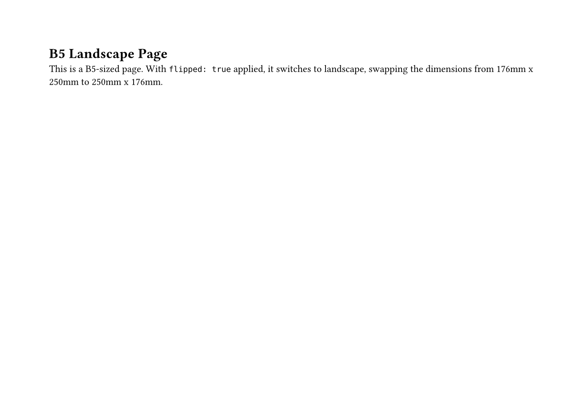
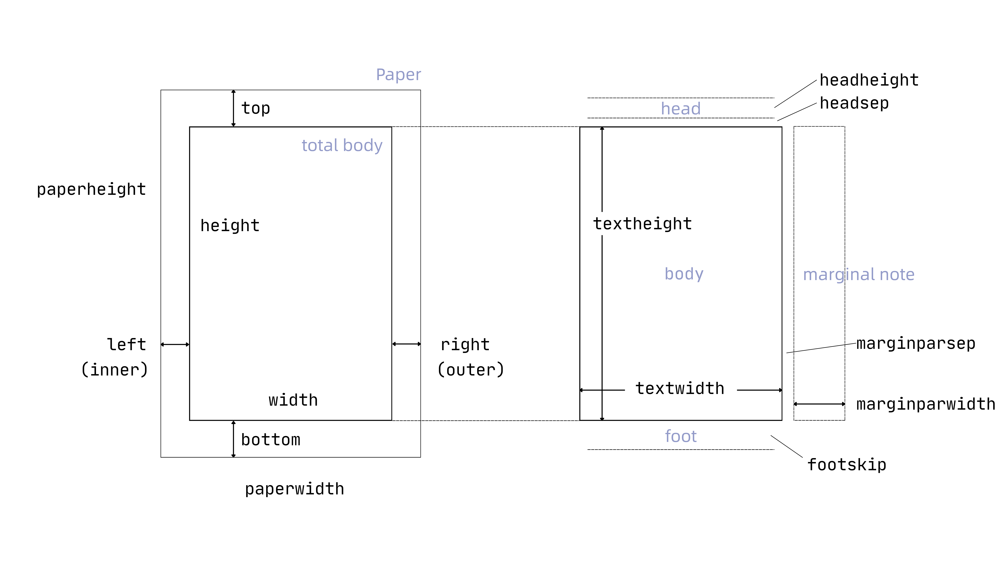
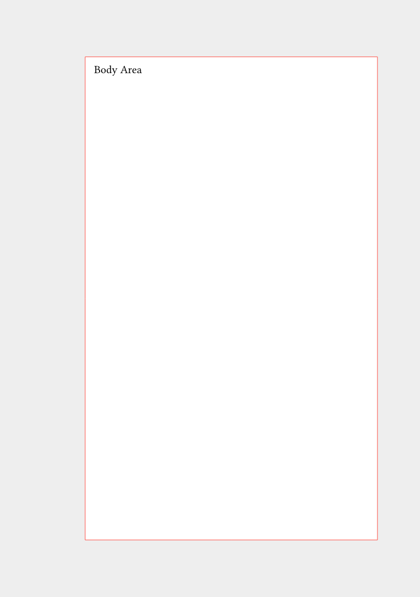
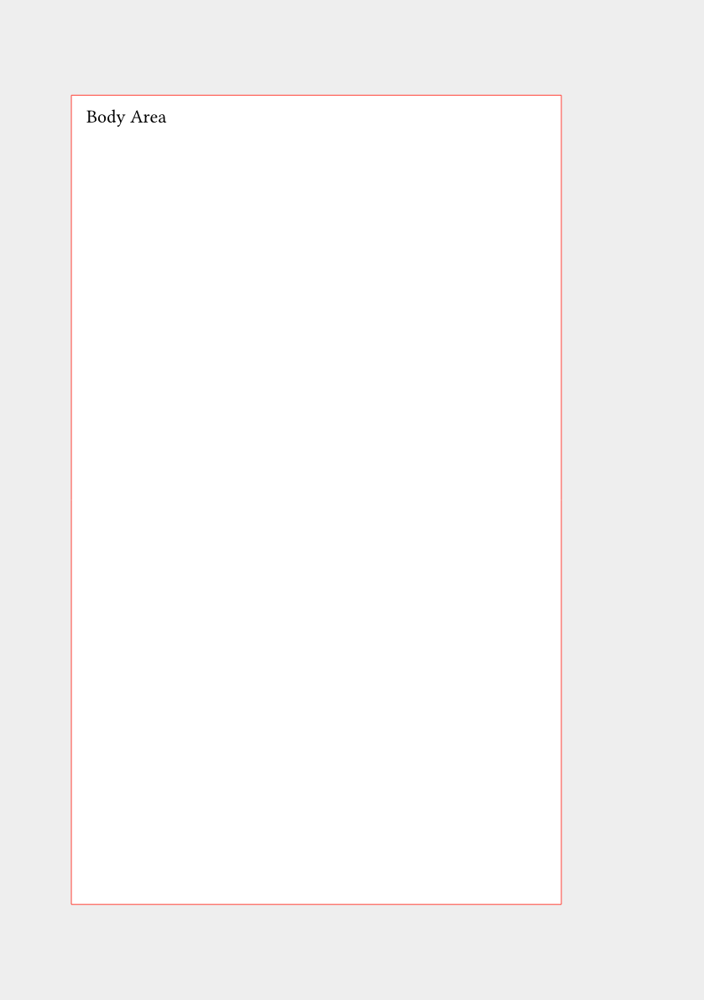
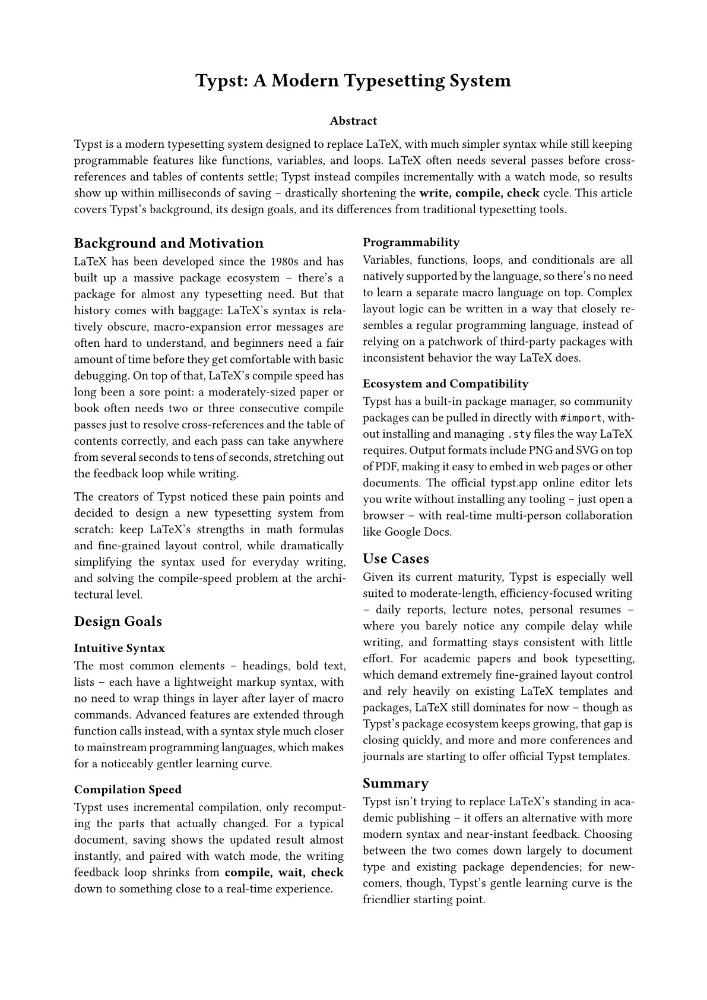
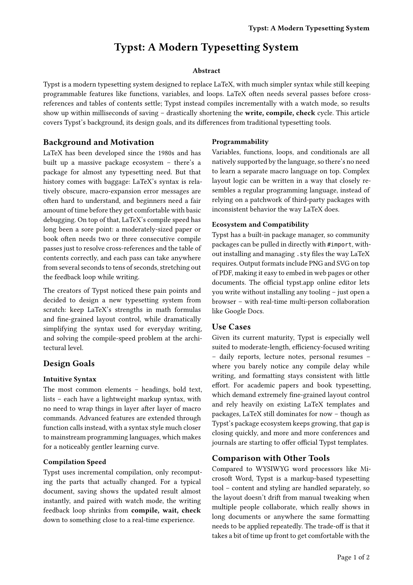
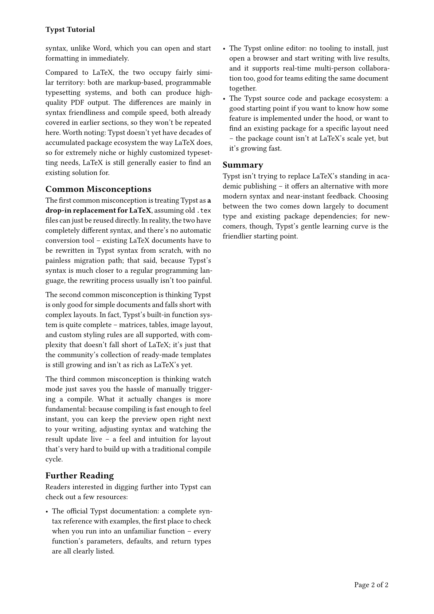

[The previous post](/articles/typst/day05-markup-code-math-en/) wrapped up two commonly-used markup features -- code blocks and math formulas -- covering syntax highlighting for inline and block code, and the rules for how formulas and variables get interpreted in math mode. This post moves up a level to handle the page itself: how big the paper is, how much margin to leave, whether to split into columns, and how to place page numbers and headers/footers -- the basic settings you can't avoid when laying out a document.

Paper size and orientation comes first, covering how to pick a standard size and how to adjust for a custom size or landscape orientation; then page margins, covering the difference between a uniform setting and per-side settings; then columns, letting content automatically flow into a multi-column layout; the page numbers section covers the basic format and custom placement; and it all wraps up with headers and footers, demonstrating how to add fixed content to the top and bottom of every page. The goal is to take a Typst document from plain body text to something that **looks like a proper formal document**.

## Paper Size and Orientation

The first thing to decide when writing a document is what size of paper it'll ultimately be printed on, and whether it's portrait or landscape. Typst splits this into two parts: a built-in table of standard paper sizes you can apply directly, and full support for custom width and height -- both handled through the same `page` function.

### Standard Paper Sizes

Typst has a large built-in table of standard paper sizes, applied directly via `#set page(paper: "...")` with a name string -- no need to look up obscure size conversions yourself:

| Name | Code | Dimensions (W x H) |
| --- | --- | --- |
| A3 | `a3` | 297mm x 420mm |
| A4 | `a4` | 210mm x 297mm |
| A5 | `a5` | 148mm x 210mm |
| A6 | `a6` | 105mm x 148mm |
| B5 (ISO) | `iso-b5` | 176mm x 250mm |
| US Letter | `us-letter` | 215.9mm x 279.4mm |
| US Legal | `us-legal` | 215.9mm x 355.6mm |

```
#set page(paper: "a4")
```

Typst's default paper is already A4, so there's no need to set this explicitly if that's what you want. More available paper codes can be found in the official Typst documentation, and the actual use cases for each size can be found in this [list of paper sizes](https://en.wikipedia.org/wiki/Paper_size).

### Custom Sizes and Landscape

If none of the standard sizes fit your needs (say, for a business card or a poster), you can specify dimensions directly with `width` and `height`:

```
#set page(width: 9cm, height: 5.5cm)
```

For a landscape layout, there's no need to swap the width and height numbers yourself -- just add `flipped: true`, and Typst will rotate the specified paper size into landscape:

```
#set page(paper: "a4", flipped: true)
```

### A Worked Example

Using the `page` function to place two different page settings in the same document: the first page is A4 in the default orientation, and the second switches to B5 in landscape:

```
#set text(font: ("Libertinus Serif", "PingFang TC"), size: 12pt)

#page(paper: "a4")[
  = A4 Portrait Page

  This is an A4-sized page in portrait (the default orientation), with paper dimensions of 210mm x 297mm.
]

#page(paper: "iso-b5", flipped: true)[
  = B5 Landscape Page

  This is a B5-sized page. With `flipped: true` applied, it switches to landscape, swapping the dimensions from 176mm x 250mm to 250mm x 176mm.
]
```

Compiling with `typst compile` produces two pages with different sizes and orientations:

<figure><figcaption>A4 portrait page output</figcaption></figure>

<figure><figcaption>B5 landscape page output</figcaption></figure>

## Page Margins

Once the paper size is decided, the next thing is how much space to leave between the body area and the paper's edges -- the margins. The diagram below lays out the terminology for page geometry:

<figure><figcaption>Page geometry diagram</figcaption></figure>

On the left, **paper height** and **paper width** correspond to the paper size set in the previous section; subtract the **top**, **bottom**, **left**, and **right** margins from that, and what's left -- the **body area** (**height** and **width**) -- is exactly the range the `margin` parameter in this section deals with. On the right, the **head** and **foot** areas are covered separately in the **Headers and Footers** section further down; **text height** and **text width** are about the paragraph's own font size and line spacing, which will be expanded on in a later post about paragraph settings.

The odd one out is the **marginal note** on the far right (along with **marginparsep** and **marginparwidth**) -- this is the common LaTeX convention of **reserving a side column next to the body for notes**, but Typst's `page` function has no corresponding built-in parameter for it; it has to be placed manually with the `place` function instead. That's covered in a later post on absolute positioning, so it's skipped here.

### Uniform Margins

The simplest case: pair `margin` with a single value, and all four sides get the same margin:

```
#set page(margin: 2.5cm)
```

Without an explicit setting, Typst's default margin value is `auto`, which picks a ratio automatically based on the paper size rather than a fixed number.

### Per-side Margins

`margin` can also take a dictionary, specifying `top`, `bottom`, `left`, and `right` individually, or `x` and `y` to set the horizontal and vertical directions at once -- any side left unfilled can be backfilled with a default via `rest`:

```
#set page(margin: (top: 3cm, bottom: 2cm, x: 2.5cm))
```

If a document is meant to be printed double-sided and bound (compare **inside margin** and **outside margin** in the diagram above), the binding side usually needs extra space -- in that case, `inside` and `outside` paired with the `binding` parameter fit better than `left` and `right`:

```
#set page(
  binding: left,
  margin: (inside: 3cm, outside: 1.5cm, y: 2cm),
)
```

`binding` specifies which side the binding is on; `inside` then automatically maps to whichever side is closer to the binding, and `outside` to the other side. That way odd and even pages automatically mirror their margins, without having to manually check which page needs which value.

### A Worked Example

The example below uses a red box flush against the body area to actually draw out how the `inside` and `outside` margins mirror between odd and even pages:

```
#set text(font: ("Libertinus Serif", "PingFang TC"), size: 11pt)
#set page(
  paper: "a5",
  binding: left,
  margin: (inside: 3cm, outside: 1.5cm, y: 2cm),
  fill: rgb("#eeeeee"),
)

#let area = rect(width: 100%, height: 100%, fill: white, stroke: 0.5pt + red)[
  #place(top + left, dx: 4pt, dy: 4pt)[Body Area]
]

#area
#pagebreak()
#area
```

After compiling, you can see: the first page (odd) has a wider left margin, and the second page (even) switches to a wider right margin -- the body areas on the two pages mirror each other left-to-right:

<figure><figcaption>Margin example output (page 1)</figcaption></figure>

<figure><figcaption>Margin example output (page 2)</figcaption></figure>

## Columns

Reports and handouts sometimes call for a newspaper-style multi-column layout. Typst offers two ways to do columns: applying it to the whole page, or scoping it to just one section of content while the rest stays single-column.

For full-page columns, use the `columns` parameter on the `page` function -- fill in a number to decide how many columns, and content automatically flows to fill each one in order:

```
#set page(columns: 2)
```

To scope columns to just one section of content while leaving the rest as single-column, wrap that section in the standalone `columns` function instead[^1], and `gutter` can adjust the spacing between columns (the default is 4% of the page width):

```
#columns(2, gutter: 12pt)[
  This is the content of the first column, which fills up before moving to the next.

  #colbreak()

  Adding `colbreak()` forces a break to the next column, without waiting for the previous one to fill up naturally.
]
```

Worth noting: the first argument to the `columns` function is the column count, and its default is 2; without manually controlling it with `colbreak()`, content fills up one column in its original order before moving to the next.

### A Worked Example

Write an example condensed onto a single A4 page: the top half is a single-column title and abstract, and the bottom half's body text is split into two columns with `columns` -- pretty close to a typical paper layout:

```
#set text(font: ("Libertinus Serif", "PingFang TC"), size: 10.5pt)
#set page(paper: "a4", margin: 2.2cm)
#set par(justify: true)

#align(center)[
  #text(size: 16pt, weight: "bold")[Typst: A Modern Typesetting System]
]

#v(0.6em)

#align(center)[#text(weight: "bold")[Abstract]]

Typst is a modern typesetting system designed to replace LaTeX, with much simpler syntax while still keeping programmable features like functions, variables, and loops. LaTeX often needs several passes before cross-references and tables of contents settle; Typst instead compiles incrementally with a watch mode, so results show up within milliseconds of saving -- drastically shortening the *write, compile, check* cycle. This article covers Typst's background, its design goals, and its differences from traditional typesetting tools.

#v(0.8em)

#columns(2, gutter: 16pt)[
  == Background and Motivation

  LaTeX has been developed since the 1980s and has built up a massive package ecosystem -- there's a package for almost any typesetting need. But that history comes with baggage: LaTeX's syntax is relatively obscure, macro-expansion error messages are often hard to understand, and beginners need a fair amount of time before they get comfortable with basic debugging. On top of that, LaTeX's compile speed has long been a sore point: a moderately-sized paper or book often needs two or three consecutive compile passes just to resolve cross-references and the table of contents correctly, and each pass can take anywhere from several seconds to tens of seconds, stretching out the feedback loop while writing.

  The creators of Typst noticed these pain points and decided to design a new typesetting system from scratch: keep LaTeX's strengths in math formulas and fine-grained layout control, while dramatically simplifying the syntax used for everyday writing, and solving the compile-speed problem at the architectural level.

  == Design Goals

  === Intuitive Syntax

  The most common elements -- headings, bold text, lists -- each have a lightweight markup syntax, with no need to wrap things in layer after layer of macro commands. Advanced features are extended through function calls instead, with a syntax style much closer to mainstream programming languages, which makes for a noticeably gentler learning curve.

  === Compilation Speed

  Typst uses incremental compilation, only recomputing the parts that actually changed. For a typical document, saving shows the updated result almost instantly, and paired with watch mode, the writing feedback loop shrinks from *compile, wait, check* down to something close to a real-time experience.

  === Programmability

  Variables, functions, loops, and conditionals are all natively supported by the language, so there's no need to learn a separate macro language on top. Complex layout logic can be written in a way that closely resembles a regular programming language, instead of relying on a patchwork of third-party packages with inconsistent behavior the way LaTeX does.

  === Ecosystem and Compatibility

  Typst has a built-in package manager, so community packages can be pulled in directly with `#import`, without installing and managing `.sty` files the way LaTeX requires. Output formats include PNG and SVG on top of PDF, making it easy to embed in web pages or other documents. The official typst.app online editor lets you write without installing any tooling -- just open a browser -- with real-time multi-person collaboration like Google Docs.

  == Use Cases

  Given its current maturity, Typst is especially well suited to moderate-length, efficiency-focused writing -- daily reports, lecture notes, personal resumes -- where you barely notice any compile delay while writing, and formatting stays consistent with little effort. For academic papers and book typesetting, which demand extremely fine-grained layout control and rely heavily on existing LaTeX templates and packages, LaTeX still dominates for now -- though as Typst's package ecosystem keeps growing, that gap is closing quickly, and more and more conferences and journals are starting to offer official Typst templates.

  == Summary

  Typst isn't trying to replace LaTeX's standing in academic publishing -- it offers an alternative with more modern syntax and near-instant feedback. Choosing between the two comes down largely to document type and existing package dependencies; for newcomers, though, Typst's gentle learning curve is the friendlier starting point.
]
```

After compiling with `typst compile`, the whole thing fits exactly on one A4 page:

<figure><figcaption>Columns example output</figcaption></figure>

## Page Numbers

Once a document has more than a few pages, page numbers are basically essential, letting readers know which page they're on and how many pages there are in total. Typst keeps this in the `page` function too, with format and placement each controlled by their own parameter.

### Basic Page Number Format

The `numbering` parameter controls whether page numbers show up and what format they use -- the pattern-string rules are the same ones used for heading numbering in [Day 04](/articles/typst/day04-lists-and-links-en/):

```
#set page(numbering: "1")
```

To show both the current page and total page count, use the `"1 / 1"` pattern, and Typst automatically computes the total and fills it in:

```
#set page(numbering: "1 / 1")
```

Just like heading numbering, `1` can be swapped for `a` (letters), `i` (Roman numerals), or other counting symbols, or combined into a custom format like `Page 1`. If `numbering` isn't set, page numbers are hidden by default.

### Custom Page Number Placement

By default, page numbers print centered in the footer. To change the position, use the `number-align` parameter. It takes a vertical direction (`top` for header, `bottom` for footer) combined with a horizontal direction (`left`, `center`, `right`) via `+`, giving six possible positions -- the same concept as the six-cell grid in [LaTeX's `fancyhdr`](https://ctan.org/pkg/fancyhdr?lang=en):

```
#set page(
  numbering: "1",
  number-align: right + top,
)
```

That switches the page number from the default centered footer to the top-right of the header.

### A Worked Example

Continuing with the Typst introduction example from the **Columns** section, add page numbers, changing the format to **Page x of x** and placing it at the bottom-right of the footer:

```
#set text(font: ("Libertinus Serif", "PingFang TC"), size: 10.5pt)
#set page(
  paper: "a4",
  margin: 2.2cm,
  numbering: (current, total) => [Page #current of #total],
  number-align: right + bottom,
)
#set par(justify: true)

#align(center)[
  #text(size: 16pt, weight: "bold")[Typst: A Modern Typesetting System]
]

...(omitted -- same content as the columns example above)
```

Here, `numbering` isn't a pattern string but a function: it takes the current page `current` and total page count `total` as two parameters, and returns whatever content you want, letting you assemble a format like **Page x of x** without being limited to the built-in pattern syntax. After compiling, the page number shows up at the bottom-right of the footer:

<figure><figcaption>Page number example output</figcaption></figure>

## Headers and Footers

Page numbers are just the most common kind of content in a footer (or header) -- the `page` function can actually fully customize what goes in the header and footer, not limited to numbers.

The `header` and `footer` parameters let you insert arbitrary content, with an effect similar to setting `numbering` directly, but you can put in titles, section names, and other static text:

```
#set page(
  header: align(right)[*Typst: A Modern Typesetting System*],
)
```

To have the header or footer show different content depending on the page number (say, odd vs. even) -- a common convention in books is putting the book title on odd pages and the chapter name on even pages -- you need `context` paired with `counter(page)` to read the current page number, then `calc.rem` to check odd or even:

```
#set page(
  header: context {
    let n = counter(page).get().first()
    if calc.rem(n, 2) == 1 {
      align(right)[*Typst: A Modern Typesetting System*]
    } else {
      align(left)[*Typst Tutorial*]
    }
  },
)
```

Worth noting: if `header` (or `footer` when `number-align` is set to top-aligned) has an explicit value, `numbering` gets ignored; but as long as the two are aligned to different positions (say, a title in the header and the page number left in the footer), they can coexist without overwriting each other.

### A Worked Example

Continuing with the Typst introduction example, this time adding a header that alternates between odd and even pages. The body also gets two more sections (Comparison with Other Tools, Further Reading) -- with the extra content, it naturally overflows onto a second page, which is exactly what lets us see the odd/even header difference:

```
#set text(font: ("Libertinus Serif", "PingFang TC"), size: 10.5pt)
#set page(
  paper: "a4",
  margin: 2.2cm,
  numbering: (current, total) => [Page #current of #total],
  number-align: right + bottom,
  header: context {
    let n = counter(page).get().first()
    if calc.rem(n, 2) == 1 {
      align(right)[*Typst: A Modern Typesetting System*]
    } else {
      align(left)[*Typst Tutorial*]
    }
  },
)
#set par(justify: true)

...(omitted -- same content as the columns example, with three extra sections added in the middle: Comparison with Other Tools, Common Misconceptions, Further Reading)
```

There's no manual `pagebreak()` here: it's purely that the content inside `columns` grew past what fits on one page, so it naturally overflows to the next, and the `columns` layout just continues right along with it. After compiling, there are two pages total: the first is an odd page, with the document title printed right-aligned in the header; the overflow onto the second page is an even page, with the header switching to left-aligned **Typst Tutorial**; the page number in the footer shows up correctly on both pages, without being covered by the header:

<figure><figcaption>Header and footer example output (page 1)</figcaption></figure>

<figure><figcaption>Header and footer example output (page 2)</figcaption></figure>

## Summary

This post covered paper size and orientation -- the standard size table, custom width/height, and landscape with `flipped`; page margins -- uniform settings, per-side settings, and `inside`/`outside` for binding; columns, in both full-page and scoped forms; page numbers, from the basic format to customizing all six placements; and finally headers and footers, demonstrating both static content and odd/even alternation. Put these settings together, and a Typst document finally has the skeleton a printed document is supposed to have.

The next post moves on to the `#set` rule itself, formally introducing this core concept that runs through Typst's entire style system -- the `#set text` and `#set page` usages scattered across earlier posts will get a more complete explanation.

See you next time~

[^1]: Once columns narrow things down, CJK text layout gets more sensitive to font choice: testing showed that without an explicit font (like the `("Libertinus Serif", "PingFang TC")` used throughout this post), the default CJK font the system picks automatically can, in narrow columns, miscalculate line spacing and cause whole paragraphs to overlap. Setting an explicit font fixed it. For columns and narrow layouts in general, it's worth making a habit of setting the font list up front to avoid this kind of layout breakage.
