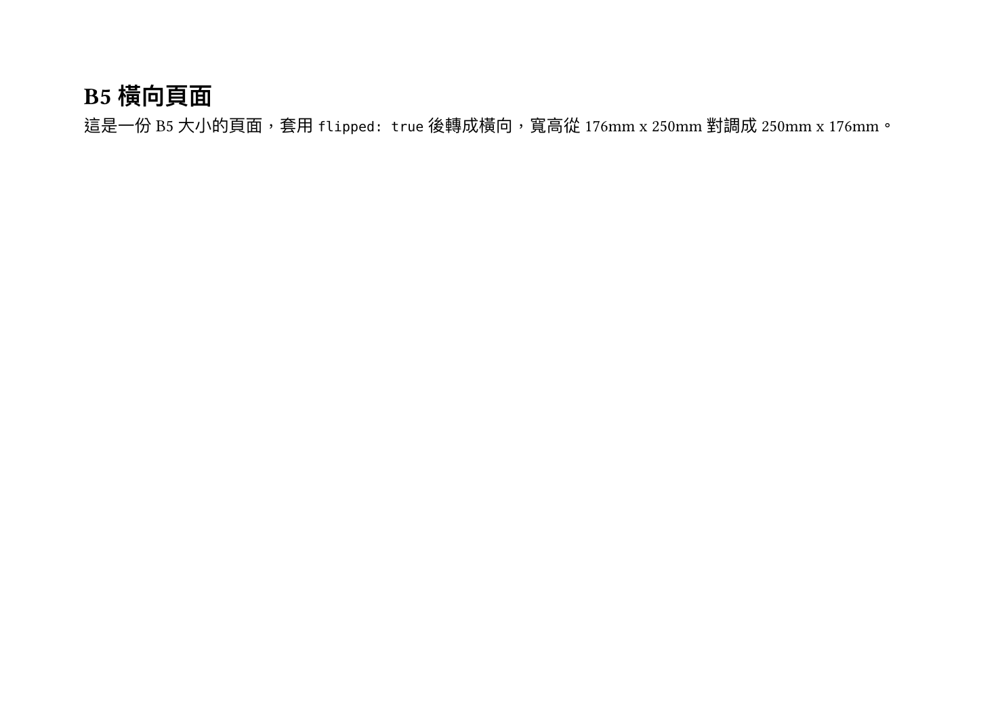
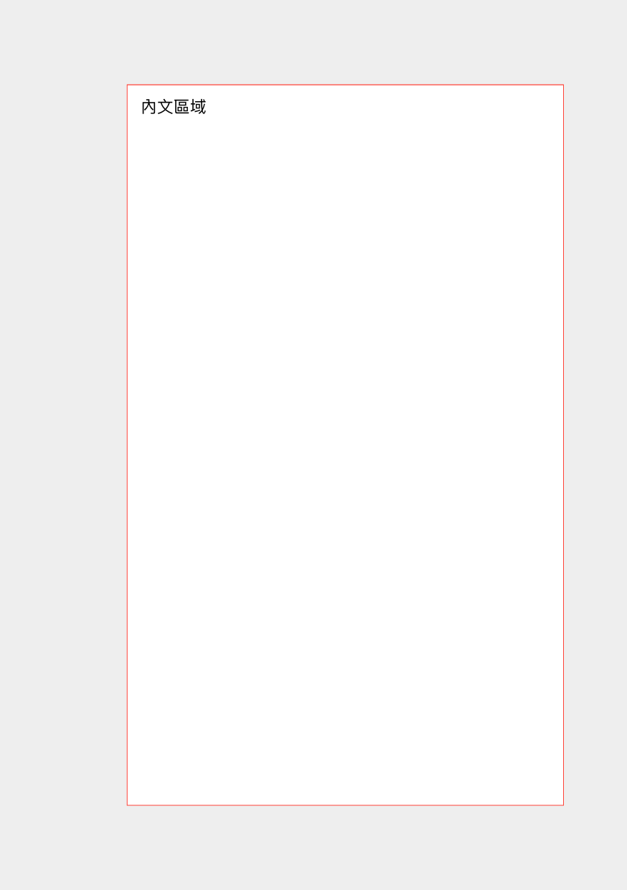
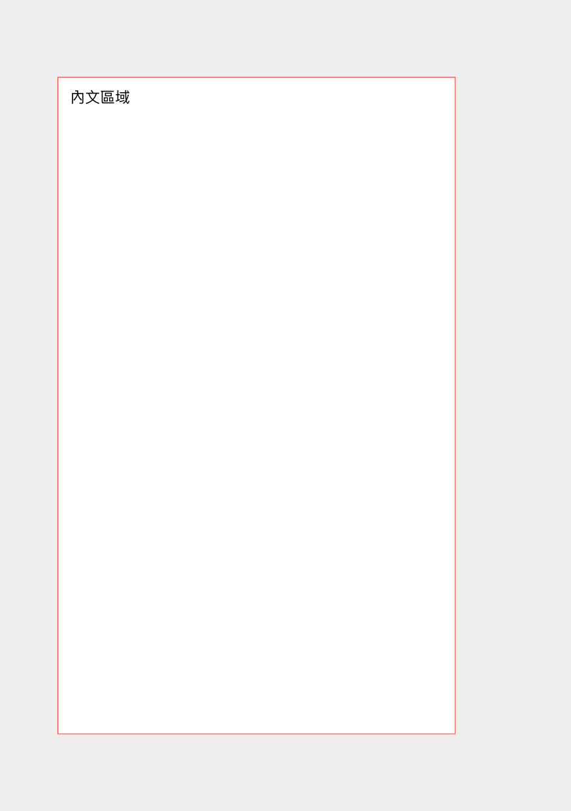
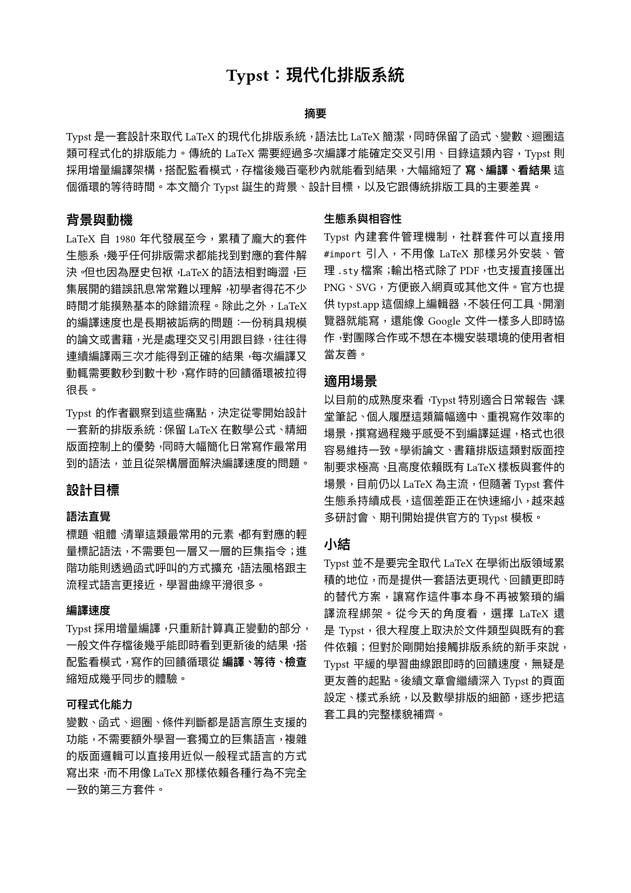
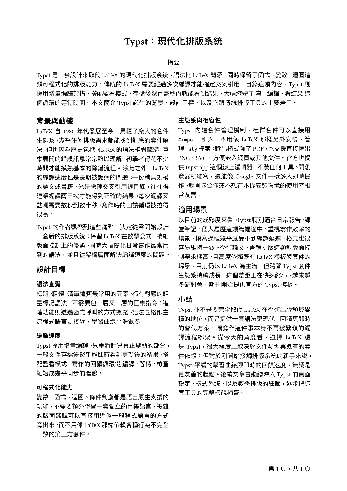
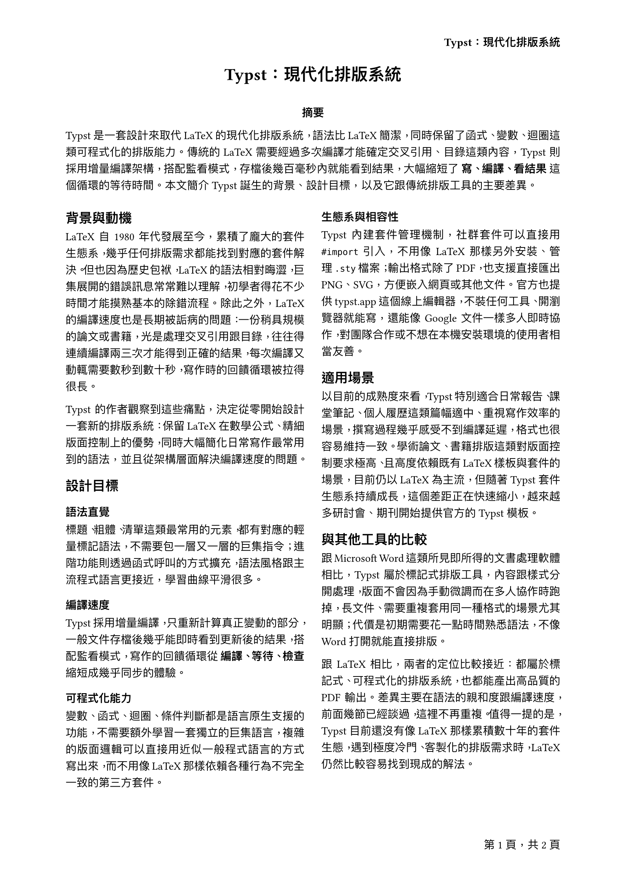
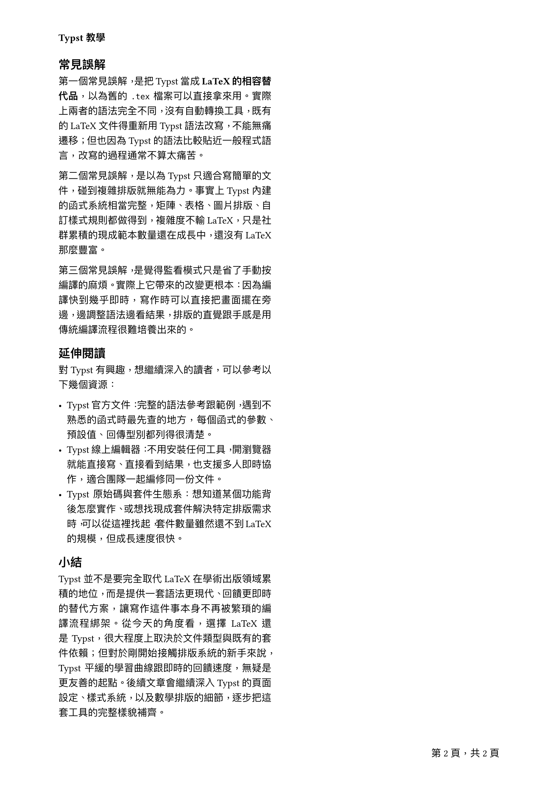

[上一篇](/articles/typst/day05-markup-code-math/)補完了程式碼區塊與數學公式這兩個常用標記，從行內、區塊程式碼的語法高亮，到數學模式裡公式跟變數的解讀規則。這篇要往上一層，處理整份文件的頁面本身，包含紙張多大、邊界留多少、要不要分欄、頁碼跟頁首頁尾怎麼擺等排版時繞不開的基本設定。

紙張大小與方向會先講標準尺寸怎麼選、需要自訂尺寸或橫向時怎麼調；接著是頁面邊界，統一設定跟四邊分別設定的差異；再來是分欄，讓內容自動排成多欄版面；頁碼的部分會講基本格式跟自訂位置；最後收在頁首與頁尾，示範怎麼在每一頁的上下方加上固定內容。目標是讓手上的 Typst 文件，從一份純內文，變成**看起來更像正式文件**的樣子。

## 紙張大小與方向

寫文件第一件要決定的事，就是這份文件最後要印在多大的紙上、直式還是橫式。Typst 把這件事切成兩塊：內建一份標準紙張尺寸表可以直接套用，也支援完全自訂寬高，兩種都可以用同一個 `page` 函式處理。

### 標準紙張尺寸

Typst 內建大量標準紙張尺寸，透過 `#set page(paper: "...")` 直接指定名稱字串就能套用，不用自己查冷門的尺寸換算：

| 名稱 | 代號 | 尺寸（寬 x 高） |
| --- | --- | --- |
| A3 | `a3` | 297mm x 420mm |
| A4 | `a4` | 210mm x 297mm |
| A5 | `a5` | 148mm x 210mm |
| A6 | `a6` | 105mm x 148mm |
| B5（ISO） | `iso-b5` | 176mm x 250mm |
| US Letter | `us-letter` | 215.9mm x 279.4mm |
| US Legal | `us-legal` | 215.9mm x 355.6mm |

```
#set page(paper: "a4")
```

Typst 預設紙張就是 A4，沒有特別指定的話不用另外設定。更多可用的紙張代號可以查 Typst 官方文件，各尺寸實際的使用場合則可以參考[紙張尺寸列表](https://zh.wikipedia.org/zh-tw/紙張尺寸)。

### 自訂尺寸與橫向

如果標準尺寸都不符合需求（例如要做名片、海報），可以用 `width`、`height` 直接指定尺寸：

```
#set page(
    width: 9cm,
    height: 5.5cm
)
```

想要橫向版面，不用自己把寬高數字對調，直接加上 `flipped: true`，Typst 就會把指定的紙張尺寸轉成橫向：

```
#set page(
    paper: "a4",
    flipped: true
)
```

### 實際範例

用 `page` 函式在同一份文件裡放兩種不同的頁面設定：第一頁是預設方向的 A4，第二頁換成橫向的 B5：

```
#set text(
    font: ("Libertinus Serif", "PingFang TC"),
    size: 12pt
)

#page(paper: "a4")[
  = A4 直式頁面

  這是一份 A4 大小、直式（預設方向）的頁面，紙張尺寸是 210mm x 297mm。
]

#page(paper: "iso-b5", flipped: true)[
  = B5 橫向頁面

  這是一份 B5 大小的頁面，套用 `flipped: true` 後轉成橫向，寬高從 176mm x 250mm 對調成 250mm x 176mm。
]
```

用 `typst compile` 編譯後，結果是兩頁不同大小、不同方向的頁面：

<figure><figcaption>A4 直式頁面輸出</figcaption></figure>

<figure><figcaption>B5 橫向頁面輸出</figcaption></figure>

## 頁面邊界

決定紙張大小之後，接著要決定內文區域跟紙張邊緣要留多少距離，也就是邊界。下圖整理了頁面幾何的幾個名詞：

<figure><figcaption>頁面幾何示意圖</figcaption></figure>

左半邊的**紙張高度**、**紙張寬度**，對應的就是上一節設定的紙張尺寸；扣掉四邊的**上邊距**、**下邊距**、**左邊距**、**右邊距**之後，剩下的**內文區域**（**內文高度**、**內文寬度**）就是這一節 `margin` 參數要處理的範圍。右半邊的**頁首區域**、**頁尾區域**，會在後面**頁首與頁尾**那節另外說明；**內文文字高度**、**內文文字寬度**則是段落本身的字級、行距，留到之後講段落設定的文章再展開。

比較特別的是最右邊的**邊註**（連同**邊註間距**、**邊註區寬度**）——這是 LaTeX 常見的、**在內文旁邊留一欄放註解**的排版方式，但 Typst 的 `page` 函式並沒有對應的內建參數，得靠 `place` 函式手動把內容放到指定位置，這部分等後面講到絕對定位的文章再處理，這篇先跳過。

### 統一邊界

最簡單的情況，用 `margin` 搭配單一數值，就能讓四邊套用同一個邊界：

```
#set page(margin: 2.5cm)
```

沒特別設定時，Typst 的邊界預設值是 `auto`，會依照紙張大小自動抓一個比例，不是固定的數字。

### 各邊分別設定

`margin` 也可以吃一個字典，分別指定 `top`、`bottom`、`left`、`right`，或用 `x`、`y` 一次設定水平、垂直方向，剩下沒填的邊則可以用 `rest` 補上預設值：

```
#set page(margin: (top: 3cm, bottom: 2cm, x: 2.5cm))
```

如果文件是要雙面印刷、裝訂成冊的（對照上圖的**內側邊距**、**外側邊距**），裝訂側通常要留比較大的空間，這時候比起 `left`、`right`，更適合用 `inside`、`outside` 搭配 `binding` 參數：

```
#set page(
  binding: left,
  margin: (inside: 3cm, outside: 1.5cm, y: 2cm),
)
```

`binding` 指定裝訂邊在哪一側，`inside` 就會自動對應到靠近裝訂邊的那一側，`outside` 則是另一側；這樣奇偶頁就能自動對稱翻轉邊界，不用自己手動判斷哪一頁該用哪個數值。

### 實際範例

底下的範例用一個貼齊內文區域的紅框，實際畫出 `inside`、`outside` 邊界在奇偶頁之間怎麼對稱翻轉：

```
#set text(
    font: ("Libertinus Serif", "PingFang TC"),
    size: 11pt
)
#set page(
  paper: "a5",
  binding: left,
  margin: (inside: 3cm, outside: 1.5cm, y: 2cm),
  fill: rgb("#eeeeee"),
)

#let area = rect(width: 100%, height: 100%, fill: white, stroke: 0.5pt + red)[
  #place(top + left, dx: 4pt, dy: 4pt)[內文區域]
]

#area
#pagebreak()
#area
```

編譯後可以看到：第一頁（奇數頁）左邊界比較寬，第二頁（偶數頁）換成右邊界比較寬，兩頁的內文區域左右對稱：

<figure><figcaption>邊界範例輸出（第一頁）</figcaption></figure>

<figure><figcaption>邊界範例輸出（第二頁）</figcaption></figure>

## 分欄

報告、講義這類文件有時候會想排成報紙那種多欄版面。Typst 提供兩種分欄方式：一種是整頁套用，另一種是只讓某一段內容分欄，其他地方維持單欄。

整頁分欄用 `page` 函式的 `columns` 參數，填數字決定要分幾欄，內容會自動依序填滿每一欄：

```
#set page(columns: 2)
```

只想讓某一段內容分欄，其他地方維持原本的單欄排版，則要用獨立的 `columns` 函式包住那段內容[^1]，並且可以用 `gutter` 調整欄與欄之間的間距（預設是頁面寬度的 4%）：

```
#columns(2, gutter: 12pt)[
  這是第一欄的內容，會先填滿再換到下一欄。

  #colbreak()

  加上 `colbreak()`，可以強制換到下一欄，不用等前一欄自然排滿。
]
```

要注意的是，`columns` 函式的第一個參數是欄數，預設值是 2；如果不用 `colbreak()` 手動控制，內容會依照原本的順序自動排滿一欄才換下一欄。

### 實際範例

寫一份濃縮在一頁 A4 裡的範例：上半部是單欄的標題跟摘要，下半部的內文則用 `columns` 分成兩欄，很接近常見的論文排版：

```
#set text(
    font: ("Libertinus Serif", "PingFang TC"),
    size: 10.5pt
)
#set page(
    paper: "a4",
    margin: 2.2cm
)
#set par(justify: true)

#align(center)[
  #text(size: 16pt, weight: "bold")[Typst：現代化排版系統]
]

#v(0.6em)

#align(center)[#text(weight: "bold")[摘要]]

Typst 是一套設計來取代 LaTeX 的現代化排版系統，語法比 LaTeX 簡潔，同時保留了函式、變數、迴圈這類可程式化的排版能力。傳統的 LaTeX 需要經過多次編譯才能確定交叉引用、目錄這類內容，Typst 則採用增量編譯架構，搭配監看模式，存檔後幾百毫秒內就能看到結果，大幅縮短了 *寫、編譯、看結果* 這個循環的等待時間。本文簡介 Typst 誕生的背景、設計目標，以及它跟傳統排版工具的主要差異。

#v(0.8em)

#columns(2, gutter: 16pt)[
  == 背景與動機

  LaTeX 自 1980 年代發展至今，累積了龐大的套件生態系，幾乎任何排版需求都能找到對應的套件解決。但也因為歷史包袱，LaTeX 的語法相對晦澀，巨集展開的錯誤訊息常常難以理解，初學者得花不少時間才能摸熟基本的除錯流程。除此之外，LaTeX 的編譯速度也是長期被詬病的問題：一份稍具規模的論文或書籍，光是處理交叉引用跟目錄，往往得連續編譯兩三次才能得到正確的結果，每次編譯又動輒需要數秒到數十秒，寫作時的回饋循環被拉得很長。

  Typst 的作者觀察到這些痛點，決定從零開始設計一套新的排版系統：保留 LaTeX 在數學公式、精細版面控制上的優勢，同時大幅簡化日常寫作最常用到的語法，並且從架構層面解決編譯速度的問題。

  == 設計目標

  === 語法直覺

  標題、粗體、清單這類最常用的元素，都有對應的輕量標記語法，不需要包一層又一層的巨集指令；進階功能則透過函式呼叫的方式擴充，語法風格跟主流程式語言更接近，學習曲線平滑很多。

  === 編譯速度

  Typst 採用增量編譯，只重新計算真正變動的部分，一般文件存檔後幾乎能即時看到更新後的結果，搭配監看模式，寫作的回饋循環從 *編譯、等待、檢查* 縮短成幾乎同步的體驗。

  === 可程式化能力

  變數、函式、迴圈、條件判斷都是語言原生支援的功能，不需要額外學習一套獨立的巨集語言，複雜的版面邏輯可以直接用近似一般程式語言的方式寫出來，而不用像 LaTeX 那樣依賴各種行為不完全一致的第三方套件。

  === 生態系與相容性

  Typst 內建套件管理機制，社群套件可以直接用 `#import` 引入，不用像 LaTeX 那樣另外安裝、管理 `.sty` 檔案；輸出格式除了 PDF，也支援直接匯出 PNG、SVG，方便嵌入網頁或其他文件。官方也提供 typst.app 這個線上編輯器，不裝任何工具、開瀏覽器就能寫，還能像 Google 文件一樣多人即時協作，對團隊合作或不想在本機安裝環境的使用者相當友善。

  == 適用場景

  以目前的成熟度來看，Typst 特別適合日常報告、課堂筆記、個人履歷這類篇幅適中、重視寫作效率的場景，撰寫過程幾乎感受不到編譯延遲，格式也很容易維持一致。學術論文、書籍排版這類對版面控制要求極高、且高度依賴既有 LaTeX 樣板與套件的場景，目前仍以 LaTeX 為主流，但隨著 Typst 套件生態系持續成長，這個差距正在快速縮小，越來越多研討會、期刊開始提供官方的 Typst 模板。

  == 小結

  Typst 並不是要完全取代 LaTeX 在學術出版領域累積的地位，而是提供一套語法更現代、回饋更即時的替代方案，讓寫作這件事本身不再被繁瑣的編譯流程綁架。從今天的角度看，選擇 LaTeX 還是 Typst，很大程度上取決於文件類型與既有的套件依賴；但對於剛開始接觸排版系統的新手來說，Typst 平緩的學習曲線跟即時的回饋速度，無疑是更友善的起點。後續文章會繼續深入 Typst 的頁面設定、樣式系統，以及數學排版的細節，逐步把這套工具的完整樣貌補齊。
]
```

用 `typst compile` 編譯後，整份內容剛好收在一頁 A4 裡：

<figure><figcaption>分欄範例輸出</figcaption></figure>

## 頁碼

頁數一多，頁碼幾乎是必備的元素，方便讀者知道自己看到第幾頁、全部有多少頁。Typst 一樣把這件事收在 `page` 函式裡，格式跟位置各自用一個參數控制。

### 基本頁碼格式

`numbering` 參數控制頁碼要不要顯示、顯示成什麼格式，寫法跟 [Day 04](/articles/typst/day04-lists-and-links/) 講過的標題編號是同一套 pattern 字串規則：

```
#set page(numbering: "1")
```

如果想同時顯示目前頁數跟總頁數，可以用 `"1 / 1"` 這個 pattern，Typst 會自動算出總頁數填進去：

```
#set page(numbering: "1 / 1")
```

跟標題編號一樣，`1` 也可以換成 `a`（字母）、`i`（羅馬數字）這類其他計數符號，或是自己排列組合成 `第 1 頁` 這種格式。沒有設定 `numbering` 的話，頁碼預設是不顯示的。

### 自訂頁碼位置

頁碼預設會印在頁尾置中，如果想換位置，要用 `number-align` 參數。它接受垂直方向（`top` 頁首、`bottom` 頁尾）加水平方向（`left`、`center`、`right`）用 `+` 組合起來，總共六種位置可以選，跟 [LaTeX 的 `fancyhdr`](https://ctan.org/pkg/fancyhdr?lang=en) 六宮格是同一個概念：

```
#set page(
  numbering: "1",
  number-align: right + top,
)
```

這樣頁碼就會從預設的頁尾置中，換成頁首右上角。

### 實際範例

沿用**分欄**那節寫的 Typst 介紹範例，加上頁碼，格式改成中文的**第 x 頁，共 x 頁**，位置放在頁尾右下角：

```
#set text(
    font: ("Libertinus Serif", "PingFang TC"),
    size: 10.5pt
)
#set page(
  paper: "a4",
  margin: 2.2cm,
  numbering: (current, total) => [第 #current 頁，共 #total 頁],
  number-align: right + bottom,
)
#set par(justify: true)

#align(center)[
  #text(size: 16pt, weight: "bold")[Typst：現代化排版系統]
]

...（中略，內容跟前面分欄範例相同）
```

`numbering` 這裡不是填 pattern 字串，而是一個函式：接收目前頁數 `current` 跟總頁數 `total` 兩個參數，回傳想要的內容，就能拼出**第 x 頁，共 x 頁**這種中文格式，不受限於內建的 pattern 語法。編譯後，頁碼出現在頁尾右下角：

<figure><figcaption>頁碼範例輸出</figcaption></figure>

## 頁首與頁尾

頁碼只是頁尾（或頁首）裡最常見的一種內容，`page` 函式其實可以完全自訂頁首、頁尾要放什麼，不限於數字。

用 `header`、`footer` 兩個參數就能塞進任意內容，效果跟直接設定 `numbering` 類似，但可以放標題、章節名稱這類靜態文字：

```
#set page(
  header: align(right)[*Typst：現代化排版系統*],
)
```

如果想讓頁首、頁尾隨著頁數（例如奇偶頁）顯示不同內容——書籍常見的排版習慣是奇數頁放書名、偶數頁放章節名，這時候要用 `context` 搭配 `counter(page)` 讀出目前頁數，再用 `calc.rem` 判斷奇偶：

```
#set page(
  header: context {
    let n = counter(page).get().first()
    if calc.rem(n, 2) == 1 {
      align(right)[*Typst：現代化排版系統*]
    } else {
      align(left)[*Typst 教學*]
    }
  },
)
```

要注意的是，如果 `header`（或 `number-align` 設成頂端對齊時的 `footer`）有明確給值，`numbering` 就會被忽略；但只要兩者對齊的位置不同（例如頁首放標題、頁碼留在頁尾），就可以並存，不會互相蓋掉。

### 實際範例

繼續沿用 Typst 介紹那份範例，這次加上奇偶頁交替的頁首，內文也補多兩節（與其他工具的比較、延伸閱讀），份量增加後自然溢到第二頁，正好可以看出奇偶頁的頁首差異：

```
#set text(
    font: ("Libertinus Serif", "PingFang TC"),
    size: 10.5pt
)
#set page(
  paper: "a4",
  margin: 2.2cm,
  numbering: (current, total) => [第 #current 頁，共 #total 頁],
  number-align: right + bottom,
  header: context {
    let n = counter(page).get().first()
    if calc.rem(n, 2) == 1 {
      align(right)[*Typst：現代化排版系統*]
    } else {
      align(left)[*Typst 教學*]
    }
  },
)
#set par(justify: true)

...（中略，內容跟前面的分欄範例相同，中間多補了與其他工具的比較、常見誤解、延伸閱讀三節）
```

這裡沒有手動加 `pagebreak()`：純粹是 `columns` 裡的內容變多，超過一頁裝得下的量，自然溢到下一頁，`columns` 分欄的排版也會直接延續過去。編譯後總共兩頁：第一頁是奇數頁，頁首靠右印文件標題；溢到的第二頁是偶數頁，頁首換成靠左的**Typst 教學**，頁尾的頁碼則兩頁都正常顯示，沒有被頁首蓋掉：

<figure><figcaption>頁首與頁尾範例輸出（第一頁）</figcaption></figure>

<figure><figcaption>頁首與頁尾範例輸出（第二頁）</figcaption></figure>

## 小結

這篇講解了紙張大小與方向，標準尺寸表跟自訂寬高、`flipped` 橫向；頁面邊界，統一設定、各邊分別設定，還有裝訂用的 `inside`、`outside`；分欄則講了整頁分欄跟區域分欄兩種寫法；頁碼的部分從基本格式講到六個位置的自訂；最後是頁首與頁尾，示範了靜態內容跟奇偶頁交替兩種用法。這幾個設定組合起來，一份 Typst 文件終於有了紙本文件該有的骨架。

下一篇要往 `#set` 規則本身走，正式介紹這個貫穿整個 Typst 樣式系統的核心概念，之前散落在各篇文章裡的 `#set text`、`#set page` 這些用法，會有一個更完整的說明。

我們下次見囉～

[^1]: 分欄之後每一欄變窄，中文字排版更容易受字型影響：實測發現如果沒有明確指定字型（例如整篇都用的 `("Libertinus Serif", "PingFang TC")`），系統自動選到的預設中文字型，在窄欄位下可能會出現行距計算錯誤、整段文字疊在一起的問題，指定好字型後就正常了。分欄、窄版面這類場景，養成習慣先設定好字型清單，比較不會遇到這種排版跑掉的狀況。
