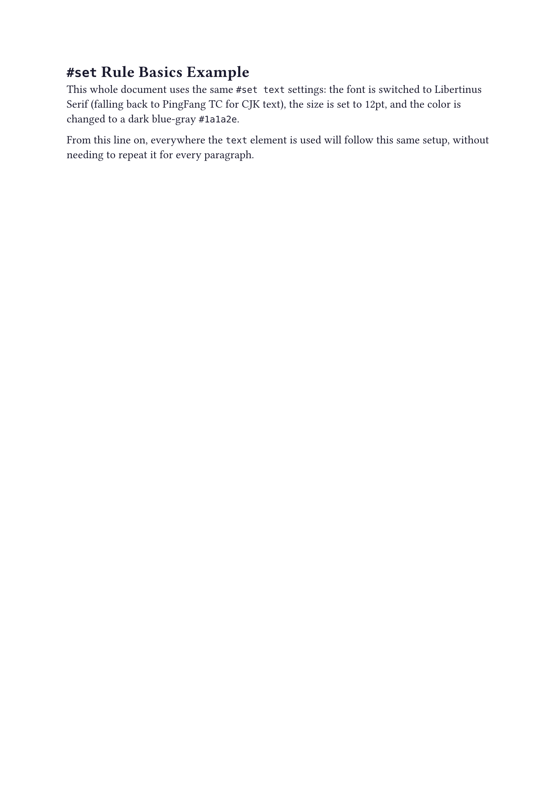
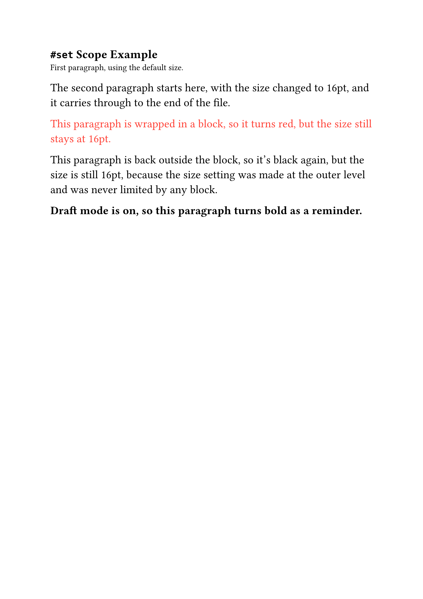
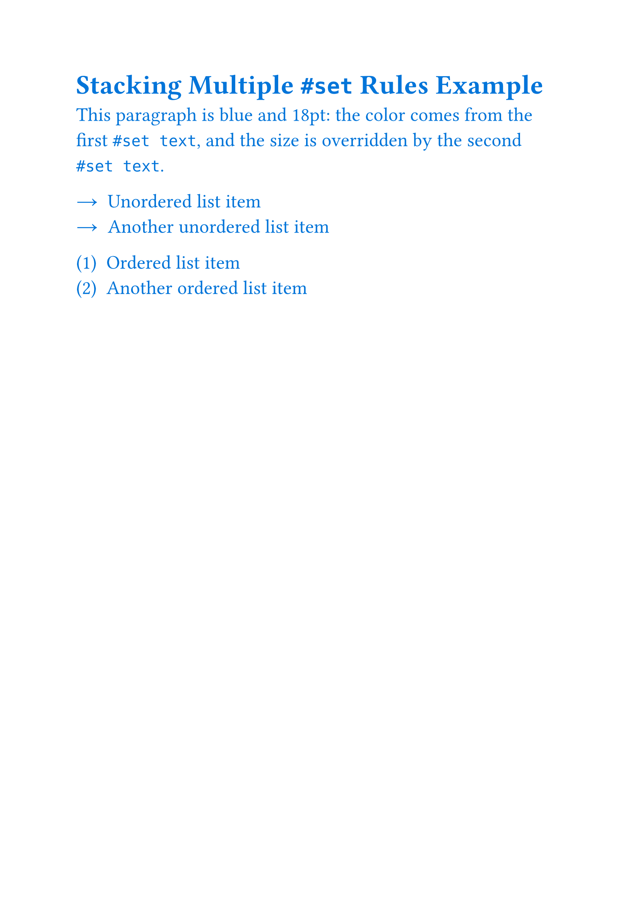
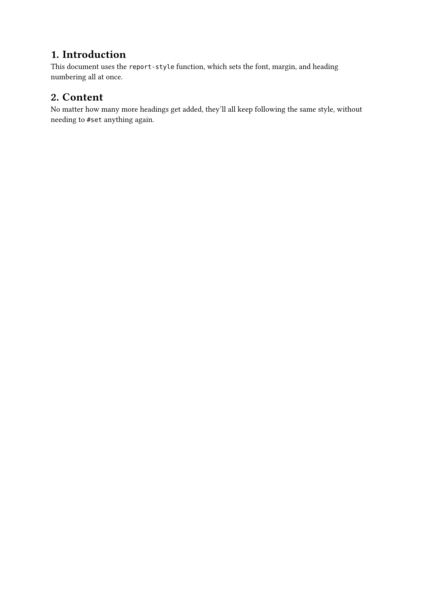

[The previous post](/articles/typst/day06-page-and-layout-en/) covered page settings -- paper size, margins, columns, page numbers, and headers/footers. The `#set text`, `#set page`, and `#set heading` used throughout those posts are all actually the same mechanism: the `#set` rule. This post goes back to properly untangle this core concept that runs through Typst's entire style system.

`#set` Rule Basics covers how the syntax is written and which parameters can be set; Scope explains exactly how far a single `#set` reaches -- across a whole file, limited to a block, or applied conditionally with `if`; Stacking Multiple `#set` Rules clears up how the same function gets overridden property-by-property while different functions stay completely independent; and finally, there's a demonstration of packaging a common group of `#set` rules into a function for reuse. The goal is to turn the `#set` syntax used in earlier posts from something you **copy from an example** into something you actually **understand**.

## `#set` Rule Basics

Earlier posts have already used `#set` plenty of times. This section breaks it down step by step: how the syntax is written, what's happening underneath, and which parameters can actually go into it.

### Syntax and How It Works

A `#set` rule always follows the same shape: the `set` keyword, followed by the name of an element function[^1], followed by the desired values as named arguments:

```
#set text(size: 14pt)

This paragraph will be 14pt.
```

You can think of what's happening underneath as Typst keeping a **list of currently active styles** for each element. A `#set` rule pushes a new style onto that list. From that line onward, everywhere the `text` element gets used -- including plain text typed directly in markup -- picks up the newest setting on that list, until it's overridden or falls out of scope.

### Settable Parameters

Not every parameter of a function can go into a `#set` rule. Only **named, optional** parameters can -- things like `text`'s `size`, `font`, and `fill`. **Positional, required** parameters -- like the actual text content passed to `text` -- can't be set this way:

```
#set text("this is some text")
```

This fails to compile with the error `unexpected argument`, because the text content of `text` is a required positional parameter, not something `#set` can handle.

To tell whether a parameter can be set, just check that function's parameter list in the [official Typst documentation](https://typst.app/docs/reference/text/text/): each parameter has a badge underneath it. One labeled `Settable` can go into a `#set` rule, usually along with a `Default` line showing its default value; one with no `Settable` badge, only `Positional` or `Required`, is a positional or required parameter and can't be set. Here's what that looks like for the `font` parameter of the `text` function:

<figure><figcaption>The Settable badge on the font parameter in the Typst docs</figcaption></figure>

That confirms `font` is a parameter you can set with `#set`.

### A Worked Example

Combining a few settable parameters into a document with a custom font, size, and color:

```
#set text(
    font: ("Libertinus Serif", "PingFang TC"),
    size: 12pt,
    fill: rgb("#1a1a2e")
)

= `#set` Rule Basics Example

This whole document uses the same `#set text` settings: the font is switched to Libertinus Serif (falling back to PingFang TC for CJK text), the size is set to 12pt, and the color is changed to a dark blue-gray `#1a1a2e`.

From this line on, everywhere the `text` element is used will follow this same setup, without needing to repeat it for every paragraph.
```

After compiling, the result looks like this:

<figure><figcaption>#set rule basics example output</figcaption></figure>

## Scope

`#set` isn't a global on/off switch -- it follows clear scoping rules for exactly where it starts and where it stops. This section breaks down three common situations.

### From Where It's Set to the End of the File

A `#set` written at the top level (not wrapped in any block) takes effect from the line it appears on, all the way through to the end of the file:

```
First paragraph, using the default size.

#set text(size: 18pt)

The second paragraph starts here, with the size changed to 18pt, and every paragraph after it follows the same setting.
```

The first paragraph, before the `#set`, keeps the default; everything from the second paragraph onward -- including every later paragraph that doesn't set its own size -- picks up the new one.

### Limiting the Scope with a Block

If you only want a small piece of content to get a special setting, without affecting the rest of the document, wrap the `#set` and the content it should affect together inside square brackets `[...]`. Once the block ends, the setting automatically stops applying, and content outside is unaffected:

```
This paragraph keeps the default style.

#[
  #set text(fill: red)
  This paragraph is wrapped in a block, so it turns red.
]

This paragraph is back outside the block, so it reverts to the default style -- the `#set` inside the block doesn't reach it.
```

### Applying Conditionally with `if`

Sometimes you want a `#set` to apply only under a certain condition -- say, turning text red only in draft mode, as a reminder. There's an easy trap here: if you put the `#set` inside an `if`'s `{}` code block, separate from the content it's supposed to affect, you'll find it simply doesn't work:

```
#let draft = true

#[
  #if draft {
    set text(fill: red)
  }
  This paragraph is supposed to turn red.
]
```

After actually compiling this, the text stays black -- the `set` inside the `if` has no effect at all. This ties back to the block-scoping rule from the previous section: `{ set text(fill: red) }` is itself a block, and since there's nothing else inside it besides that one `set` line, the block ends the instant the setting is written -- its scope hits zero before it ever gets a chance to reach the content sitting just outside it (even one line away).

The correct way to write it is to wrap the `#set` and the content it should affect together inside the same square-bracket `[...]` branch, instead of splitting them between `{}` and the outside:

```
#let draft = true

#[
  #if draft [
    #set text(fill: red)
    This paragraph is supposed to turn red.
  ] else [
    This paragraph is supposed to turn red.
  ]
]
```

Written this way, when `draft` is `true`, execution enters the first branch, and the `set` and the following text are both inside the same `[...]` -- so the setting actually takes effect.

### A Worked Example

Combining all three scoping situations -- to-the-end-of-file, block-limited, and conditional -- into one document:

```
#set text(
    font: ("Libertinus Serif", "PingFang TC"),
    size: 12pt
)

= `#set` Scope Example

First paragraph, using the default size.

#set text(size: 16pt)

The second paragraph starts here, with the size changed to 16pt, and it carries through to the end of the file.

#[
  #set text(fill: red)
  This paragraph is wrapped in a block, so it turns red, but the size still stays at 16pt.
]

This paragraph is back outside the block, so it's black again, but the size is still 16pt, because the size setting was made at the outer level and was never limited by any block.

#let draft = true

#if draft [
  #set text(weight: "bold")
  Draft mode is on, so this paragraph turns bold as a reminder.
] else [
  This paragraph keeps the normal style.
]
```

After compiling with `typst compile`, the result looks like this:

<figure><figcaption>#set scope example output</figcaption></figure>

You can see from this output: the red only shows up inside the block, but the size stays 16pt even outside it -- because the size was set at the outer level and was never limited by any block, which is a completely different scope than the color set inside the block. The conditional-apply section deliberately uses `weight: "bold"`[^2] instead of italics.

## Stacking Multiple `#set` Rules

In practice, you rarely write just one `#set`. This section looks at how Typst decides the final result when several `#set` rules stack together.

### Same Function: Later Overrides Earlier

Setting the same function with `#set` more than once doesn't mean the later call wipes out everything the earlier one set -- it's compared **property by property**: for a property both calls touch, the later value wins; for a property only the earlier call touched, that value is kept:

```
#set text(fill: blue)
#set text(size: 20pt)

This paragraph is blue and 20pt -- the color comes from the first #set, the size comes from the second #set, and they stack instead of overwriting each other.
```

Since the two `#set` calls set different properties, the end result is exactly the same as writing one combined `#set` with both properties together:

```
#set text(
  fill: blue,
  size: 20pt,
)
```

Whether you write it split up or combined, as long as there's no overlapping property, the effect is identical -- it's purely a matter of style, and neither way is more "correct."

It's only when two `#set` calls set the *same* property that the later one wins:

```
#set text(fill: blue)
#set text(fill: red)

This paragraph is red, because fill was set twice, and the last one wins.
```

### Different Functions: No Effect on Each Other

Different element functions each keep their own independent list of styles. Setting one function with `#set` never affects another function's settings, even when both appear in the same document:

```
#set list(marker: [→])
#set enum(numbering: "(1)")

- Unordered list item
+ Ordered list item
```

`#set list` only affects unordered lists starting with `-`, and `#set enum` only affects ordered lists starting with `+` -- their markers and numbering don't interfere with each other. That's also why earlier posts could `#set text`, `#set page`, and `#set heading` all at once without worrying about them clashing.

### A Worked Example

Combining same-function stacking and different-function independence into one document:

```
#set text(
    font: ("Libertinus Serif", "PingFang TC"),
    size: 12pt
)
#set text(fill: blue)
#set text(size: 18pt)

= Stacking Multiple `#set` Rules Example

This paragraph is blue and 18pt: the color comes from the first `#set text`, and the size is overridden by the second `#set text`.

#set list(marker: [→])
#set enum(numbering: "(1)")

- Unordered list item
- Another unordered list item

+ Ordered list item
+ Another ordered list item
```

After compiling with `typst compile`, the result looks like this:

<figure><figcaption>Stacking multiple #set rules example output</figcaption></figure>

## Packaging into a Reusable Function

This post hasn't formally covered how to write your own function yet -- this is the first time the series touches on it, so don't worry: only the simplest possible form gets used here, and the full function syntax is saved for a later post dedicated to functions. This section is purely about wrapping up a commonly-used group of `#set` rules for reuse.

If the same group of `#set` rules keeps getting applied across different documents (say, a company's internal reports always need a certain font and a certain margin), retyping it every time gets old fast. You can use `#let` to package that group of settings into a function:

```
#let report-style(body) = {
  set text(font: ("Libertinus Serif", "PingFang TC"), size: 11pt)
  set page(margin: 2.5cm)
  set heading(numbering: "1.")
  body
}
```

Breaking that down: `#let report-style(body) = {...}` defines a function called `report-style` that takes one parameter, `body` (the content that this set of styles should apply to). Inside the braces, a few `#set` rules come first, and the last line is just `body`, passing the original content straight back out -- without that last line, whatever gets passed in as `body` would simply vanish and never show up in the final document.

Once it's defined, apply it to the rest of the document with `#show: report-style`:

```
#show: report-style

= Chapter One
Content...

= Chapter Two
Content...
```

`#show: function-name` passes everything that follows as `body` into `report-style`, applying every `#set` rule inside it at once. Next time you need another document with the same format, there's no need to retype `#set text`, `#set page`, and `#set heading` -- just copy the `report-style` function definition and add `#show: report-style`.

### A Worked Example

Applying the `report-style` function to a simple document:

```
#let report-style(body) = {
  set text(
    font: ("Libertinus Serif", "PingFang TC"),
    size: 11pt
  )
  set page(margin: 2.5cm)
  set heading(numbering: "1.")
  body
}

#show: report-style

= Introduction
This document uses the `report-style` function, which sets the font, margin, and heading numbering all at once.

= Content
No matter how many more headings get added, they'll all keep following the same style, without needing to `#set` anything again.
```

After compiling with `typst compile`, the result looks like this:

<figure><figcaption>Packaging into a reusable function example output</figcaption></figure>

## Summary

This post gave the `#set` syntax used across earlier posts a proper, formal treatment: the basics covered how the syntax is written and which parameters can be set; scope covered three situations -- the whole file, block-limited, and conditional; stacking multiple `#set` rules clarified how the same function gets overridden property-by-property while different functions stay independent; and finally, packaging a common group of `#set` rules into a function with `#let`, applied with `#show: function-name`, so you don't have to retype the same settings for every new document.

The next post moves on to the `#show` rule -- just as central to Typst's style system as `#set`, but doing a different job: `#set` can only adjust existing parameters, while `#show` can rewrite how an element is presented entirely. The `#show: function-name` used to apply the packaged function in this post is actually one form of a `#show` rule, which the next post will properly introduce.

See you next time~

[^1]: An element function is something like `text`, `heading`, `list`, or `page` -- a function that, when called, produces an actual structural piece of the document (a run of text, a heading, a list, a page), unlike a plain function that just returns a number or a string. This distinction matters because only element functions have the style list that `#set` and `#show` rules can hook into -- ordinary functions don't have this mechanism.

[^2]: The original plan was to demonstrate this with `style: "italic"`, but testing showed CJK text doesn't turn italic at all -- fonts like PingFang TC typically don't ship with a built-in italic face, and Typst doesn't synthesize italics for CJK text automatically, so `style: "italic"` only affects the English half. Switching to `weight: "bold"` works for both CJK and English, which makes for a demo that's less likely to mislead readers.
