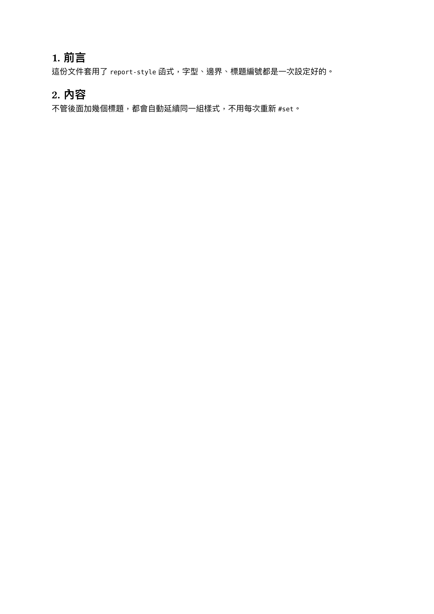

[上一篇](/articles/typst/day06-page-and-layout/)提到了頁面設定相關的議題，包含紙張大小、邊界、分欄、頁碼、頁首頁尾。這幾篇陸續用過的 `#set text`、`#set page`、`#set heading`，其實都是同一套機制：`#set` 規則。這篇要回頭把這個貫穿整個 Typst 樣式系統的核心概念梳理清楚！

`#set` 規則基礎會講語法本身怎麼寫、哪些參數可以設定；作用範圍則說明一個 `#set` 到底管到哪裡，從整份檔案、區塊限制，到搭配 `if` 做條件式套用都會提到；接著看多個 `#set` 疊加時的行為，同一個函式後面蓋過前面、不同函式之間互不干擾；最後示範怎麼把常用的一組 `#set` 打包成函式，重複套用在不同文件上。目標是讓前面幾篇用過的 `#set` 語法，從**照著範例打**變成**知道自己在設定什麼**。

## `#set` 規則基礎

前面幾篇文章已經用過不少次 `#set`，這節先一步步拆解，看語法怎麼寫、背後在做什麼事、還有哪些參數才能塞進去。

### 語法與運作方式

`#set` 規則的寫法固定：`set` 關鍵字後面接一個**元素函式**[^1]的名稱，再用具名參數的方式填入想要的設定值：

```typst
#set text(size: 14pt)

這段文字會變成 14pt。
```

背後的運作方式，可以想成 Typst 幫每個元素維護一份**目前生效中的樣式清單**，`#set` 規則就是把新的樣式推進這份清單，從這行之後，所有用到 `text` 元素的地方（包含 markup 語法直接打的文字），都會先套用清單裡最新的設定，直到被覆蓋或離開作用範圍為止。

### 可設定參數

不是函式的每一個參數都能塞進 `#set`。能設定的只有**具名、可選**的參數，像 `text` 的 `size`、`font`、`fill` 這些；至於**位置、必填**的參數——例如 `text` 函式實際要顯示的文字內容本身——就不能透過 `#set` 指定：

```typst
#set text("這是文字內容")
```

這段會直接編譯失敗，錯誤訊息是 `unexpected argument`，因為 `text` 的文字內容是必填的位置參數，不屬於 `#set` 能處理的範圍。

要分辨一個參數能不能 `#set`，直接查 [Typst 官方文件](https://typst.app/docs/reference/text/text/)裡該函式的參數列表就好：每個參數下面都會有徽章標示，寫著 `Settable` 的就是能塞進 `#set` 的參數，通常還會附一行 `Default` 顯示預設值；沒有 `Settable` 徽章、只標 `Positional`、`Required` 的，就是位置參數或必填參數，設不了。以 `text` 函式的 `font` 參數為例，文件上長這樣：

<figure><figcaption>Typst 文件裡 font 參數的 Settable 徽章</figcaption></figure>

就表示 `font` 是可透過 `#set` 進行設定的參數。

### 實際範例

把幾個可設定參數兜在一起，寫一份套用自訂字型、字級、顏色的文件：

```typst
#set text(
    font: ("Libertinus Serif", "PingFang TC"),
    size: 12pt,
    fill: rgb("#1a1a2e")
)

= `#set` 規則基礎範例

這整份文件套用了同一組 `#set text` 設定：字型換成 Libertinus Serif（中文退回 PingFang TC）、字級調成 12pt、顏色換成深藍灰色 `#1a1a2e`。

從這行開始，後面所有用到 `text` 元素的地方，都會沿用這組設定，不用每一段文字重複指定一次。
```

編譯後，結果如下：

<figure><figcaption>`#set` 規則基礎範例輸出</figcaption></figure>

## 作用範圍

`#set` 不是全域生效的開關，它有明確的作用範圍規則，包含從哪裡開始生效、管到哪裡結束，以下把三種常見情境拆開進行討論：

### 從設定位置到檔案結尾

寫在最外層（沒有被任何區塊包住）的 `#set`，會從它出現的那一行開始，一路生效到整份檔案結尾：

```typst
第一段文字，使用預設字級。

#set text(size: 18pt)

第二段文字開始，字級變成 18pt，後面所有段落都會沿用這個設定。
```

第一段在 `#set` 之前，維持預設值；第二段之後，包含後面所有沒再另外設定的段落，全部套用新的字級。

### 用區塊限制影響範圍

如果只想讓某一小段內容套用特殊設定，不想影響後面整份文件，可以用井字號 `#` 加上方括號 `[...]` 把 `#set` 跟受影響的內容包在同一個區塊裡。區塊結束，設定就自動失效，外面的內容不受影響：

```typst
這段文字維持預設樣式。

#[
  #set text(fill: red)
  這段文字被包在區塊裡，會變成紅色。
]

這段文字回到區塊外面，變回預設樣式，不會被裡面的 `#set` 影響。
```

### 條件式套用：搭配 `if`

有時候會想依條件決定要不要套用某個 `#set`，例如草稿模式才把文字變紅色提醒自己。這裡有個容易踩的坑：如果把 `#set` 塞進 `{}` 程式碼區塊裡的 `if`，跟受影響的內容分開寫，會發現設定完全沒生效：

```typst
#let draft = true

#[
  #if draft {
    set text(fill: red)
  }
  這段文字理論上應該要變紅色。
]
```

實際編譯後，這段文字還是黑色的，`if` 裡的 `set` 完全沒作用。原因跟前一節提到的區塊限制有關：`{ set text(fill: red) }` 本身也是一個區塊，而且區塊裡除了那行 `set` 之外沒有別的內容，所以設定一寫完，區塊就結束了，範圍當場歸零，根本還沒機會影響到區塊外面（就算只差一行）的文字。

正確的寫法，是把 `#set` 跟受影響的內容包在同一個方括號 `[...]` 分支裡，而不是分開放在 `{}` 跟外面：

```typst
#let draft = true

#[
  #if draft [
    #set text(fill: red)
    這段文字理論上應該要變紅色。
  ] else [
    這段文字理論上應該要變紅色。
  ]
]
```

這樣寫，`draft` 為 `true` 時才會進入第一個分支，`set` 跟後面的文字都在同一個 `[...]` 裡，設定才吃得到。

### 實際範例

把檔案結尾生效、區塊限制、條件式套用三種情境兜在一起：

```typst
#set text(
    font: ("Libertinus Serif", "PingFang TC"),
    size: 12pt
)

= `#set` 作用範圍範例

第一段文字，使用預設字級。

#set text(size: 16pt)

第二段文字開始，字級變成 16pt，會一路套用到檔案結尾。

#[
  #set text(fill: red)
  這段文字被包在區塊裡，變成紅色，字級仍維持 16pt。
]

這段文字回到區塊外面，變回黑色，但字級還是 16pt，因為外層的字級設定沒有被區塊限制。

#let draft = true

#if draft [
  #set text(weight: "bold")
  草稿模式開啟，這段文字變成粗體提醒自己。
] else [
  這段文字維持正常樣式。
]
```

用 `typst compile` 編譯後，結果如下：

<figure><figcaption>`#set` 作用範圍範例輸出</figcaption></figure>

從這份輸出可以看到：紅色只出現在區塊內，字級的 16pt 卻延續到區塊外面——因為字級是在最外層設定的，沒有被任何區塊限制過，跟區塊內才設定的顏色，作用範圍完全是兩回事。條件式套用那段刻意選用 `weight: "bold"`[^2] 而不是斜體。

## 多個 `#set` 疊加

實務上很少只寫一個 `#set`，這節我們就來看當多個 `#set` 疊在一起時，Typst 怎麼決定最後套用的結果。

### 同一函式：後面蓋過前面

同一個函式若是被 `#set` 好幾次，並不是後面整個蓋掉前面、把之前的設定全部清空，而是**屬性逐一比對**：兩次都設定到的屬性，後面的值蓋過前面；只有前面設定到、後面沒提到的屬性，則會繼續保留前面的值：

```typst
#set text(fill: blue)
#set text(size: 20pt)

這段文字是藍色、20pt——顏色沿用第一個 #set，字級套用第二個 #set，兩者疊加而不是互相取代。
```

因為兩個 `#set` 設定的是不同屬性，最後的結果其實跟直接寫成一個 `#set`、把兩個屬性放在一起是一樣的：

```typst
#set text(
  fill: blue,
  size: 20pt,
)
```

分開寫、合併寫，只要屬性沒有重複，效果完全相同；差別純粹是寫法習慣，沒有誰比較正確。

如果兩個 `#set` 都設定了同一個屬性，才會是後面蓋過前面：

```typst
#set text(fill: blue)
#set text(fill: red)

這段文字是紅色，因為 fill 被設定了兩次，最後一次生效。
```

### 不同函式：互不影響

不同的元素函式各自維護自己的一份樣式清單，彼此完全獨立，`#set` 一個函式不會影響到另一個函式的設定，就算兩者都出現在同一段文件裡：

```typst
#set list(marker: [→])
#set enum(numbering: "(1)")

- 無序清單項目
+ 有序清單項目
```

`#set list` 只影響用 `-` 開頭的無序清單，`#set enum` 只影響用 `+` 開頭的有序清單，兩者的符號、編號互不干擾，這也是為什麼前面幾篇文章可以同時 `#set text`、`#set page`、`#set heading` 而不用擔心互相打架。

### 實際範例

把同一函式疊加、不同函式互不影響兩種情境寫在同一份文件裡：

```typst
#set text(
    font: ("Libertinus Serif", "PingFang TC"),
    size: 12pt
)
#set text(fill: blue)
#set text(size: 18pt)

= 多個 `#set` 疊加範例

這段文字是藍色、18pt：顏色沿用第一個 `#set text`，字級被第二個 `#set text` 蓋過。

#set list(marker: [→])
#set enum(numbering: "(1)")

- 無序清單項目
- 另一個無序清單項目

+ 有序清單項目
+ 另一個有序清單項目
```

用 `typst compile` 編譯後，結果如下：

<figure><figcaption>多個 `#set` 疊加範例輸出</figcaption></figure>

## 打包成函式重複使用

這篇到目前為止都還沒正式提過函式怎麼自己寫——這是系列文章第一次碰到，先別緊張，這裡只會用到最簡單的一種寫法，完整的函式語法留到後面專門講函式的文章再仔細展開，這節純粹示範怎麼把一組常用的 `#set` 包起來重複用。

如果同一組 `#set` 常常要套用在不同文件上（例如公司內部報告固定要用某個字型、某個邊界），每次都重新打一遍很麻煩。這時候可以用 `#let` 把這組設定包成一個函式：

```typst
#let report-style(body) = {
  set text(font: ("Libertinus Serif", "PingFang TC"), size: 11pt)
  set page(margin: 2.5cm)
  set heading(numbering: "1.")
  body
}
```

拆開來看：`#let report-style(body) = {...}` 定義了一個叫 `report-style` 的函式，它接收一個參數 `body`（也就是之後要套用這組樣式的內容）；大括號裡先放幾個 `#set`，最後一行寫 `body`，把原本的內容原封不動吐回去——沒有這一行，`body` 傳進來的內容就會憑空消失，不會顯示在最後的文件裡。

定義好之後，用 `#show: report-style` 把它套用到後面整份文件：

```typst
#show: report-style

= 第一章
內文……

= 第二章
內文……
```

`#show: 函式名稱` 這個寫法會把後面所有內容都當成 `body` 傳進 `report-style`，等於一次套用裡面全部的 `#set`。下次要寫另一份格式一樣的文件，就不用重新打一次 `#set text`、`#set page`、`#set heading`，直接複製 `report-style` 這個函式定義、加上 `#show: report-style` 就好。

把 `report-style` 函式實際套用在一份簡單文件上：

```typst
#let report-style(body) = {
  set text(
    font: ("Libertinus Serif", "PingFang TC"),
    size: 11pt
  )
  set page(margin: 2.5cm)
  set heading(numbering: "1.")
  body
}

#show: report-style

= 前言
這份文件套用了 `report-style` 函式，字型、邊界、標題編號都是一次設定好的。

= 內容
不管後面加幾個標題，都會自動延續同一組樣式，不用每次重新 `#set`。
```

用 `typst compile` 編譯後，結果如下：

<figure><figcaption>打包成函式重複使用範例輸出</figcaption></figure>

## 小結

這篇把前面幾天陸續用過的 `#set` 語法正式梳理了一遍：規則基礎講了語法怎麼寫、哪些參數才能設定；作用範圍分成整份檔案、區塊限制、條件式套用三種情境；多個 `#set` 疊加則釐清了同一函式逐屬性覆蓋、不同函式互不干擾的行為；最後示範怎麼把常用的一組 `#set` 用 `#let` 包成函式，搭配 `#show: 函式名稱` 重複套用，不用每份文件都重新打一次設定。

下一篇要接著講 `#show` 規則，跟 `#set` 一樣是 Typst 樣式系統的核心，但做的事情不一樣——`#set` 只能調整既有的參數，`#show` 則可以直接改寫元素的呈現方式，這篇最後打包函式時用到的 `#show: 函式名稱`，其實就是 `#show` 規則的其中一種用法，下一篇會正式介紹。

我們下次見囉～

[^1]: 元素函式指的是像 `text`、`heading`、`list`、`page` 這類，呼叫之後會產生文件裡實際結構（一段文字、一個標題、一份清單、一頁）的函式，跟單純回傳一個數字或字串的普通函式不一樣。之所以特別強調這個區別，是因為只有元素函式才有 `#set`、`#show` 規則可以介入的樣式清單，一般函式沒有這個機制。
[^2]: 這裡原本想用 `style: "italic"` 示範，實測後發現中文字完全沒有變成斜體——PingFang TC 這類中文字型通常沒有內建斜體字型檔，Typst 也不會自動幫中文字合成斜體，`style: "italic"` 只對英文那半有效。改用 `weight: "bold"` 則中英文都吃得到效果，示範起來比較不會誤導讀者。
