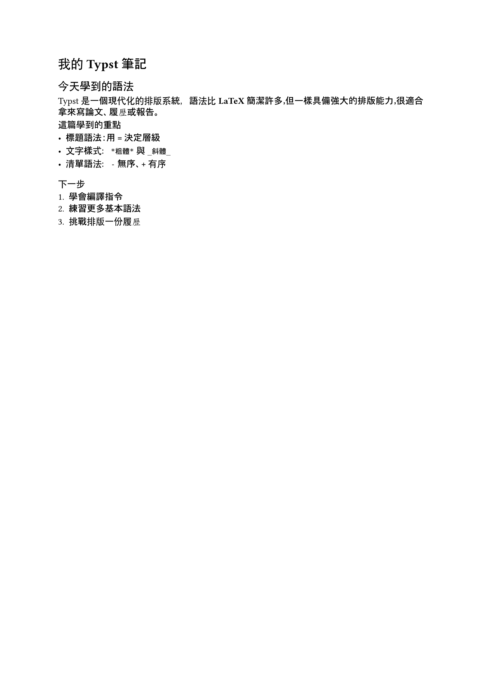

[上一篇](../day01-intro-and-install/day01-intro-and-install.html)我們把環境準備好了，無論是本機安裝 CLI 搭配 VS Code 插件，還是直接用 typst.app 線上編輯，這篇要正式動手寫出第一份 Typst 文件。

除了帶大家跑完第一次編譯，這篇也會介紹編譯與監看兩種編譯方式的差別，以及什麼情境該用哪一種；最後會快速掃過標題、粗體斜體、清單這幾個最常用的基本語法，讓手上的第一份文件不是一份只有純文字的文件而已，而是稍微有點樣子的排版。這些語法後續文章都會再深入展開，這篇的目標單純是先建立起**寫、編譯、看結果**的習慣！

## 撰寫第一份 Typst 文件

Typst 檔案本質上就是一份純文字檔，副檔名為 `.typ`，不需要額外的複雜設定，開一個新檔案就能開始寫。

首先我們在 VS Code 或任何編輯器建資料夾，名為 `hello-typst/`。建立成功後再底下建立 `hello.typ` 檔：

```
hello-typst/
└── hello.typ
```

### 標題

Typst 的標題語法跟 Markdown 很相似，用等號 `=` 開頭（Markdown 語法則是 `#`），等號數量代表層級，一個 `=` 是一級標題，兩個 `==` 是二級標題，以此類推。

| 語法 | 層級 |
| --- | --- |
| `=` | 一級標題 |
| `==` | 二級標題 |
| `===` | 三級標題 |

: {tbl-colwidths="[30,70]"}

現在我們實際在 `hello.typ` 打上以下內容：

```typst
= 我的 Typst 筆記
== 基本語法
=== 標題語法
```

### 粗體、斜體與其他文字樣式

若要強調文字，把想加粗的部分用星號 `*` 包起來，斜體則用底線 `_` 包起來，兩者也可以疊加使用[^1]：

```typst
這是*粗體文字*，這是_斜體文字_，也可以_*同時*_套用兩種樣式。
```

### 清單

無序清單用連字號 `-` 開頭，有序清單用加號 `+` 開頭，Typst 會自動幫有序清單編號，不用自己手動維護數字；縮排一層則可以做出巢狀清單[^2]：

```typst
- 蘋果
- 香蕉
- 橘子

+ 第一步
+ 第二步
+ 第三步
```

### 一份完整的文件

把前面學到的標題、粗體斜體、清單語法整合起來，把 `hello.typ` 改寫成一份稍微有內容的筆記：

```typst
= 我的 Typst 筆記
== 今天學到的語法

Typst 是一個現代化的排版系統，語法比 *LaTeX* 簡潔許多，但一樣具備強大的排版能力，很適合拿來寫論文、履歷或報告。

=== 這篇學到的重點

- 標題語法：用 `=` 決定層級
- 文字樣式：`*粗體*` 與 `_斜體_`
- 清單語法：`-` 無序、`+` 有序

=== 下一步

+ 學會編譯指令
+ 練習更多基本語法
+ 挑戰排版一份履歷
```

## 編譯與預覽

`hello.typ` 寫完之後，接下來要把它變成看得懂的排版結果！

Typst CLI 提供兩種方式：一種是下指令編譯一次，產出 PDF 後就結束；另一種是啟動監看模式，檔案存檔就自動重新編譯，搭配編輯器或瀏覽器即時看到畫面更新，很適合邊寫邊調整版面的時候用[^3]。


#### 編譯模式

執行編譯最直接的方式是在終端機切到 `hello-typst/` 資料夾，並在終端機執行：

```bash
typst compile hello.typ
```

指令跑完，資料夾底下就會多一個 `hello.pdf`，內容就是排好版的結果，用任何 PDF 閱讀器打開即可；沒有特別指定輸出檔名的話，Typst 會用來源檔案的名稱，輸出到同一層資料夾。打開來就會看到前面整合出的那份筆記，標題、粗體斜體、清單都照剛剛寫的樣子排好了：



如果是用 VS Code 搭配 Tinymist 插件，甚至不用切到終端機下指令：開啟 `.typ` 檔案後，編輯器上方會自動多出一排工具列，內建 Preview、Export 等功能，點個兩下就能直接匯出 PDF：


#### 監看模式

編譯模式每次都要手動重下指令，但如果寫文件時如果想邊改邊看實際排版出來的效果方便微調，更適合的方式是用 `watch`：

```bash
typst watch hello.typ
```

執行指令後，終端機會停在那裡持續監看，不會馬上結束；接下來只要存檔，Typst 就會自動偵測變更並重新編譯，`hello.pdf` 也會跟著即時更新。這時候只要用支援自動刷新的 PDF 閱讀器打開 `hello.pdf`（例如 VS Code 內建的 PDF 檢視、或 [Skim](https://skim-app.sourceforge.io/) 等第三方閱讀器），改一個字存檔，畫面幾乎立刻跟著變。想結束監看的話，回到終端機按 `Ctrl + C` 就會停止。

```
watching hello.typ
writing to hello.pdf

[16:36:40] compiling ...
watching hello.typ
writing to hello.pdf

[16:36:40] compiled successfully in 393.02 ms
```

如果是用 Tinymist 插件，體驗會更直接：點工具列的 Preview，VS Code 會直接開一個內建的預覽分頁，本身就是即時更新的，不需要額外的監看指令，也不用切去外部 PDF 閱讀器。


## 小結

這篇終於從零開始寫出第一份 Typst 文件：建了 `hello.typ`，練了標題、粗體斜體、清單三種最常用的基本語法，也把它們整合成一份稍微有點內容的筆記，最後分別用 `typst compile` 跟 `typst watch` 把它變成一份 PDF。**寫、編譯、看結果**的循環會貫穿整個系列，接下來會繼續往下，把 Typst 的語法一項一項攤開來講，一步步比對它跟 LaTeX、Markdown 的差異！

我們下次見囉～

本篇程式碼：[day02-getting-started](https://github.com/yueswater/typst-ironman-2026/tree/main/day02-getting-started)

[^1]: 與 Markdown 不同的是：Markdown 的粗體、斜體通常用雙符號（如 `**bold**`、`__italic__`），Typst 只用單一個符號（`*bold*`、`_italic_`）就能達成同樣效果。
[^2]: Markdown 的無序清單可以用 `-`、`*`、`+` 任一符號開頭，有序清單則用數字加句點（如 `1.`）；Typst 的無序清單固定用 `-`，有序清單則用 `+` 自動編號，也支援跟 Markdown 一樣用數字加句點手動指定編號。
[^3]: LaTeX 通常需要跑好幾輪編譯流程，例如先 `pdflatex`，再跑 `bibtex` 或 `biber` 處理參考文獻，接著再跑一兩次 `pdflatex` 讓交叉引用、目錄、參考文獻編號正確，每次修改內容都得重新跑一輪，等待時間長；Typst 的監看模式只要下一次指令，之後存檔就會自動增量重新編譯、即時更新預覽，不需要手動重跑整條編譯鏈。
