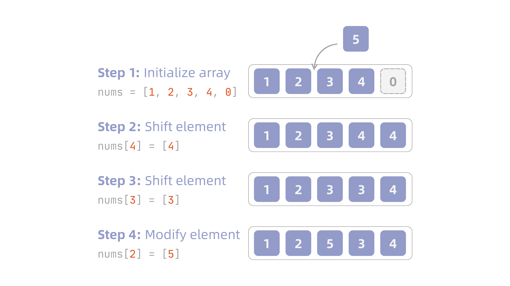
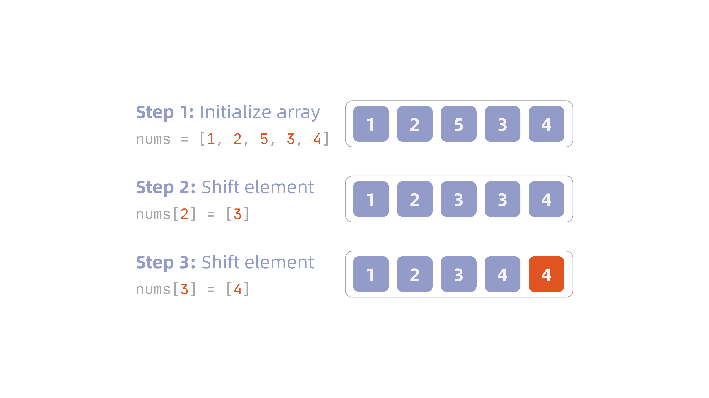

Whenever a program needs to hold a group of same-typed values, the first data structure that comes to mind is almost always the **array (array)** — it stores data contiguously in memory, so any element's address can be computed directly from its index, making both reads and writes $O(1)$. But that same contiguity is exactly why insertion and deletion often require shifting a large number of elements, which usually costs more than people expect. This post works from the memory-layout level up, to make the real complexity behind each array operation clear.

!!! info "Definition: Array (array)"
    An array is regarded as a contiguous sequence of bytes in memory. If the index of the array's first element is $s$, the array starts at memory address $a$, and each element occupies $b$ bytes, then the $i$-th element occupies bytes $a+b(i-s)$ through $a+b(i-s+1)-1$. Assuming the computer takes the same amount of time to access any memory location, accessing any element of the array takes constant time, regardless of the index.

<p class="caption">Source: Cormen, Leiserson, Rivest, Stein, <em>Introduction to Algorithms</em>, 4th ed., §10.1.1</p>

## One-Dimensional Arrays

A one-dimensional array is the most basic form an array can take: its index has a single dimension, and its elements sit in order inside one contiguous block of memory. We'll start from the address formula — how a single formula can locate any element — before moving on to the complexity behind the basic operations: initialization, insertion, access, and deletion.

### Address Calculation

Say we have an integer array `arr[-3:9]` (starting index `-3`, ending index `9`), starting at memory address `100`, with each integer cell taking up 4 bytes. To find the address of `arr[5]`:

$$
\text{Loc}(\texttt{arr[5]}) = 100 + [5 - (-3)] \times 4 = 132
$$

This gives us a more general formula for the memory address of element `i` in an array:

$$
\text{Loc}(\texttt{arr[i]}) = \ell_{0} + (i - s) \times d
$$

$\ell_0$ is the starting address, and $i-s$ is how many cells you need to skip to reach the $i$-th element. Because this formula can compute the address of any element in constant time, without visiting the elements in order, this is exactly why arrays support **random access**.

A more intuitive way to picture it: elementary-school math textbooks are full of "counting trees" problems — given the position of the first tree and the spacing between trees, you can figure out where the $n$-th tree stands without actually walking out to count them. An array's address calculation works the very same way:

::: {#fig-tree-index-address}
{width=400}
:::

### Basic Operations

Next, let's look at the four most common basic operations on a one-dimensional array: initialization, insertion, access, and deletion.

#### Initialization

There are two common ways to initialize a one-dimensional array: **giving a size without values**, or **giving the values directly**.

<div class="tabset">
<div class="tabset-nav">
<button class="tabset-btn active" data-tab="tab1">Fixed size</button>
<button class="tabset-btn" data-tab="tab2">Direct values</button>
</div>
<div class="tabset-panel active" data-tab="tab1">

```python
arr: list[int] = [0] * 5            # a size-5 array
```

You can also use the `array` module, which locks in both the type and the size, matching the definition of an array much more closely:

```python
import array

arr = array.array('i', [0] * 5)     # 'i' is the type code
```

</div>
<div class="tabset-panel" data-tab="tab2">

```python
arr: list[int] = [1, 2, 3, 4, 5]    # values given directly
```

You can also use the `array` module:

```python
import array

arr = array.array('i', [1, 2, 3, 4, 5])
```

</div>
</div>

Either way, though, the array's length is locked in the moment it's declared, and that block of memory can never be resized in place afterward. This is because an array is a **contiguous** block of memory, and the computer needs to know upfront exactly how large a block to reserve ($n \times d$ bytes) — which is exactly why the length can't change midway through[^1].

#### Insertion

Because an array is a contiguous block of memory, forcing a new element into the middle means every element after it has to shift right to make room. Given the following array:

```python
nums: list[int] = [1, 2, 3, 4, 0]
```

Say we want to insert the value `5` at index `2`, and the array's tail deliberately has a spare slot available. Starting from the tail, each element is shifted one slot to the right in turn, until the slot at index `2` opens up, and then `5` is written in (technically overwriting whatever value was there):

::: {#fig-array-insert}
{width=600}
:::

Here's how we can implement the steps above:

```python
nums: list[int] = [1, 2, 3, 4, 0]

# insert function
def insert(nums: list[int], num: int, index: int):
    # shift from the tail to make room
    for i in range(len(nums) - 1, index, -1):
        nums[i] = nums[i - 1]
    nums[index] = num

insert(nums, 5, 2)
```

#### Access

Accessing an element is really just an application of the address formula. Given the array `nums = [1, 2, 3, 4, 5]`, to access `nums[i]`, the computer doesn't check each cell in order — it plugs the index straight into the formula, computes the address, and jumps directly there.

To actually look at the memory address, we can again use `buffer_info()` from the `array` module. `buffer_info()` returns a tuple `(address, length)`, giving the current memory address and the length of the buffer holding the array's elements. For an `array.array` object, you can also read the `itemsize` attribute, which is the number of bytes each element takes up (`4` in the example below, since it's an array of integers).

```python
import array

nums = array.array('i', [1, 2, 3, 4, 5])
addr, length = nums.buffer_info()

for i in range(length):
    print(f"nums[{i}] address = {addr + i * nums.itemsize}")

# nums[0] address = 4378588336
# nums[1] address = 4378588340
# nums[2] address = 4378588344
# nums[3] address = 4378588348
# nums[4] address = 4378588352
```

#### Deletion

Deletion is the mirror image of insertion: we knock out the slot we want to delete, then shift every element after it one slot to the left to fill the gap.

Continuing the insertion example, given the array after inserting `5`, say we want to remove it. The steps are shown below:

::: {#fig-array-delete}
{width=600}
:::

Implemented in Python the same way:

```python
nums: list[int] = [1, 2, 5, 3, 4]

def remove(nums: list[int], index: int):
    for i in range(index, len(nums) - 1):
        nums[i] = nums[i + 1]
remove(nums, 2)
```

#### Time Complexity of Each Operation

| Operation | Best Case | Worst Case | Notes |
| --- | --- | --- | --- |
| Initialization | $O(n)$ | $O(n)$ | Every one of the `n` elements has to be written individually — no shortcut |
| Access | $O(1)$ | $O(1)$ | The address is computed directly from the formula, regardless of index size |
| Insertion | $O(1)$ | $O(n)$ | Inserting at the tail (with room to spare) needs no shifting; inserting at the front shifts every element |
| Deletion | $O(1)$ | $O(n)$ | Deleting at the tail needs no shifting; deleting at the front shifts every element |

## Two-Dimensional Arrays

If a one-dimensional array can be pictured as a **vector** in linear algebra, a two-dimensional array corresponds to a **matrix**. Take the matrix $M$ below:

$$
M = 
\begin{bmatrix}
a_{11} & a_{12} & \cdots & a_{1n}\\
a_{21} & a_{22} & \cdots & a_{2n}\\
\vdots & \vdots & \ldots & \vdots\\
a_{m1} & a_{m2} & \cdots & a_{mn}\\
\end{bmatrix}
$$

We call this a matrix with $m$ **rows** and $n$ **columns**, often written as an $m \times n$ matrix, with the element in row $i$, column $j$ written as $M_{ij}$.

Generally speaking, a two-dimensional array (matrix) is represented using one or more one-dimensional arrays. The two most common storage schemes are **row-major order** and **column-major order**.

Take a simple $2 \times 2$ matrix as an example:

$$
M =
\begin{bmatrix}
1 & 2\\
3 & 4
\end{bmatrix}
$$

In Python, we'd typically express this as a nested `list`:

```python
M = [
    [1, 2],
    [3, 4],
]

M[0][1]     # 2 (row 0, column 1)
```

### Row-Major Order

Under row-major order, the rows are simply flattened out one after another:

```python
M = [1, 2, 3, 4]
```

The address formula is:

$$
\text{Loc}(M[i,j]) = \ell_0 + (i \times n + j) \times d
$$

The `array` module only supports one-dimensional arrays, though, so to actually observe the address of a two-dimensional array we need `numpy` (which defaults to row-major order):

```python
import numpy as np

M = np.array([[1, 2], [3, 4]], dtype=np.int32)
base = M.ctypes.data
n = M.shape[1]          # cols: 2
d = M.itemsize          # 4

for i in range(2):
    for j in range(2):
        addr = base + (i * n + j) * d
        print(f"M[{i}][{j}] address = {addr}")

# M[0][0] = 1 address = 39276970224
# M[0][1] = 2 address = 39276970228
# M[1][0] = 3 address = 39276970232
# M[1][1] = 4 address = 39276970236
```

### Column-Major Order

Unlike row-major order, column-major order reads the two-dimensional array **column by column**. Flattening the matrix above column-major-style gives us:

```python
M = [1, 3, 2, 4]
```

The address formula is:

$$
\text{Loc}(M[i,j]) = \ell_0 + (j \times m + i) \times d
$$

`numpy` needs `order='F'` specified to store an array column-major:

```python
import numpy as np

M = np.array([[1, 2], [3, 4]], dtype=np.int32, order='F')
base = M.ctypes.data
m = M.shape[0]           # rows: 2
d = M.itemsize            # 4

for i in range(2):
    for j in range(2):
        addr = base + (j * m + i) * d
        print(f"M[{i}][{j}] address = {addr}")

# M[0][0] address = 4353785056
# M[0][1] address = 4353785064
# M[1][0] address = 4353785060
# M[1][1] address = 4353785068
```

## Higher-Dimensional Arrays

Beyond one and two dimensions, the array concept generalizes to $n$ dimensions too, though arrays with more than three dimensions are rarely used in practice — so we'll just give the formula here without going any deeper.

Suppose we have an $n$-dimensional array, with the size along each dimension given by $u_1, u_2, \ldots, u_n$, and indices $i_1, i_2, \ldots, i_n$ all starting from $0$. Then:

$$
\begin{aligned}
    \text{Row-major}:& \quad \text{Loc}(A[i_1, \ldots, i_n]) = \ell_0 + \left[ \sum_{k=1}^{n} i_k \prod_{p=k+1}^{n} u_p \right] \times d\\
    \text{Column-major}:& \quad \text{Loc}(A[i_1, \ldots, i_n]) = \ell_0 + \left[ \sum_{k=1}^{n} i_k \prod_{p=1}^{k-1} u_p \right] \times d
\end{aligned}
$$

The idea is exactly the same as for a two-dimensional array — there are just more dimensions, so the product terms get longer.

## Dynamic Arrays

As mentioned earlier, an array's length is fixed the moment it's declared and can't be resized in place. But Python and Java both feel like you can add elements to a list indefinitely — and that illusion is entirely the work of the **dynamic array**.

A dynamic array sounds complicated, but it's really just a plain array with two extra pieces of bookkeeping: how many slots are currently used (`len`) and how many slots have been allocated in total (`capacity`). The logic is:

- When `len < capacity`, a new element can simply be appended at the tail
- When `len == capacity`, the array is full, and it needs to **expand**

Here's the interesting part: the intuitive approach to expanding would be to add just one extra slot every time the array fills up. But that requires $O(n)$ reallocations, each of which copies $1, 2, \cdots, n$ elements respectively, for a total copying cost of:

$$
1 + 2 + \cdots + n = O(n^2)
$$

— which throws away the whole advantage a fixed array was supposed to give you. So in practice, the approach is to double the capacity instead. This way, each reallocation only needs to copy $1, 2, 4, 8, \cdots, n$ elements, which sums to $O(n)$ in total. The number of reallocations becomes $O(\log n)$: assuming we start at capacity 1 and double it every time it fills up, after $k$ doublings the capacity becomes $2^{k}$. To fit $n$ elements, we need $2^{k} \geq n$, and solving that inequality gives us:

$$
k \geq \log_{2} n
$$

In other words, it only takes about $\log_2 n$ doublings for the capacity to fit $n$ elements!

## In-Place Operations

Everything so far has been about time complexity, but sometimes — whether by design, or because a problem specifically demands it — you don't want to use any **extra space**. That's when you need to think about **in-place** operations.

Say we need to reverse a given array of characters using only $O(1)$ memory. The most intuitive idea is to reach for Python's slicing:

```python
def reverseString(s: list[str]) -> list[str]:
    return s[::-1]
```

But if we inspect this using `id()`, it turns out we're actually using extra memory:

```python
s = ["h", "e", "l", "l", "o"]
reversed_s = reverseString(s)

print(id(s))                          # 4384115008
print(id(reversed_s))                 # 4384116800
print(id(s) == id(reversed_s))        # False
```

`s[::-1]` carves out a separate block of memory to hold the reversed result — `s` itself is never touched, and `reversed_s` is a brand-new object. That's the extra memory being used: space complexity $O(n)$, which doesn't meet the $O(1)$ requirement.

The approach that actually achieves $O(1)$ extra space is to swap elements from both ends toward the middle using two pointers, writing directly back into `s` itself without ever creating a new `list`:

```python
def reverseString(s: list[str]) -> None:
    left, right = 0, len(s) - 1
    while left < right:
        s[left], s[right] = s[right], s[left]
        left += 1
        right -= 1
```

Verifying with `id()` again — this time we need to compare the same variable's `id` before and after the call, not the return value (which is `None`):

```python
s = ["h", "e", "l", "l", "o"]
id_before = id(s)

reverseString(s)

print(s)                         # ['o', 'l', 'l', 'e', 'h']
print(id_before == id(s))        # True
```

`id_before` and `id(s)` after the call are identical — the reversal happens directly inside the original `list`, with no block of memory the size of the input ever being allocated along the way. Space complexity: $O(1)$.

[^1]: As for why Python's `list` and Java's `ArrayList` feel like you can add elements freely, that actually comes down to how they expand.
