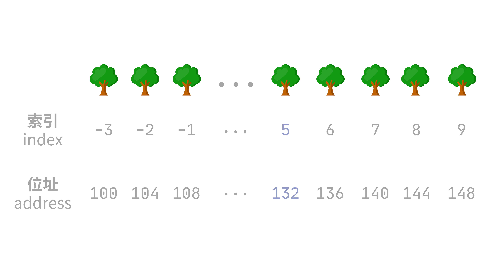
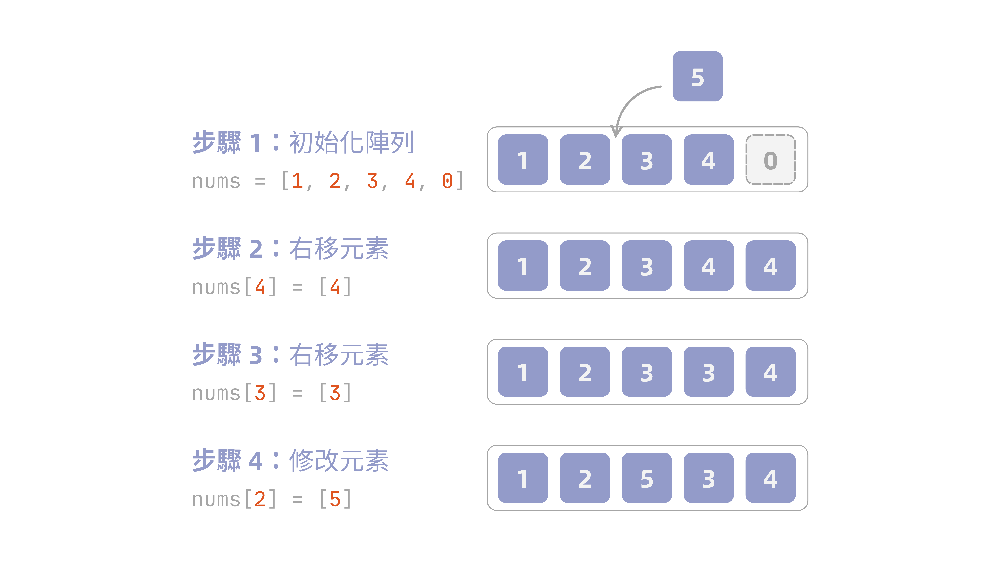
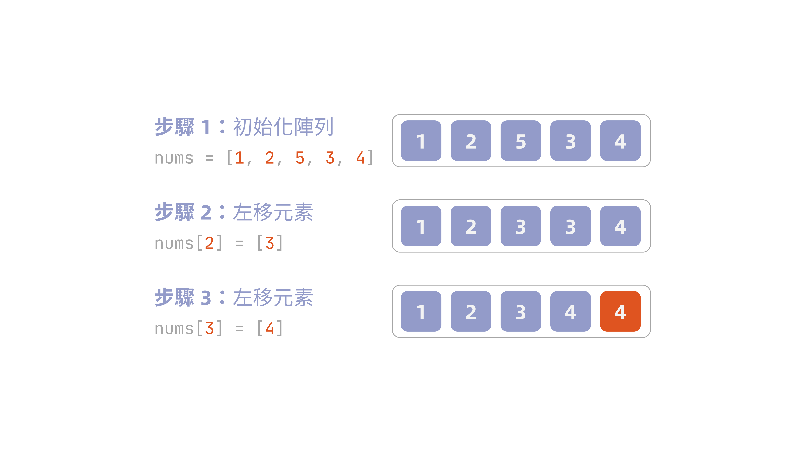

寫程式時，只要涉及一群同類型的資料，第一個想到的資料結構幾乎都是**陣列 (array)**——它把資料連續存放在記憶體裡，配合索引值就能直接算出位址，讀寫都是 $O(1)$。但也正因為連續存放，插入、刪除時常常得搬動一大票元素，代價沒有想像中便宜。這篇要從記憶體配置的角度出發，講清楚陣列各種操作背後真正的複雜度。

!!! info "定義：陣列 (array)"
    陣列被視為記憶體中一段**連續**的位元組序列。若陣列第一個元素的索引是 $s$，陣列起始於記憶體位址 $a$，且每個元素佔用 $b$ 個位元組，則第 $i$ 個元素佔用位元組 $a+b(i-s)$ 到 $a+b(i-s+1)-1$。假設電腦存取任何記憶體位置所需時間相同，那麼存取陣列中任一元素都只需要常數時間，與索引值無關。

## 一維陣列

一維陣列是最基礎的陣列型態，索引只有單一個維度，元素依序排列在一段連續的記憶體中。以下先從位址計算切入，理解陣列如何用一條公式定位任一元素，再進一步認識初始化、插入、存取、刪除這幾個基本操作背後的複雜度。

### 位址計算

假設有一個整數陣列是 `arr[-3:9]`（起始索引為 `-3`，結束索引為 `9`），且起始位址為 `100`，通常整數在儲存格的大小為 4 位元組。因此若要求 `arr[5]` 的位址，則：

$$
\text{Loc}(\texttt{arr[5]}) = 100 + [5 - (-3)] \times 4 = 132
$$

因此可以得到以下求算陣列中元素 `i` 的記憶體位址更簡便的公式：

$$
\text{Loc}(\texttt{arr[i]}) = \ell_{0} + (i - s) \times d
$$

$\ell_0$ 即是起始位址，$i-s$ 則是需要跳過幾格才可以到第 $i$ 個。因為這條公式能在常數時間內直接算出任一元素的位址，不用依序走訪，這就是陣列支援**隨機存取 (random access)** 的原因。

更好的理解方式是：小學數學課本中，時常會有數樹木的題目——已知第一棵樹的位置、樹與樹的間距，要求第幾棵樹在哪，不用真的走過去數，直接套公式就能算出來，陣列的位址計算也是同樣道理：

::: {#fig-tree-index-address}
{width=400}
:::

### 基本操作

接下來介紹一維陣列最常見的四種基本操作：初始化、插入元素、存取元素、刪除元素。

#### 初始化

初始化一個一維陣列有兩種常見的方式：**給予陣列大小不給值**以及**直接給予初始值**。

<div class="tabset">
<div class="tabset-nav">
<button class="tabset-btn active" data-tab="tab1">指定長度</button>
<button class="tabset-btn" data-tab="tab2">直接賦值</button>
</div>
<div class="tabset-panel active" data-tab="tab1">

```python
arr: list[int] = [0] * 5            # 指定陣列大小為 5
```

也可以使用 `array` 套件，型別、大小都固定死，更貼近這裡講的陣列定義：

```python
import array

arr = array.array('i', [0] * 5)     # 'i' 為型別代碼
```

</div>
<div class="tabset-panel" data-tab="tab2">

```python
arr: list[int] = [1, 2, 3, 4, 5]    # 直接給予陣列數值
```

也可以使用 `array` 套件：

```python
import array

arr = array.array('i', [1, 2, 3, 4, 5])
```

</div>
</div>

不過無論哪種方式，陣列的長度在宣告當下就直接固定了，之後無法直接對該塊記憶體進行修改。原因在於陣列實際上是一塊**連續**的記憶體，電腦必須事先知道需要保留多大塊（$n \times d$ 個位元組），才可以一次劃出這塊空間，也因此長度不可以中途變動[^1]。

#### 插入元素

由於陣列是一塊連續的記憶體，如果中間硬要插入元素，後面的元素都要往右挪動位子騰出空間。給定以下陣列：

```python
nums: list[int] = [1, 2, 3, 4, 0]
```

假設要在索引 `2` 的位置插入元素 `5`，且陣列尾端故意留有一格空位可以使用。從陣列尾端開始，把每個元素依序往右搬一格，直到騰出索引 `2` 的空位，再把 `5` 填進去（實際上是覆蓋原本的值）：

::: {#fig-array-insert}
{width=600}
:::

我們可以用以下的方式來實現上述的步驟：

```python
nums: list[int] = [1, 2, 3, 4, 0]

# 插入函式
def insert(nums: list[int], num: int, index: int):
    # 從尾端騰出空間
    for i in range(len(nums) - 1, index, -1):
        nums[i] = nums[i - 1]
    nums[index] = num

insert(nums, 5, 2)
```

#### 存取元素

存取元素的方式其實就是位址計算的方法。給定陣列 `nums = [1, 2, 3, 4, 5]`，若要存取 `nums[i]` 的話，電腦不用一格一格看，而是直接套公式算出位址後，直接跳過去讀取即可。

若要直接看記憶體位址，我們一樣可以用 `array` 套件中的 `buffer_info()` 來處理。`buffer_info()` 會回傳一個 tuple `(address, length)`，表示目前的記憶體位址和陣列儲存元素的緩衝區記憶體長度。而對於 `array.array` 物件，可以獲取 `itemsize` 屬性，即代表陣列中元素所需的位元組長度（下例因陣列為整數陣列，故為 `4`）。

```python
import array

nums = array.array('i', [1, 2, 3, 4, 5])
addr, length = nums.buffer_info()

for i in range(length):
    print(f"nums[{i}] address = {addr + i * nums.itemsize}")

# nums[0] address = 4378588336
# nums[1] address = 4378588340
# nums[2] address = 4378588344
# nums[3] address = 4378588348
# nums[4] address = 4378588352
```

#### 刪除元素

刪除元素與插入正好相反：我們需要把要刪除的那格挖掉，然後後面的元素往左搬一格補上空缺。

承插入元素的例子，給定陣列插入 `5` 之後的陣列，我們想要把 `5` 拿掉，步驟如下圖所示：

::: {#fig-array-delete}
{width=600}
:::

一樣用 Python 實現：

```python
nums: list[int] = [1, 2, 5, 3, 4]

def remove(nums: list[int], index: int):
    for i in range(index, len(nums) - 1):
        nums[i] = nums[i + 1]
remove(nums, 2)
```

#### 各項操作時間複雜度

| 操作 | 最佳情況 | 最差情況 | 說明 |
| --- | --- | --- | --- |
| 初始化 | $O(n)$ | $O(n)$ | 需要逐一寫入 `n` 個元素，沒有捷徑 |
| 存取元素 | $O(1)$ | $O(1)$ | 直接套位址公式算出位置，跟索引大小無關 |
| 插入元素 | $O(1)$ | $O(n)$ | 插在尾端（且有空間）免搬移；插在開頭要搬動全部元素 |
| 刪除元素 | $O(1)$ | $O(n)$ | 刪在尾端免搬移；刪在開頭要搬動全部元素 |

## 二維陣列

如果一維陣列可以想像成是線性代數中的**向量 (vector)**，那麼二維陣列就可以對應到**矩陣 (matrix)**。假設給定以下的矩陣 $M$

$$
M = 
\begin{bmatrix}
a_{11} & a_{12} & \cdots & a_{1n}\\
a_{21} & a_{22} & \cdots & a_{2n}\\
\vdots & \vdots & \ldots & \vdots\\
a_{m1} & a_{m2} & \cdots & a_{mn}\\
\end{bmatrix}
$$

我們會稱之為一個具有 $m$ **列 (row)**、$n$ **行 (column)** 的矩陣，或常以 $m \times n$ 矩陣表示，而第 $i$ 列第 $j$ 行的元素記成 $M_{ij}$。

通常來說，二維陣列（矩陣）多用一個或是多個一維陣列表示。最常見的儲存方式為**列優先 (row-major order)** 與**行優先 (column-major order)**。

以一個簡單的 $2 \times 2$ 矩陣為例：

$$
M =
\begin{bmatrix}
1 & 2\\
3 & 4
\end{bmatrix}
$$

在 Python 中，我們常以巢狀 `list` 表達：

```python
M = [
    [1, 2],
    [3, 4],
]

M[0][1]     # 2（第 0 列、第 1 行）
```

### 列優先

如果以列優先，就是直接把列攤平，變成：

```python
M = [1, 2, 3, 4]
```

存取位址的公式為

$$
\text{Loc}(M[i,j]) = \ell_0 + (i \times n + j) \times d
$$

不過 `array` 僅支援一維陣列，不支援二維陣列，因此需要用到 `numpy` 來觀察二維陣列的位址（預設即為列優先）：

```python
import numpy as np

M = np.array([[1, 2], [3, 4]], dtype=np.int32)
base = M.ctypes.data
n = M.shape[1]          # cols: 2
d = M.itemsize          # 4

for i in range(2):
    for j in range(2):
        addr = base + (i * n + j) * d
        print(f"M[{i}][{j}] address = {addr}")

# M[0][0] = 1 address = 39276970224
# M[0][1] = 2 address = 39276970228
# M[1][0] = 3 address = 39276970232
# M[1][1] = 4 address = 39276970236
```

### 行優先

與列優先不同，行優先則是**直的看**二維陣列。若將上述矩陣攤平，以行優先的方式表示，則為

```python
M = [1, 3, 2, 4]
```

存取位址的公式為

$$
\text{Loc}(M[i,j]) = \ell_0 + (j \times m + i) \times d
$$

而 `numpy` 需要指定 `order='F'` 才會是行優先的儲存方式：

```python
import numpy as np

M = np.array([[1, 2], [3, 4]], dtype=np.int32, order='F')
base = M.ctypes.data
m = M.shape[0]           # rows: 2
d = M.itemsize            # 4

for i in range(2):
    for j in range(2):
        addr = base + (j * m + i) * d
        print(f"M[{i}][{j}] address = {addr}")

# M[0][0] address = 4353785056
# M[0][1] address = 4353785064
# M[1][0] address = 4353785060
# M[1][1] address = 4353785068
```

## 高維陣列

除了一維、二維，陣列的概念也可以推廣到 $n$ 維，只是實務上很少真的用到三維以上的陣列。

假設一個 $n$ 維陣列，每一維的大小分別為 $u_1, u_2, \ldots, u_n$，索引 $i_1, i_2, \ldots, i_n$ 皆從 $0$ 開始，則：

$$
\begin{aligned}
    \text{列優先}:& \quad \text{Loc}(A[i_1, \ldots, i_n]) = \ell_0 + \left[ \sum_{k=1}^{n} i_k \prod_{p=k+1}^{n} u_p \right] \times d\\
    \text{行優先}:& \quad \text{Loc}(A[i_1, \ldots, i_n]) = \ell_0 + \left[ \sum_{k=1}^{n} i_k \prod_{p=1}^{k-1} u_p \right] \times d
\end{aligned}
$$

概念跟二維陣列完全一樣，只是維度變多、連乘的部分變長而已。

## 動態陣列

前面提到，陣列在宣告時就已固定長度，無法原地變大。但是 Python 與 Java 卻可以用起來感覺像是無限增加元素——這就是**動態陣列 (dynamic array)** 的功勞。

動態陣列雖然聽起來複雜，但是實際上就是比一般樸素的陣列多存了兩個屬性：目前用了幾格（`len`）以及共配了幾格（`capacity`）。邏輯如下：

- 當 `len < capacity` 時，直接可以在陣列尾端加入元素
- 當 `len == capacity` 時，代表陣列已滿，此時就需要**擴容 (expand)** 陣列

不過有趣的地方是，擴容直覺上應該是每次碰到陣列滿的時候，就多一格就好，但這樣操作會需要進行 $O(n)$ 次搬移，每次搬移分別要複製 $1, 2, \cdots, n$ 個元素，總複製成本為

$$
1 + 2 + \cdots + n = O(n^2)
$$

等於白做了固定陣列的優勢。因此實務上的做法是倍增，此時每次只要複製 $1, 2, 4, 8, \cdots, n$ 個元素，總和為 $O(n)$。每次搬移次數為 $O(\log n)$，假設從容量 1 開始，每次滿了就翻倍，則翻倍 $k$ 次後，容量會變成 $2^{k}$，若要讓容量塞得下 $n$ 個元素，則需要 $2^{k} \geq n$，解不等式可得

$$
k \geq \log_{2} n
$$

也就是說，只要翻倍大約 $\log_2 n$ 次，容量就夠塞下 $n$ 個元素了！

## 原地操作

前面我們著眼的觀念在於時間複雜度，但有時在撰寫演算法，或題目特別要求，不希望使用**額外空間**，此時就要考慮**原地操作 (in-place)**。

假設我們必須在 $O(1)$ 記憶體中將給定的字串陣列進行反轉，最直觀的想法，其實就是利用 Python 的切片：

```python
def reverseString(s: list[str]) -> list[str]:
    return s[::-1]
```

但是如果我們用 `id()` 函式去觀察，會發現其實我們用到額外的記憶體了：

```python
s = ["h", "e", "l", "l", "o"]
reversed_s = reverseString(s)

print(id(s))                          # 4384115008
print(id(reversed_s))                 # 4384116800
print(id(s) == id(reversed_s))        # False
```

`s[::-1]` 會另外切出一段新的記憶體存放反轉後的結果，`s` 本身完全沒被動到，`reversed_s` 是一個全新的物件——這就是額外用掉的記憶體，空間複雜度 $O(n)$，不符合題目 $O(1)$ 的要求。

真正符合 $O(1)$ 額外空間的做法，是用雙指標從頭尾往中間交換，直接寫回 `s` 本身，不額外造新的 `list`：

```python
def reverseString(s: list[str]) -> None:
    left, right = 0, len(s) - 1
    while left < right:
        s[left], s[right] = s[right], s[left]
        left += 1
        right -= 1
```

一樣用 `id()` 驗證，這次呼叫前後要接住同一個變數的 `id` 來比較，而不是拿回傳值（回傳值是 `None`）：

```python
s = ["h", "e", "l", "l", "o"]
id_before = id(s)

reverseString(s)

print(s)                         # ['o', 'l', 'l', 'e', 'h']
print(id_before == id(s))        # True
```

可以看到 `id_before` 與呼叫後的 `id(s)` 完全一樣——反轉是直接發生在原本那個 `list` 裡，全程沒有多配任何一塊跟輸入等大小的新記憶體，空間複雜度為 $O(1)$。

[^1]: 至於為何 Python 的 `list`、Java 的 `ArrayList` 看似可以隨便新增元素，實際上與擴容有關。