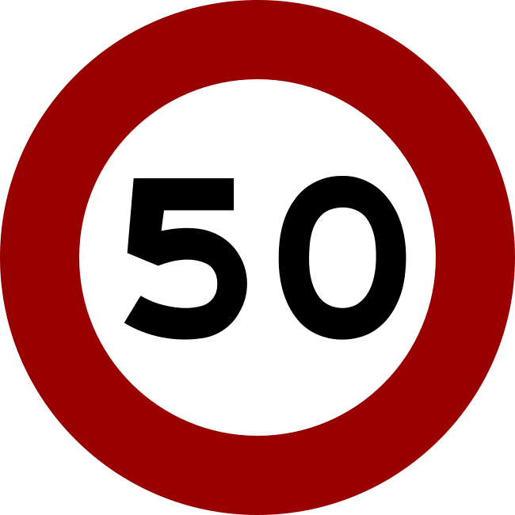
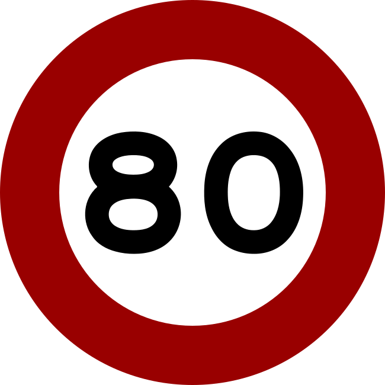
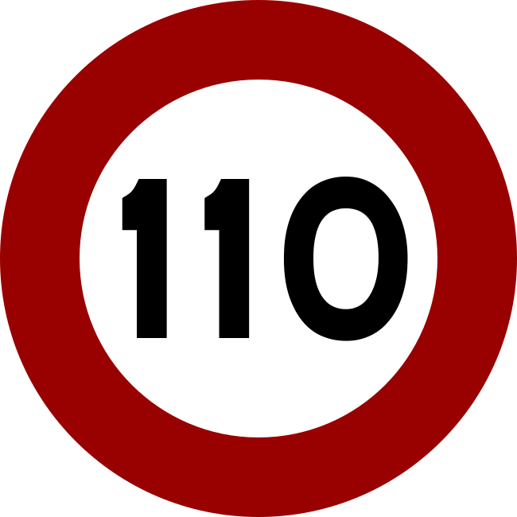
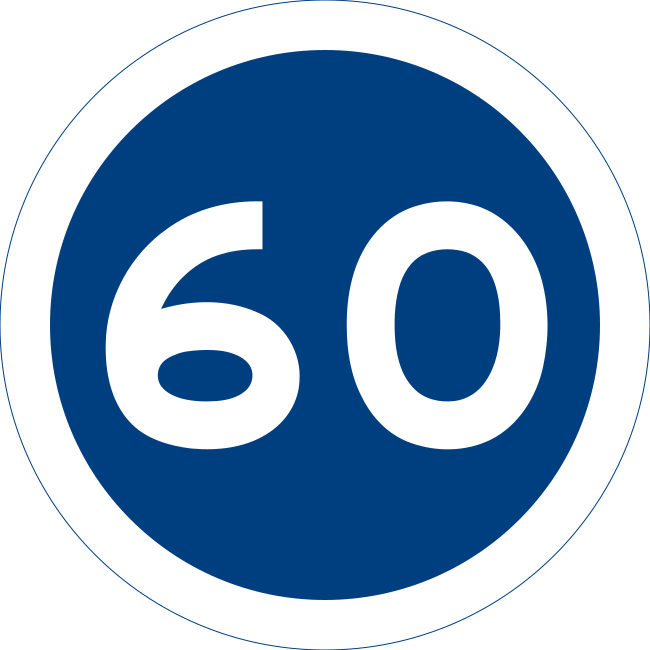
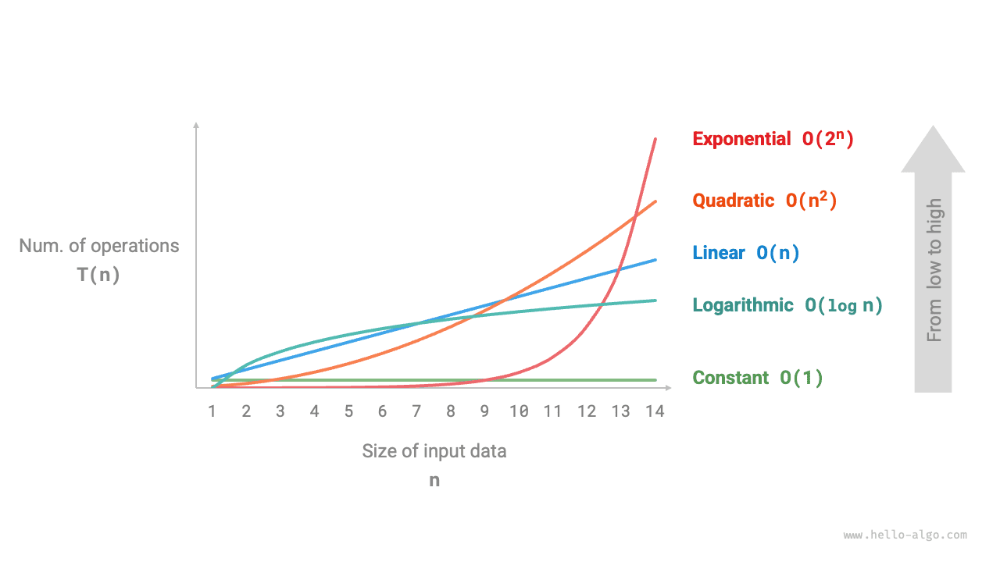
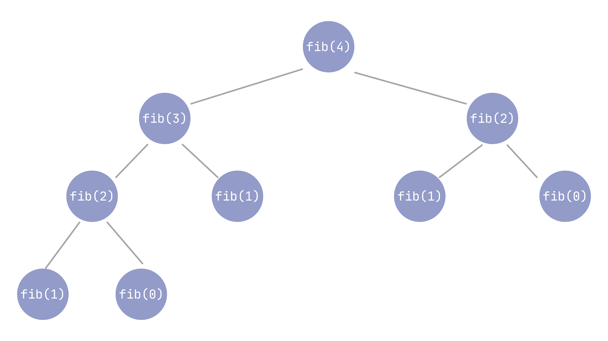
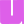

When writing an algorithm, getting the code to run is really just the minimum bar. Whether it finishes within a **reasonable runtime** is the real test.

**Complexity analysis** is the tool for dealing with this problem: without actually running the code, it lets us roughly predict how runtime and memory usage will grow as the input size grows. Because the result isn't affected by hardware performance or differences between programming languages, it can be used to compare different approaches to the same problem — making it the most basic, and most important, way to judge how good an algorithm is.

## Notation

The most commonly used notation for describing complexity is Big-$O$, but in fact **asymptotic** notation is an entire family, roughly split into three groups by what kind of bound they express: upper bounds, lower bounds, and tight bounds that pin down both sides at once. Each group also has a **loose** and a **strict** version, depending on whether the two growth rates are allowed to be exactly equal.

Let's borrow an example from everyday driving. Suppose $n$ is the number of hours spent driving, and $f(n)$ is the distance covered (in kilometers) over that time. Since distance equals speed times time, as long as the speed is kept within some range, the distance covered is pinned down by that range multiplied by $n$ — and speed limits on Taiwanese roads happen to map neatly onto each of these bounds.

### Upper bounds: Big-$O$, small-$o$

**Big-$O$** describes an asymptotic **upper bound**: it says that the growth rate of $f(n)$ never exceeds some constant multiple of another function $g(n)$. For example, if you drive the whole way on a regular road with a 50 km/h speed limit, the distance covered in $n$ hours will never exceed $50n$:

<figure><figcaption>Regular-road speed limit: 50 km/h</figcaption></figure>

!!! info "Definition: Big-$O$"
    There exist positive constants $c$ and $n_0$ such that for all $n \ge n_0$, $0 \le f(n) \le c \cdot g(n)$ holds:

    <script type="math/tex; mode=display">
    O(g(n)) = \{\, f(n) : \exists\, c > 0,\ n_0 > 0,\ \forall n \ge n_0,\ 0 \le f(n) \le c \cdot g(n) \,\}
    </script>


This upper bound only requires that **some constants $c$ and $n_0$ can be found** to make the inequality hold — it doesn't require the bound to be tight. Even if you switch to an expressway with an 80 km/h limit, $80n$ is still a valid upper bound; it's just looser than $50n$:

<figure><figcaption>Expressway speed limit: 80 km/h</figcaption></figure>

This is exactly the flexibility $O$-notation allows: a statement like $n = O(n^2)$ still holds, even though $n$ actually grows far more slowly than $n^2$.

To express that an upper bound is **loose enough that the two functions genuinely grow at different orders of magnitude**, we use **small-$o$**. Imagine driving for the same $n$ hours, but this time you hit a jam on the freeway — as shown below, the sign reports speeds have dropped below 40. No matter how long the jam lasts, the distance covered ends up making up a shrinking, eventually negligible share of the distance you'd cover **driving at the full speed limit the whole time**. This idea of being **increasingly, thoroughly slower** is exactly what small-$o$ captures.

<figure><figcaption>Freeway traffic jam, the electronic sign shows speeds dropping below 40</figcaption></figure>

<p class="caption">Photo credit: <a href="https://commons.wikimedia.org/wiki/File:2022-01-30_cars_on_the_Freeway_1_in_middle_west_Taiwan_01.jpg" target="_blank" rel="noopener">Lobester00</a> via Wikimedia Commons, <a href="https://creativecommons.org/licenses/by-sa/4.0/" target="_blank" rel="noopener">CC BY-SA 4.0</a></p>

!!! info "Definition: small-$o$"
    For any positive constant $c$, there exists $n_0$ such that for all $n \ge n_0$, $0 \le f(n) < c \cdot g(n)$ holds:

    <script type="math/tex; mode=display">
    f(n) = o(g(n)) \iff \forall\, c > 0,\ \exists\, n_0 > 0,\ \forall n \ge n_0,\ 0 \le f(n) < c \cdot g(n)
    </script>


Intuitively, small-$o$ means $f(n)$ gets squeezed toward 0 relative to $g(n)$, i.e.:

$$
\lim_{n \to \infty} \frac{f(n)}{g(n)} = 0
$$

The difference lies in **there exists one constant** versus **holds for every constant** — Big-$O$ only requires the former, while small-$o$ requires the latter, meaning $f$ is more thoroughly slower than $g$. For example, $n = o(n^2)$ holds, but $n^2 \ne o(n^2)$, because the two belong to the same order of magnitude and can't be strictly smaller for every constant $c$.

### Lower bounds: Big-$\Omega$, small-$\omega$

**Big-$\Omega$** is the mirror image of Big-$O$, describing an asymptotic **lower bound**. Motorcycles and slow vehicles are banned on the freeway, and there's also a minimum speed limit of 90: as long as you're legally driving on the freeway, the distance covered in $n$ hours will be at least $90n$:

<figure><figcaption>Freeway minimum speed limit: 90 km/h</figcaption></figure>

!!! info "Definition: Big-$\Omega$"
    There exist positive constants $c$ and $n_0$ such that for all $n \ge n_0$, $0 \le c \cdot g(n) \le f(n)$ holds:

    <script type="math/tex; mode=display">
    \Omega(g(n)) = \{\, f(n) : \exists\, c > 0,\ n_0 > 0,\ \forall n \ge n_0,\ 0 \le c \cdot g(n) \le f(n) \,\}
    </script>


In other words, the growth rate of $f(n)$ is never slower than some constant multiple of $g(n)$. Likewise, to express that a lower bound is **loose enough that the growth rate is genuinely faster**, we use **small-$\omega$**: imagine driving flat-out, completely ignoring any speed limit — the longer you drive, the wider the gap grows between your actual distance and the distance from **sticking exactly to the 90 km/h minimum**, growing disproportionately large.

!!! info "Definition: small-$\omega$"
    For any positive constant $c$, there exists $n_0$ such that for all $n \ge n_0$, $0 \le c \cdot g(n) < f(n)$ holds:

    <script type="math/tex; mode=display">
    f(n) = \omega(g(n)) \iff \forall\, c > 0,\ \exists\, n_0 > 0,\ \forall n \ge n_0,\ 0 \le c \cdot g(n) < f(n)
    </script>


Intuitively, small-$\omega$ means $f(n)$ gets amplified toward infinity relative to $g(n)$, i.e.:

$$
\lim_{n \to \infty} \frac{f(n)}{g(n)} = \infty
$$

### Tight bounds: Big-$\Theta$

**Big-$\Theta$** provides both an upper and a lower bound at once, making it the notation most commonly used to precisely describe complexity. The freeway is a ready-made example: it has both an upper limit of 110 and a lower limit of 90 at the same time, so as long as you stay within that range, the distance covered in $n$ hours is tightly sandwiched between $90n$ and $110n$:

<div style="display:flex; gap:16px; align-items:center;">


</div>

The regular road works the same way, just with a different pair of numbers: an upper limit of 80 and a lower limit of 60, so the distance covered is likewise sandwiched tightly between $60n$ and $80n$:

<div style="display:flex; gap:16px; align-items:center;">


</div>

!!! info "Definition: Big-$\Theta$"
    There exist positive constants $c_1$, $c_2$, and $n_0$ such that for all $n \ge n_0$, $0 \le c_1 g(n) \le f(n) \le c_2 g(n)$ holds:

    <script type="math/tex; mode=display">
    \Theta(g(n)) = \{\, f(n) : \exists\, c_1, c_2 > 0,\ n_0 > 0,\ \forall n \ge n_0,\ 0 \le c_1 g(n) \le f(n) \le c_2 g(n) \,\}
    </script>


In other words, $f(n) = \Theta(g(n))$ holds if and only if both $f(n) = O(g(n))$ and $f(n) = \Omega(g(n))$ hold at the same time: the upper and lower bounds are both pinned to the same $g(n)$, sandwiching the growth rate right in the middle — this is what it means to precisely describe complexity. $\Theta$ has no strict counterpart, because it's already a two-sided squeeze; there's no room left to make it "looser" or "tighter."

Mapping these five symbols onto the ordering relations of real numbers makes the differences between them much easier to remember:

| Notation | Meaning | Analogy |
| --- | --- | --- |
| $f(n) = O(g(n))$ | $f$ doesn't exceed a constant multiple of $g$ | $a \le b$ |
| $f(n) = \Omega(g(n))$ | $f$ isn't smaller than a constant multiple of $g$ | $a \ge b$ |
| $f(n) = \Theta(g(n))$ | $f$ and $g$ are the same order of magnitude | $a = b$ |
| $f(n) = o(g(n))$ | $f$ is strictly slower than $g$ | $a < b$ |
| $f(n) = \omega(g(n))$ | $f$ is strictly faster than $g$ | $a > b$ |

<p class="caption">Common complexity notation</p>

So how is complexity actually calculated? There's a tacit assumption behind all complexity analysis: basic operations — addition, subtraction, multiplication, division, modulo, bitwise operations, memory access, comparisons, assignments, and so on — are all treated as taking the same unit of time. The analysis then works out how many of these operations a piece of code executes in total, adds them up, and looks at the order of magnitude of that total — and that order of magnitude is the complexity.

> Why is this simplification valid?

Because on a real machine, different operations really do take different amounts of time (division is slower than addition, and memory access speed also varies with caching) — but these differences are only noticeable when the input is small. Once the input is large enough, what determines the runtime is the order of magnitude of the operation count, not the fraction of a nanosecond each individual operation differs by. This is also why asymptotic notation only cares about behavior once $n$ is sufficiently large — differences at small scale are mostly just noise.

<figure><figcaption>Growth curves of common time complexities<span class="caption-credit"><span class="caption-paren">(</span>Image credit: <a href="https://www.hello-algo.com/en/chapter_computational_complexity/time_complexity/#234" target="_blank" rel="noopener">Hello Algo</a> | Author: <a href="https://github.com/krahets" target="_blank" rel="noopener">krahets</a> | <a href="https://creativecommons.org/licenses/by-nc-sa/4.0/" target="_blank" rel="noopener">CC BY-NC-SA 4.0</a><span class="caption-paren">)</span></span></figcaption></figure>

The gap between different orders of magnitude opens up dramatically once $n$ grows large. Suppose a computer can perform 1 billion basic operations per second:

| $n$ | $O(n)$ | $O(n\log n)$ | $O(n^2)$ | $O(n^3)$ | $O(2^n)$ |
| --- | --- | --- | --- | --- | --- |
| 10 | 10 ns | 33 ns | 100 ns | 1 μs | 1 μs |
| 100 | 100 ns | 664 ns | 10 μs | 1 ms | 4 × 10¹³ years |
| 1,000 | 1 μs | 10 μs | 1 ms | 1 s | 3.4 × 10²⁸⁴ years |
| 1,000,000 | 1 ms | 20 ms | 16.7 min | 31.7 years | not worth calculating |

<p class="caption">Actual runtime of different complexities at various input sizes</p>

$O(n)$ only goes from 10 nanoseconds to 1 millisecond as $n$ goes from 10 to $10^6$; $O(n^3)$ explodes from 1 microsecond to 31.7 years over the same range; $O(2^n)$ has already blown past the age of the universe by several orders of magnitude by the time $n=100$. This table is probably the most convincing argument for complexity analysis: for the exact same piece of code, picking the wrong order of magnitude isn't a matter of "a bit slower" — it's a matter of **whether it finishes within your lifetime**.

In practice, when solving problems, the order of magnitude your complexity works out to directly determines whether an approach is even feasible. Assuming a 1-second time limit, an order of magnitude under $10^7$ usually passes comfortably, while $10^9$ or above usually times out; around $10^8$ is a gray zone where whether it passes depends on constants and implementation details. This also means that as long as the order of magnitude isn't creeping toward $10^8$, constant-factor differences within the same complexity class don't really matter — just pick whichever approach is easiest to write and least error-prone, rather than mangling the code's readability to shave off a bit of constant factor.

## How to Determine Complexity

Given a piece of code, how do you actually work out its complexity? The answer splits into two parts: **time complexity** looks at how the operation count grows with $n$, and **space complexity** looks at how the extra memory usage grows with $n$. The analysis techniques are similar, but they're tracking different things, so mixing them up makes it easy to miscount.

### Time Complexity

The fastest way to estimate it is to **count the nesting depth of loops**: no loop is $O(1)$, one level is $O(n)$, two levels is $O(n^2)$. But this trick has three traps:

- **An operation isn't automatically $O(1)$**: computing a power by repeated multiplication is actually $O(n)$; fast exponentiation is what gets you $O(\log n)$.
- **Recursion can't be counted by loop nesting**: you have to write out a recurrence relation and solve it. The naive recursive Fibonacci makes two recursive calls each time, only shrinking the problem size by 1, and the complexity blows up straight to $O(2^n)$:

    <figure><figcaption>Fibonacci recursion</figcaption></figure>

- **Amortized complexity is easy to overestimate**: looking only at the single most expensive operation can be overly pessimistic — details in the next section.

So the safer approach is to sum up the total operation count, keep only the highest order of magnitude, and drop the constants. Unless stated otherwise, time complexity by default refers to the worst case.

### Amortized Analysis

As mentioned above, unless stated otherwise, complexity by default refers to the **worst case** — finding the single most expensive input and using its operation count as the upper bound. But the most expensive single operation **doesn't mean every operation, on average, is that expensive** — and that gap is exactly what **amortized analysis** deals with.

Besides the worst case, another common way to analyze complexity is the **average case**: assuming all inputs occur with equal probability, and computing the expected operation count. For example, quicksort's worst case is $O(n^2)$ (when the worst possible pivot is picked every time), but its average case is $O(n \log n)$ — which is also why quicksort is still widely used in practice, despite its unappealing theoretical upper bound.

Amortized analysis is a different matter entirely: it makes no assumption about the probability distribution of the input. Instead, for a **sequence of operations**, it spreads the total cost across the whole sequence to figure out the average cost per operation. The classic example is a dynamic array (like Python's `list`): `append` is $O(1)$ most of the time, but once capacity is full, it has to allocate a larger block of memory and copy the entire array over — and that single operation is $O(n)$. If you only look at that single most expensive `append`, you'd mistakenly conclude every `append` costs $O(n)$ — but as long as **capacity doubles** (rather than growing by a fixed amount each time), spreading the total cost of $n$ appends across all $n$ of them still averages out to $O(1)$ per operation.

The stack's `pop(k)` mentioned earlier works the same way: a single worst case is $O(n)$, but over the entire lifetime of the structure, each element gets popped at most once, so the total cost of $n$ operations never exceeds $O(n)$ — amortized to $O(1)$ per operation.

The difference between the three can be remembered like this: the **worst case** looks at the single most expensive input; the **average case** looks at the expected value across all inputs; **amortized analysis** looks at the real cost spread across a sequence of operations. Since they're asking different questions, it's only natural that they can give different answers.

### Space Complexity

Space complexity, as the name suggests, looks at how much extra memory gets used, described using the same notation as above. An algorithm that only uses a handful of variables and allocates no extra data structures is $O(1)$, referred to as **in-place**.

An easily overlooked detail is that recursive calls themselves occupy the **call stack**: each call pushes another frame, so recursion depth directly translates into extra space:

<figure><figcaption>Call stack</figcaption></figure>

Note that time and space can be traded off against each other! For example, adding memoization to the Fibonacci sequence brings the time complexity down from $O(2^n)$ to $O(n)$, at the cost of spending an extra $O(n)$ space to store the cached results.

### A Fun Package

If you'd rather not do the manual analysis every time, Python has a small package called [`big_O`](https://github.com/pberkes/big_O) that can give you an **experimental estimate** of complexity: feed it a function and an input generator that scales with $n$, and it will actually run several different values of $n$, measure the runtime, and fit the closest-matching complexity curve using least squares.

<div class="tabset">
<div class="tabset-nav">
<button class="tabset-btn active" data-tab="pip">pip</button>
<button class="tabset-btn" data-tab="poetry">poetry</button>
<button class="tabset-btn" data-tab="uv">uv</button>
</div>
<div class="tabset-panel active" data-tab="pip">

```bash
pip install big-o
```

</div>
<div class="tabset-panel" data-tab="poetry">

```bash
poetry add big-o
```

</div>
<div class="tabset-panel" data-tab="uv">

```bash
uv add big-o
```

</div>
</div>

Once it's installed, `import big_o` (note the underscore — it's spelled differently from the install command's package name), then hand it a function and a data generator to run:

```python
import big_o

def linear_search(arr):
    return max(arr)

best, others = big_o.big_o(
    linear_search,
    lambda n: big_o.datagen.integers(n, 0, 10000),
    n_repeats=100,
)
print(best)
# Linear: time = -0.00035 + 2.7E-06*n (sec)
```

As mentioned earlier, this is ultimately still an **experimental estimate** — if the input range you test is too narrow, or the growth rate has a log factor that's hard to detect, it can still get it wrong. Use it to get a rough sense of the order of magnitude, not as a formal proof.

### Guessing the Target Complexity

We've already covered the usual order of operations: write the code, work out the complexity, then compare that order of magnitude against the time limit. Here, we'll flip that around — given the constraints stated in a problem (say, $1 \le n \le 10^5$), how do you guess the required complexity? With a typical 1-second time limit and a machine that runs $10^8$ to $10^9$ basic operations per second, just looking at the range of $n$ is usually enough to guess the target complexity before writing a single line of code, immediately ruling out approaches that are too slow:

| Range of $n$ | Target complexity | Common matching approaches |
| --- | --- | --- |
| $n \le 10$ to $20$ | $O(2^n)$, $O(n!)$ | Brute force, bitmask DP, backtracking |
| $n \le 500$ to $1000$ | $O(n^2)$, $O(n^3)$ | Nested-loop DP, brute-force pairing |
| $n \le 10^5$ to $10^6$ | $O(n \log n)$ | Sort then greedy, binary search, heaps, segment trees |
| $n \le 10^7$ to $10^8$ | $O(n)$ | Linear scan |
| $n \ge 10^9$ or effectively unbounded | $O(\log n)$, $O(1)$ | Binary search on the answer, closed-form math, number theory |

<p class="caption">Working backward from input size to target complexity</p>

This isn't a hard rule — constants and implementation details can shift the boundaries — but as a first instinct, it's usually good enough: if you see $n \le 10^5$ and find yourself reaching for an $O(n^2)$ solution, that's usually a sign you're heading in the wrong direction.
