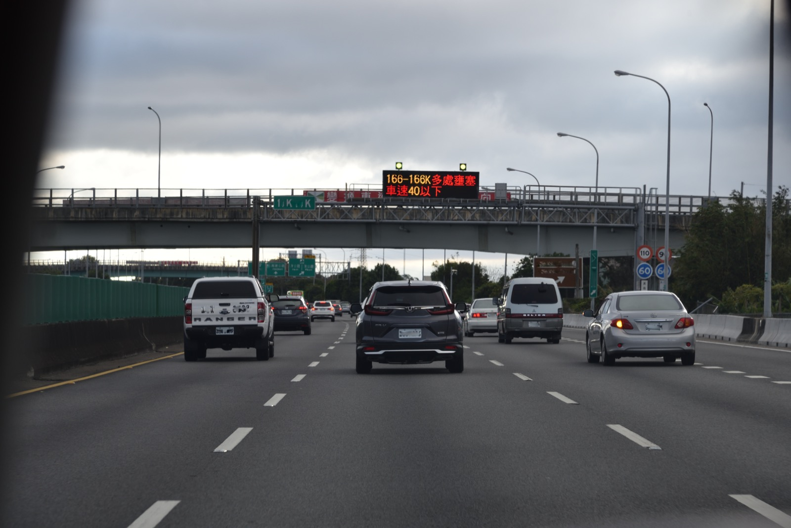
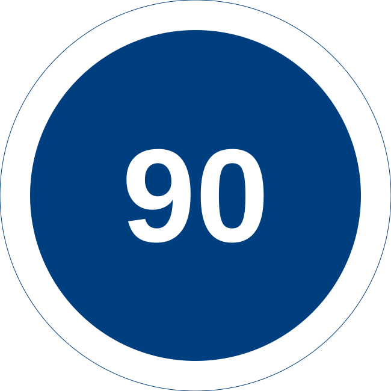
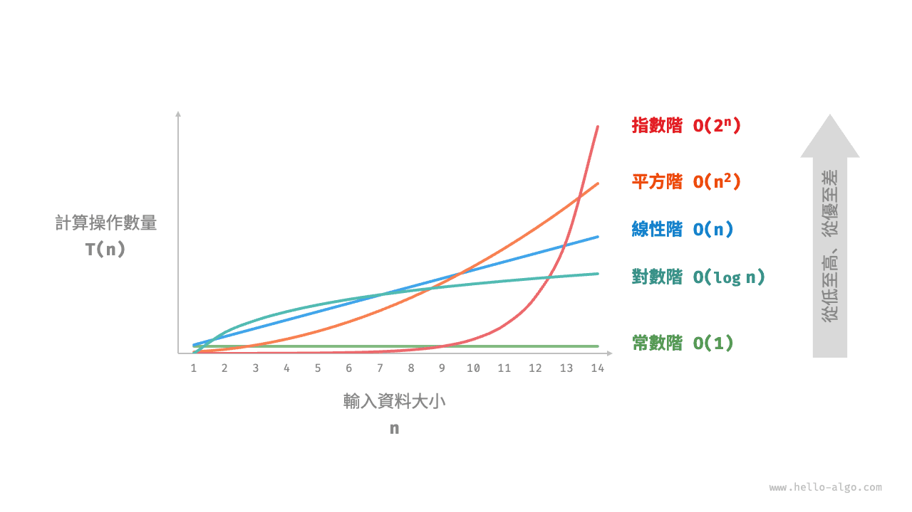
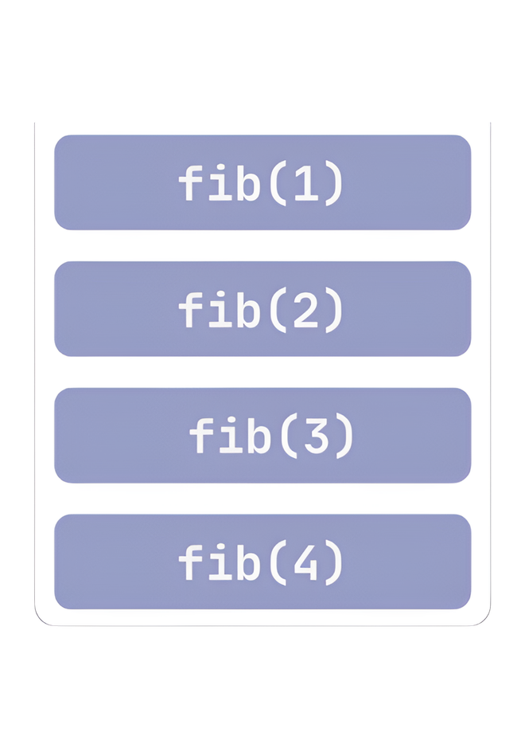

當我們在寫演算法時，能跑出程式碼僅是及格線而已，能否在**合理時間 (runtime)** 內跑完，才是真正的關卡。

**複雜度分析 (complexity analysis)** 就是用來處理此問題的工具：毋需真的執行程式碼，就能大致預測隨著輸入規模變大時，執行時間與記憶體用量會如何成長。這樣的結論不會被硬體效能、程式語言差異干擾，也才能拿來比較不同寫法之間孰優孰劣，是評估一段演算法好壞時最基本、也最重要的方式。

## 各種記號

最常用來描述複雜度的記號是 Big-$O$，但事實上**漸進 (asymptotic)** 記號是一整個家族，依照界線大致可以分成三組：上界、下界，以及同時夾住上下界的緊界。每一組又各自有**寬鬆**與**嚴格**兩種版本，差別在於允不允許成長速度剛好相等。

拿實際生活中的開車為例。假設 $n$ 是開車的時數（小時），$f(n)$ 是這段時間內累積的里程數（公里）。因為里程等於速度乘上時間，只要車速被限制在某個範圍內，里程數的成長就會被那個範圍乘上 $n$ 壓住——臺灣的道路速限剛好可以拿來對應這幾種界線。

### 上界：Big-$O$、Small-$o$

**Big-$O$** 描述的是漸進**上界**，意即函數 $f(n)$ 的成長速度，最多不會超過另一個函數 $g(n)$ 的常數倍。比如全程都開在平面道路上，速限 50，$n$ 小時內的里程數不會超過 $50n$：

<figure><figcaption>平面道路速限 50 公里／小時</figcaption></figure>

!!! info "定義：Big-$O$"
    存在正常數 $c$ 與 $n_0$，使得對所有 $n \ge n_0$，恆有 $0 \le f(n) \le c \cdot g(n)$：

    <script type="math/tex; mode=display">
    O(g(n)) = \{\, f(n) : \exists\, c > 0,\ n_0 > 0,\ \forall n \ge n_0,\ 0 \le f(n) \le c \cdot g(n) \,\}
    </script>


這個上界只要求**找得到一組常數 $c$、$n_0$ 讓不等式成立**，不要求貼得多緊。就算換成速限 80 的快速道路，$80n$ 一樣是合法的上界，只是比 $50n$ 更寬鬆而已：

<figure><figcaption>快速道路速限 80 公里／小時</figcaption></figure>

這正是 $O$-notation 允許的彈性：像 $n = O(n^2)$ 這種寫法依然成立，即使 $n$ 實際上比 $n^2$ 慢得多。

如果想表達**上界貼得夠鬆、兩者成長速度真的不同量級**，就要用 **small-$o$**：想像同樣開了 $n$ 小時，卻遇上國道回堵，如下圖所示，電子看板顯示車速降到 40 以下——不管塞多久，它的里程數跟**照速限一路開**比起來，佔比會被壓縮到幾乎可以忽略——這種**慢得越來越徹底**的概念正是 small-$o$ 想表達的。

<figure><figcaption>國道回堵，電子看板顯示車速降到 40 以下</figcaption></figure>

<p class="caption">照片來源：<a href="https://commons.wikimedia.org/wiki/File:2022-01-30_cars_on_the_Freeway_1_in_middle_west_Taiwan_01.jpg" target="_blank" rel="noopener">Lobester00</a> via Wikimedia Commons, <a href="https://creativecommons.org/licenses/by-sa/4.0/" target="_blank" rel="noopener">CC BY-SA 4.0</a></p>

!!! info "定義：small-$o$"
    對任意正常數 $c$，都存在 $n_0$，使得對所有 $n \ge n_0$，恆有 $0 \le f(n) < c \cdot g(n)$：

    <script type="math/tex; mode=display">
    f(n) = o(g(n)) \iff \forall\, c > 0,\ \exists\, n_0 > 0,\ \forall n \ge n_0,\ 0 \le f(n) < c \cdot g(n)
    </script>


直覺上，small-$o$ 代表 $f(n)$ 相對 $g(n)$ 會被壓縮到趨近於 0，也就是：

$$
\lim_{n \to \infty} \frac{f(n)}{g(n)} = 0
$$

差別就在**存在一個常數**跟**對所有常數皆成立**——Big-$O$ 只要求前者，small-$o$ 要求後者，代表 $f$ 比 $g$ 慢得更徹底。例如 $n = o(n^2)$ 成立，但 $n^2 \ne o(n^2)$，因為兩者屬於同一個量級，不可能對所有常數 $c$ 都嚴格小於。

### 下界：Big-$\Omega$、Small-$\omega$

**Big-$\omega$** 是 Big-$O$ 的鏡像，描述漸進**下界**。國道禁行機車、慢速車輛，還設有最低速限 90：只要合法上國道開，$n$ 小時內的里程數至少會有 $90n$：

<figure><figcaption>國道最低速限 90 公里／小時</figcaption></figure>

!!! info "定義：Big-$\Omega$"
    存在正常數 $c$ 與 $n_0$，使得對所有 $n \ge n_0$，恆有 $0 \le c \cdot g(n) \le f(n)$：

    <script type="math/tex; mode=display">
    \Omega(g(n)) = \{\, f(n) : \exists\, c > 0,\ n_0 > 0,\ \forall n \ge n_0,\ 0 \le c \cdot g(n) \le f(n) \,\}
    </script>


也就是 $f(n)$ 的成長速度，至少不會比某個 $g(n)$ 的常數倍慢。同樣地，如果要表達**下界也貼得夠鬆、成長速度真的更快**，就要用 **small-$\omega$**：想像一路狂飆、完全不甩速限的開法，隨著開車時間拉長，實際里程跟**乖乖維持在最低速限 90** 之間的差距會被拉得越來越大，快得不成比例。

!!! info "定義：small-$\omega$"
    對任意正常數 $c$，都存在 $n_0$，使得對所有 $n \ge n_0$，恆有 $0 \le c \cdot g(n) < f(n)$：

    <script type="math/tex; mode=display">
    f(n) = \omega(g(n)) \iff \forall\, c > 0,\ \exists\, n_0 > 0,\ \forall n \ge n_0,\ 0 \le c \cdot g(n) < f(n)
    </script>


直覺上，small-$\omega$ 代表 $f(n)$ 相對 $g(n)$ 會被放大到趨近於無限大，也就是：

$$
\lim_{n \to \infty} \frac{f(n)}{g(n)} = \infty
$$

### 緊界：Big-$\Theta$

**Big-$\Theta$** 同時提供上界與下界，是最常用來精確描述複雜度的記法。國道正好是個現成的例子：上限 110、下限 90 同時存在，只要乖乖開在這個範圍內，$n$ 小時的里程數會被牢牢夾在 $90n$ 到 $110n$ 之間：

<div style="display:flex; gap:16px; align-items:center;">


</div>

快速道路也是同樣的例子，只是換一組數字：上限 80、下限 60，里程數一樣會被牢牢夾在 $60n$ 到 $80n$ 之間：

<div style="display:flex; gap:16px; align-items:center;">


</div>

!!! info "定義：Big-$\Theta$"
    存在正常數 $c_1$、$c_2$ 與 $n_0$，使得對所有 $n \ge n_0$，恆有 $0 \le c_1 g(n) \le f(n) \le c_2 g(n)$：

    <script type="math/tex; mode=display">
    \Theta(g(n)) = \{\, f(n) : \exists\, c_1, c_2 > 0,\ n_0 > 0,\ \forall n \ge n_0,\ 0 \le c_1 g(n) \le f(n) \le c_2 g(n) \,\}
    </script>


換句話說，$f(n) = \Theta(g(n))$ 若且唯若 $f(n) = O(g(n))$ 且 $f(n) = \Omega(g(n))$ 同時成立：上界與下界都貼著同一個 $g(n)$，成長速度被夾在中間，這才是真正精確描述複雜度的記號。$\Theta$ 沒有對應的嚴格版本，因為它本身已經是雙邊夾擠，沒有**更鬆**或**更緊**的空間可以再細分。

把這五個記號拿來跟實數的大小關係類比，會更容易記住彼此的差異：

| 記號 | 意義 | 類比 |
| --- | --- | --- |
| $f(n) = O(g(n))$ | $f$ 不超過 $g$ 的常數倍 | $a \le b$ |
| $f(n) = \Omega(g(n))$ | $f$ 不小於 $g$ 的常數倍 | $a \ge b$ |
| $f(n) = \Theta(g(n))$ | $f$ 與 $g$ 同一量級 | $a = b$ |
| $f(n) = o(g(n))$ | $f$ 嚴格慢於 $g$ | $a < b$ |
| $f(n) = \omega(g(n))$ | $f$ 嚴格快於 $g$ | $a > b$ |

<p class="caption">常見複雜度記號</p>

不過複雜度到底要如何計算呢？在分析複雜度時，有一個大家心照不宣的假設：把加減乘除、取餘數、位元運算、記憶體存取、比較、賦值…這些基本操作，都當成花費同樣一單位時間。分析的做法就是把一段程式總共會執行幾次這些操作後全部加總，再看看這個總數的量級——這個量級就是複雜度。

> 為什麼可以這樣簡化？

因為在真實機器上，不同操作花的時間本來就有落差（除法比加法慢、記憶體存取速度也因快取而異），但這些落差只有在輸入規模很小的時候看得出來；一旦輸入規模夠大，決定執行時間的早就是操作次數的量級，而不是每個操作差那零點幾奈秒。這也是為什麼漸進符號只在乎 $n$ 夠大之後的行為——小規模時的差異，多半只是雜訊。

<figure><figcaption>常見時間複雜度的成長曲線比較<span class="caption-credit"><span class="caption-paren">（</span>圖片來源：<a href="https://www.hello-algo.com/zh-hant/chapter_computational_complexity/time_complexity/#234" target="_blank" rel="noopener">Hello 算法</a> | 作者：<a href="https://github.com/krahets" target="_blank" rel="noopener">krahets</a> | <a href="https://creativecommons.org/licenses/by-nc-sa/4.0/" target="_blank" rel="noopener">CC BY-NC-SA 4.0</a><span class="caption-paren">）</span></span></figcaption></figure>

不同量級之間的差距，一旦 $n$ 變大會拉開到很誇張的地步。假設一台電腦每秒能跑 10 億次基本操作：

| $n$ | $O(n)$ | $O(n\log n)$ | $O(n^2)$ | $O(n^3)$ | $O(2^n)$ |
| --- | --- | --- | --- | --- | --- |
| 10 | 10 奈秒 | 33 奈秒 | 100 奈秒 | 1 微秒 | 1 微秒 |
| 100 | 100 奈秒 | 664 奈秒 | 10 微秒 | 1 毫秒 | 4 × 10¹³ 年 |
| 1,000 | 1 微秒 | 10 微秒 | 1 毫秒 | 1 秒 | 3.4 × 10²⁸⁴ 年 |
| 1,000,000 | 1 毫秒 | 20 毫秒 | 16.7 分鐘 | 31.7 年 | 已經不用算了 |

<p class="caption">不同複雜度在各種輸入規模下的實際耗時</p>

$O(n)$ 從 $n=10$ 到 $n=10^6$，只從 10 奈秒變成 1 毫秒；$O(n^3)$ 同樣的範圍卻從 1 微秒暴增到 31.7 年；$O(2^n)$ 在 $n=100$ 就已經超出宇宙年齡好幾個數量級。這張表大概是複雜度分析最有說服力的理由：同一段程式碼，選錯演算法的量級，差距不是快一點慢一點，而是**能不能在有生之年跑完**的問題。

實務上寫題目時，複雜度算出來大概落在哪個量級，也直接決定了這個寫法可不可行。假設時限抓 1 秒，量級落在 $10^7$ 以下通常穩過，$10^9$ 以上通常會超時；$10^8$ 左右算是灰色地帶，能不能過要看常數與實作細節。這也代表一件事：只要複雜度的量級沒有逼近 $10^8$，同一個複雜度等級底下的常數差異其實不重要，挑寫起來最順手、最不容易出錯的寫法就好，不用刻意為了省一點常數把程式碼弄得難以維護。

## 如何判斷複雜度

拿到一段程式碼，實際上要怎麼判斷複雜度？答案要拆成兩塊看：**時間複雜度**看的是操作次數怎麼隨 $n$ 成長，**空間複雜度**看的是額外記憶體用量怎麼隨 $n$ 成長——分析手法相似，但盯的目標不同，混在一起看反而容易漏算。

### 時間複雜度

最快的估法是**數迴圈層數**：沒有迴圈 $O(1)$，一層 $O(n)$，兩層 $O(n^2)$。但這招有三個地雷：

- **操作不一定是 $O(1)$**：次方逐一相乘其實是 $O(n)$，快速冪才是 $O(\log n)$。
- **遞迴數不了迴圈**：得寫成遞迴關係式來解。費氏數列的樸素遞迴每次分裂成兩支呼叫，規模只減 1，複雜度直接炸成 $O(2^n)$：

    <figure><figcaption>費氏遞迴</figcaption></figure>

- **均攤複雜度容易被高估**：只看單次最耗時的操作會太悲觀，細節留到下一節展開。

因此較為保險的做法是，將操作次數全部加總、留最大量級、丟常數。若沒特別說明，時間複雜度預設是最壞情況。

### 均攤分析

前面提到，如果沒特別說明，複雜度預設看的是**最壞情況 (worst case)**，也就是找出時間成本最高的那個輸入，用它的操作次數當上界。但最耗時的單次操作**不代表平均下來每次的時間成本都這麼高**，這正是**均攤分析 (amortized analysis)** 要處理的落差。

除了最壞情況，還有一種常見的分析方式是**平均情況 (average case)**，亦即假設所有輸入等機率出現，算出操作次數的期望值。例如快速排序最壞情況是 $O(n^2)$（每次都挑到最爛的基準），但平均情況是 $O(n \log n)$——這也是為什麼快速排序實務上依然常用，即使理論上界不好看。

均攤分析則是另一回事：它不假設輸入的機率分布，而是針對**一連串操作**，把總成本攤開來算每次操作平均要花多少。最經典的例子是動態陣列（如 Python 的 `list`）：`append` 大多數時候是 $O(1)$，但容量滿了就要配置一塊更大的記憶體、把整個陣列複製過去，這一次是 $O(n)$。如果只看最耗時的那一次 `append`，會誤以為每次 `append` 都要 $O(n)$——但只要**容量倍增**（不是每次加固定大小，而是滿了就變兩倍），把 $n$ 次 `append` 的總成本攤開來除以 $n$，均攤下來每次還是 $O(1)$。

前面提過的堆疊 `pop(k)` 也是同樣的道理：單次最壞是 $O(n)$，但整個生命週期裡，每個元素最多只會被彈出一次，$n$ 次操作的總成本不會超過 $O(n)$，均攤下來每次操作是 $O(1)$。

三者的差別可以這樣記：**最壞情況**看單一次時間成本最高的輸入，**平均情況**看所有輸入的期望值，**均攤分析**看一連串操作攤下來的真實成本——三個問的問題不一樣，答案自然也可能不一樣。

### 空間複雜度

空間複雜度顧名思義，即是看額外用掉多少記憶體，同樣用上述的記號描述。只用幾個變數、沒配置額外資料結構的演算法是 $O(1)$，稱為**原地 (in-place)**。

容易被忽略的地方是，遞迴呼叫本身要佔用**呼叫堆疊 (call stack)**，每呼叫一次多推一層，遞迴深度直接等於額外空間：

<figure><figcaption>呼叫堆疊</figcaption></figure>

注意到時間與空間是可以互換的！例如費氏數列加上記憶化，時間從 $O(2^n)$ 壓到 $O(n)$，代價是多花 $O(n)$ 空間存結果。

### 有趣的套件

如果不想每次都手動分析，Python 有個小套件 [`big_O`](https://github.com/pberkes/big_O) 可以幫你**實驗性估計**複雜度：餵它一個函式跟一個隨 $n$ 遞增的輸入產生器，它會實際跑多組不同的 $n$、量測 runtime，再用最小平方法 fit 出最像的複雜度曲線。

<div class="tabset">
<div class="tabset-nav">
<button class="tabset-btn active" data-tab="pip">pip</button>
<button class="tabset-btn" data-tab="poetry">poetry</button>
<button class="tabset-btn" data-tab="uv">uv</button>
</div>
<div class="tabset-panel active" data-tab="pip">

```bash
pip install big-o
```

</div>
<div class="tabset-panel" data-tab="poetry">

```bash
poetry add big-o
```

</div>
<div class="tabset-panel" data-tab="uv">

```bash
uv add big-o
```

</div>
</div>

裝好之後 `import big_o`（注意底線，跟安裝指令的套件名稱寫法不同），丟一個函式跟資料產生器進去就能跑：

```python
import big_o

def linear_search(arr):
    return max(arr)

best, others = big_o.big_o(
    linear_search,
    lambda n: big_o.datagen.integers(n, 0, 10000),
    n_repeats=100,
)
print(best)
# Linear: time = -0.00035 + 2.7E-06*n (sec)
```

跟前面提過的一樣，這終究是**實驗估計**，範圍抓太窄、log 因子量不出來的話一樣會誤判，拿來抓個大概量級就好，別當成正式證明。

### 推測目標複雜度

前面已經提到，寫完程式碼、算出複雜度，再拿量級去對時限的步驟，這裡要反過來操作——根據題目給定的限制（例如 $1 \le n \le 10^5$），該如何推測複雜度。時限通常抓 1 秒、機器每秒能跑 $10^8$ 至 $10^9$ 次基本操作，只要看到 $n$ 的範圍，寫程式前就能大概先猜出目標複雜度，直接篩掉太慢的想法：

| $n$ 的範圍 | 目標複雜度 | 常見對應解法 |
| --- | --- | --- |
| $n \le 10$ 至 $20$ | $O(2^n)$、$O(n!)$ | 暴力窮舉、狀態壓縮 DP、回溯 |
| $n \le 500$ 至 $1000$ | $O(n^2)$、$O(n^3)$ | 雙層迴圈 DP、暴力配對 |
| $n \le 10^5$ 至 $10^6$ | $O(n \log n)$ | 排序後貪心、二分搜、heap、線段樹 |
| $n \le 10^7$ 至 $10^8$ | $O(n)$ | 線性掃描 |
| $n \ge 10^9$ 或近乎無上限 | $O(\log n)$、$O(1)$ | 二分答案、數學公式、數論 |

<p class="caption">從輸入規模反推目標複雜度</p>

這並非硬性規定，常數、實作細節都可能讓邊界移動，但作為第一直覺已經很夠用——看到 $n \le 10^5$ 卻在想 $O(n^2)$ 的解法，通常就是走錯方向了！