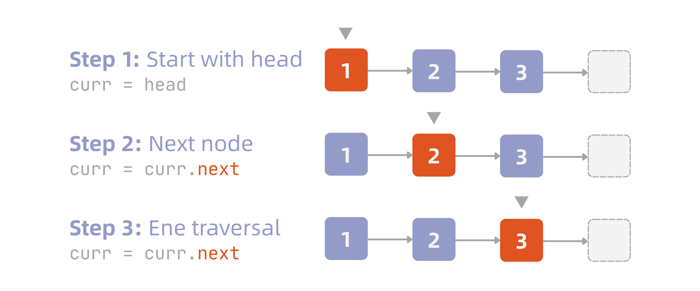
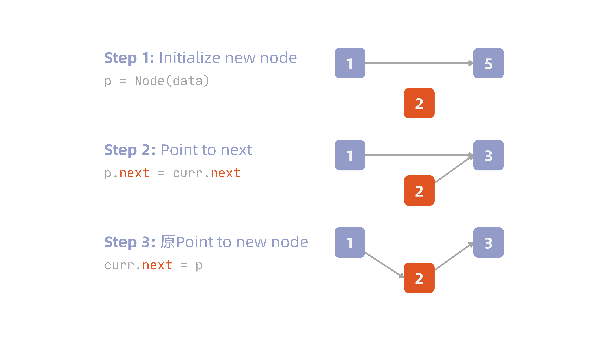
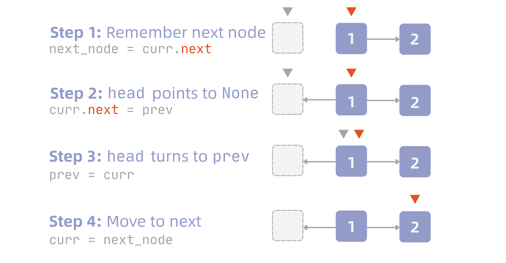

An [array](/dsa/array-en/) offers fast access, but inserting or deleting an element often means shifting a large number of items around — the cost isn't as small as it looks. A **linked list** flips that trade-off: it gives up contiguous memory in exchange for flexible insertion and deletion. Elements are no longer located by index, but by a pointer each node stores itself, chaining one to the next. This post starts from the basic structure of a linked list, working through the trade-off against arrays and the real complexity behind each operation.

!!! info "Definition: Linked List"
    A linked list is a data structure in which objects are arranged in linear order. Unlike an array, where that order is determined by index values, a linked list's order is determined by a pointer stored inside each object. The list is made up of a chain of **nodes**, and each node has two fields:

    - **Data field**: stores the actual data the node holds
    - **Link field**: a pointer to the next node

Because the elements of a linked list usually carry a searchable key, a linked list is sometimes also called a **search list**. As a data structure, it's also commonly used to implement a **dynamic set** — a set that supports frequent insertion and deletion. This is the core trade-off between a linked list and an array: an array gives up flexible insertion and deletion in exchange for random access, while a linked list does the opposite.

## Singly Linked List

As mentioned above, what makes a linked list distinctive is that it chains individual nodes together, with each node holding both data and a pointer.

This section covers the singly linked list; the doubly linked list comes later — each serves its own purpose.

### Initializing a Linked List

Before initializing a linked list, we first need to define a node:

```python
class Node:
    def __init__(self, data: int):
        self.data: int = data
        self.next: Node | None = None
```

A list is like an unfolded string of beads — it always has a front and a back. The front is called the **head**, and the back is called the **tail**. So we can try building a list like this:

::: {#fig-linked-list-basic}
{width=350}
:::

Implemented in Python, that looks like:

```python
head = Node(1)
head.next = Node(2)
head.next.next = Node(3)
```

Notice that since `3` is the very end of the list, its next node is `None`.

### Traversing Nodes

**Traversal** means starting from the head node and moving forward one node at a time via the `next` attribute, until you hit `None` — which means you've reached the end of the list and there's no next node.

When traversing, we typically use `curr` to keep track of where we currently are, and use a loop to move it forward:

::: {#fig-linked-list-traverse}
{width=600}
:::

The implementation looks like this:

```python
def traverse(head: Node | None) -> None:
    curr = head     # start from the head node
    while curr is not None:
        print(curr.data)
        curr = curr.next

traverse(head)
# 1
# 2
# 3
```

One thing to watch out for: the loop condition **must not be written as** `curr.next is not None` — that would stop right at the tail node (since its next is `None`). Printing one value per line isn't very readable either, though, so let's rewrite the `traverse` function a bit:

```python
def traverse(head: Node | None) -> str:
    if head is None:
        return ''

    result: list[int] = []
    curr = head
    while curr is not None:
        result.append(str(curr.data))
        curr = curr.next
    return " -> ".join(result)
```

Printed, this gives:

```plaintext
'1 -> 2 -> 3'
```

Separately, if you want to work out the length of a list, you can use a `count` variable while traversing:

```python
def length(head: Node | None) -> int:
    count: int = 0
    curr = head
    while curr is not None:
        curr = curr.next
        count += 1
    return count

print(length(head))     # 3
```

### Inserting a Node

Inserting a node breaks down into three cases: **inserting at the head**, **inserting after a given node**, and **inserting at the tail**.

#### Inserting at the Head

The new node needs to become the new head, so the order should be:

1. Have the new node grab hold of the old `head`
2. Replace the head with the new node

Using the list from before as an example, say we want to add node `0` at the very front. We can first define a function:

```python
def insert_at_head(head: Node | None, data: int) -> Node:
    p = Node(data)
    p.next = head
    return p
```

Then insert it:

```python
head = insert_at_head(head, 0)
traverse(head)

# 0 -> 1 -> 2 -> 3
```

#### Inserting After a Given Node

This uses the same definition of `k` as `delete_at` (covered below): after insertion, the new node itself becomes index `k`. So we first need to traverse to **the node at index $k-1$**, and attach the new node right after it:

```python
def insert_at(head: Node | None, k: int, data: int) -> Node:
    if k == 0:
        return insert_at_head(head, data)

    curr = head
    i = 0
    while curr is not None and i < k - 1:
        curr = curr.next
        i += 1
    if curr is None:
        raise ValueError("k is out of range")
    p = Node(data)
    p.next = curr.next
    curr.next = p
    return head
```

::: {#fig-linked-list-insert-at-k}

:::

`k = 0` needs to be handled separately, because index `0` (the new head) has no previous node to traverse to — that case is handed straight off to `insert_at_head`. Only for `k >= 1` do we traverse to find the predecessor and insert that way.

Say we want node `4` to become index `1` (starting from `1 -> 2 -> 3`, `4` is inserted after `1`):

```python
head = insert_at(head, 1, 4)
traverse(head)

# 1 -> 4 -> 2 -> 3
```

#### Inserting at the Tail

This is the opposite case from inserting at the head. Since the tail node has no meaningful next pointer, the only way to move `curr` to the last node is by traversing — and the way we know **this is the last one** is that `curr.next` is `None`.

```python
def insert_at_tail(head: Node | None, data: int) -> Node:
    p = Node(data)
    
    if head is None:
        return p
    
    curr = head
    while curr.next is not None:
        curr = curr.next

    curr.next = p
    return p

_ = insert_at_tail(head, 5)
traverse(head)

# '1 -> 2 -> 3 -> 5'
```

### Deleting a Node

To delete a node from the list, you first need to find that node's predecessor, then skip straight over the target node to whatever came after it. Just like insertion, this splits into three cases: **deleting the head**, **deleting a specific node**, and **deleting the tail**.

#### Deleting the Head

The simplest case. Since the head has no predecessor, all we need to do is make `head` point to what's currently the second node:

```python
def delete_at_head(head: Node | None) -> Node | None:
    if head is None:
        return None
    return head.next

head = delete_at_head(head)
traverse(head)

# '2 -> 3'
```

Nothing points to the original node `1` anymore, so Python automatically reclaims that memory — no manual deallocation needed.

#### Deleting a Specific Node

To delete the $k$-th node, we first need to traverse to node $k-1$ and stop there (call it `curr`), then have `curr.next` skip over the node to be deleted and connect directly to what was `x.next`.

```python
def delete_at(head: Node | None, k: int) -> Node | None:
    if k == 0:
        return delete_at_head(head)

    curr = head
    i = 0
    while curr is not None and i < k - 1:
        curr = curr.next
        i += 1
    
    if curr is None or curr.next is None:
        raise ValueError("k is out of range")

    curr.next = curr.next.next
    return head
```

For example, to delete node `2` — at index `1` — we'd write:

```python
node = delete_at(head, 1)
traverse(head)

# '1 -> 3'
```

#### Deleting the Tail

Deleting the tail follows the same logic as deleting a middle node — the only difference is that the traversal target becomes the second-to-last node (the one right before the tail), and we set that node's `next` to `None`.

```python
def delete_at_tail(head: Node | None) -> Node | None:
    if head is None or head.next is None:
        return head

    curr = head
    while curr.next.next is not None:
        curr = curr.next

    curr.next = None
    return head

node = delete_at_tail(head)
traverse(head)

# '1 -> 2'
```

### Querying a Node

Querying a node is considerably simpler than inserting or deleting one. It splits into two cases: **querying the $k$-th node** and **querying by data value**.

#### Querying the $k$-th Node

This is almost identical to traversal — the only addition is an index `i` that tracks how many steps we've taken, stopping once we reach step $k$ and returning the current node:

```python
def query_at(head: Node | None, k: int) -> Node | None:
    curr = head
    i = 0
    while curr and i < k:
        curr = curr.next
        i += 1
    return curr
```

Using the earlier list `1 -> 2 -> 3` as an example, querying index `1` (which is node `2`):

```python
node = query_at(head, 1)
print(node.data)

# 2
```

If `k` exceeds the length of the list, `curr` will reach `None`, which makes the loop condition false and stops the loop early — so `None` is returned, meaning no such node exists.

#### Querying by Data Value

If you don't know a node's position and only know the data value you're looking for, you need to compare each node's `data` one by one, until you find a match or reach the end of the list without finding one:

```python
def query_by(head: Node | None, data: int) -> Node | None:
    curr = head
    while curr and curr.data != data:
        curr = curr.next
    return curr
```

Again using `1 -> 2 -> 3` as an example, querying for the node with data `2`:

```python
node = query_by(head, 2)
print(node.data)

# 2
```

If that value doesn't exist in the list, `curr` will keep going all the way to `None`, the loop condition becomes false, and `None` is returned.

### Implementing a Singly Linked List

Every operation so far has been a standalone function that takes `head` as a parameter. Here, we'll organize them into a single `LinkedList` class, where `head` becomes state managed internally by the object, and each operation is rewritten as a method:

```python
class Node:
    def __init__(self, data: int):
        self.data: int = data
        self.next: Node | None = None

class LinkedList:
    def __init__(self, head: Node | None = None):
        self.head: Node | None = head

    def traverse(self) -> str:
        result: list[str] = []
        curr = self.head
        while curr is not None:
            result.append(str(curr.data))
            curr = curr.next
        return " -> ".join(result)

    def length(self) -> int:
        count = 0
        curr = self.head
        while curr is not None:
            curr = curr.next
            count += 1
        return count

    def insert_at_head(self, data: int) -> None:
        p = Node(data)
        p.next = self.head
        self.head = p

    def insert_at(self, k: int, data: int) -> None:
        if k == 0:
            self.insert_at_head(data)
            return
        curr = self.head
        i = 0
        while curr is not None and i < k - 1:
            curr = curr.next
            i += 1
        if curr is None:
            raise ValueError("k is out of range")
        p = Node(data)
        p.next = curr.next
        curr.next = p

    def insert_at_tail(self, data: int) -> None:
        p = Node(data)
        if self.head is None:
            self.head = p
            return
        curr = self.head
        while curr.next is not None:
            curr = curr.next
        curr.next = p

    def delete_at_head(self) -> None:
        if self.head is None:
            return
        self.head = self.head.next

    def delete_at(self, k: int) -> None:
        if k == 0:
            self.delete_at_head()
            return
        curr = self.head
        i = 0
        while curr is not None and i < k - 1:
            curr = curr.next
            i += 1
        if curr is None or curr.next is None:
            raise ValueError("k is out of range")
        curr.next = curr.next.next

    def delete_at_tail(self) -> None:
        if self.head is None or self.head.next is None:
            self.head = None
            return
        curr = self.head
        while curr.next.next is not None:
            curr = curr.next
        curr.next = None

    def query_at(self, k: int) -> Node | None:
        curr = self.head
        i = 0
        while curr and i < k:
            curr = curr.next
            i += 1
        return curr

    def query_by(self, data: int) -> Node | None:
        curr = self.head
        while curr and curr.data != data:
            curr = curr.next
        return curr
```

Compared to the standalone-function version, the content is essentially identical. The only difference is that `head` — which previously had to be passed in and its return value manually captured on every call — becomes `self.head`, with the object remembering its own state. The caller no longer needs to worry about capturing a return value, which conveniently fixes the earlier pitfall of forgetting to capture `insert_at_head`'s return value, since the method now mutates `self.head` directly.

Let's chain a few operations together and see it in action:

```python
ll = LinkedList(Node(1))
ll.head.next = Node(2)
ll.head.next.next = Node(3)
print(ll.traverse())   # 1 -> 2 -> 3

ll.insert_at_head(0)
print(ll.traverse())   # 0 -> 1 -> 2 -> 3

ll.insert_at(2, 4)
print(ll.traverse())   # 0 -> 1 -> 4 -> 2 -> 3

ll.insert_at_tail(5)
print(ll.traverse())   # 0 -> 1 -> 4 -> 2 -> 3 -> 5

ll.delete_at_head()
print(ll.traverse())   # 1 -> 4 -> 2 -> 3 -> 5

ll.delete_at(1)
print(ll.traverse())   # 1 -> 2 -> 3 -> 5

ll.delete_at_tail()
print(ll.traverse())   # 1 -> 2 -> 3

print(ll.query_at(1).data)   # 2
print(ll.query_by(3).data)   # 3
```

### Time Complexity of Each Operation

| Operation | Best Case | Worst Case | Notes |
| --- | --- | --- | --- |
| Initialization | $O(1)$ | $O(1)$ | Creating a node and wiring up a pointer are both constant-time steps |
| Traversal | $O(n)$ | $O(n)$ | Every node has to be visited one by one — no shortcuts |
| Insertion | $O(1)$ | $O(n)$ | Inserting at the head needs no traversal; inserting in the middle or at the tail requires traversing to find the position first |
| Deletion | $O(1)$ | $O(n)$ | Deleting the head needs no traversal; deleting in the middle or at the tail requires traversing to find the predecessor first |
| Query | $O(1)$ | $O(n)$ | The smaller the index, or the closer the data sits to the front, the faster; worst case means walking all the way to the end |

Looking back at the singly linked list: even though inserting and deleting a node are constant-time on their own, traversal is $O(n)$, which drags the overall operation down to $O(n)$. The reason is that, unlike an array, a linked list has no formula to compute an address directly.

## Doubly Linked List

Unlike a singly linked list, a doubly linked list adds two pointers to each node — one pointing backward, one pointing forward — which makes inserting and deleting around a specific node much more convenient.

First, we can define the node for a doubly linked list:

```python
class Node:
    def __init__(self, data: int):
        self.data: int = data
        self.prev: Node | None = None
        self.next: Node | None = None
```

Just like the singly linked list, we organize the operations into a `DoublyLinkedList` class. The difference is that both the `prev` and `next` pointers need to be kept in sync whenever we insert or delete:

```python
class DoublyLinkedList:
    def __init__(self, head: Node | None = None):
        self.head: Node | None = head

    def traverse(self) -> str:
        result: list[str] = []
        curr = self.head
        while curr is not None:
            result.append(str(curr.data))
            curr = curr.next
        return " -> ".join(result)

    def length(self) -> int:
        count = 0
        curr = self.head
        while curr is not None:
            curr = curr.next
            count += 1
        return count

    def insert_at_head(self, data: int) -> None:
        p = Node(data)
        p.next = self.head          # grab the old head
        if self.head is not None:
            self.head.prev = p      # old head points back to p
        self.head = p               # swap in the new head

    def insert_at(self, k: int, data: int) -> None:
        if k == 0:
            self.insert_at_head(data)
            return

        curr = self.head
        i = 0
        while curr is not None and i < k - 1:
            curr = curr.next
            i += 1
        if curr is None:
            raise ValueError("k is out of range")

        p = Node(data)
        p.next = curr.next           # grab curr's original next
        p.prev = curr                # p points back to curr
        if curr.next is not None:
            curr.next.prev = p       # the next node points back to p
        curr.next = p                # curr now points to p

    def insert_at_tail(self, data: int) -> None:
        p = Node(data)
        if self.head is None:
            self.head = p
            return

        curr = self.head
        while curr.next is not None:
            curr = curr.next

        curr.next = p                # tail now points to p
        p.prev = curr                # p points back to the old tail

    def delete_at_head(self) -> None:
        if self.head is None:
            return
        self.head = self.head.next
        if self.head is not None:
            self.head.prev = None    # new head has no predecessor

    def delete_at(self, k: int) -> None:
        if k == 0:
            self.delete_at_head()
            return

        curr = self.head
        i = 0
        while curr is not None and i < k:
            curr = curr.next
            i += 1
        if curr is None:
            raise ValueError("k is out of range")

        if curr.prev is not None:
            curr.prev.next = curr.next   # predecessor skips over curr
        if curr.next is not None:
            curr.next.prev = curr.prev   # successor skips over curr

    def delete_at_tail(self) -> None:
        if self.head is None:
            return
        if self.head.next is None:       # only one node left
            self.head = None
            return

        curr = self.head
        while curr.next is not None:
            curr = curr.next

        curr.prev.next = None            # disconnect the predecessor's next

    def query_at(self, k: int) -> Node | None:
        curr = self.head
        i = 0
        while curr and i < k:
            curr = curr.next
            i += 1
        return curr

    def query_by(self, data: int) -> Node | None:
        curr = self.head
        while curr and curr.data != data:
            curr = curr.next
        return curr
```

Notice that `delete_at` here differs from the singly linked version: the singly linked version has to traverse to the **predecessor** first, because a singly linked node has no way of knowing its own predecessor. The doubly linked version can traverse directly to the **target node itself**, since `prev` is available — no need for that extra step.

## Circular Linked List

In both the singly and doubly linked lists covered above, the tail node points to `None`. A circular linked list doesn't — its tail points back to the head instead, turning the list into a loop (think of it as joining the two ends of an unfolded necklace back together). Using the list from before as an example, converting it into a circular linked list gives `1 -> 2 -> 3 -> 1`, implemented like this:

```python
head = Node(1)
head.next = Node(2)
head.next.next = Node(3)
head.next.next.next = head
```

From here you can already tell that the original `traverse` function will fall into an infinite loop. The reason is simple: the tail node no longer points to `None`, but to the head — so `while curr is not None` can never break out, and the loop runs forever.

### Traversing Nodes

To fix the infinite-loop problem, we need a different stopping condition: since the tail now points back to the head, the loop should end once we hit the head again.

```python
def traverse(head: Node | None) -> str:
    if head is None:
        return ''
    result: list[int] = [str(head.data)]
    curr = head.next
    while curr is not head:
        result.append(str(curr.data))
        curr = curr.next
    return " -> ".join(result)
```

The result is still `1 -> 2 -> 3`.

Computing the length of a circular linked list also needs special handling:

```python
def length(head: Node | None) -> int:
    if head is None:
        return 0
    
    count: int = 1
    curr = head.next
    while curr is not head:
        count += 1
        curr = curr.next
    return count
```

### Inserting a Node

Inserting at the head needs separate handling: because a circular list's tail points back to the head, once the new node becomes the head, the tail also has to be updated to point to it — but there's no ready-made pointer to the tail, so we have to walk all the way around to find it:

```python
def insert_at_head(head: Node | None, data: int) -> Node:
    p = Node(data)
    if head is None:
        p.next = p      # only one node in the list, so it points to itself
        return p

    p.next = head
    curr = head
    while curr.next is not head:   # walk around to find the tail
        curr = curr.next
    curr.next = p                   # tail now points to the new head
    return p
```

For insertion anywhere else, a circular linked list has no such thing as being **out of range** — because the structure itself is a closed loop, indices naturally repeat as you go around. So we use `length` to work out the total length, and normalize $k$ into the range $[0, n)$ with the modulo operator:

```python
def insert_at(head: Node | None, k: int, data: int) -> Node:
    if head is None:
        return insert_at_head(head, data)

    n = length(head)
    k = k % n       # normalize

    if k == 0:
        return insert_at_head(head, data)
    
    curr = head
    for _ in range(k - 1):
        curr = curr.next

    p = Node(data)
    p.next = curr.next
    curr.next = p
    return head
```

Using the earlier list as an example: say $k = 100$. Since there are only three nodes, $100 \bmod 3 = 1$, which lands right back on the same node as $k = 1$.

### Deleting a Node

Deleting the head mirrors inserting at the head: we still need to walk around to find the tail and update it to point to the new head. If only one node is left, deleting it empties the list:

```python
def delete_at_head(head: Node | None) -> Node | None:
    if head is None:
        return None
    if head.next is head:          # only one node left
        return None
    curr = head
    while curr.next is not head:   # walk around to find the tail
        curr = curr.next
    curr.next = head.next          # tail now points to the new head
    return head.next
```

Deleting anywhere else follows similar logic — again, normalize `k` first using `length`:

```python
def delete_at(head: Node | None, k: int) -> Node | None:
    if head is None:
        return None

    n = length(head)
    k = k % n       # normalize

    if k == 0:
        return delete_at_head(head)
    
    curr = head
    for _ in range(k - 1):
        curr = curr.next
    curr.next = curr.next.next
    return head
```

### Querying a Node

Querying a node follows the same pattern. Here's the implementation:

```python
def query_at(head: Node | None, k: int) -> Node | None:
    if head is None:
        return None

    n = length(head)
    k = k % n

    curr = head
    for _ in range(k):
        curr = curr.next
    return curr
```

If you're querying by data value instead, you need to cap the loop at exactly one full circuit (controlled via `length`):

```python
def query_by(head: Node | None, data: int) -> Node | None:
    if head is None:
        return None
        
    curr = head
    for _ in range(length(head)):
        if curr.data == data:
            return curr
        curr = curr.next
    return None
```

## Related Topics

### Dummy Node

Every time we've inserted or deleted a node so far, we've needed an extra check for the head node — the reason is that the head has no predecessor, which is exactly why we've needed `if k == 0` and `if head is None` checks.

The real idea behind a dummy node is this: since the head is missing a predecessor, just conjure one up out of thin air and attach it in front. This node doesn't hold any real data — it's purely a placeholder:

```python
dummy = Node(0)     # the value here doesn't matter
dummy.next = head
```

Now the list is considered to start from `dummy`, and the actual first piece of data is `dummy.next`. Insertion and deletion can now be handled with one unified piece of logic — take deletion as an example:

```python
def delete_at(dummy: Node, k: int) -> None:
    curr = dummy
    for _ in range(k):
        curr = curr.next
    curr.next = curr.next.next
```

As mentioned above, since `dummy.next` is the real data (i.e. the original `head`), what you return should be `dummy.next`, not `dummy` itself.

### Reversing a Linked List

Say we're given the list `1 -> 2 -> 3`, and our goal is to reverse it into `3 -> 2 -> 1`. How would we go about that?

The core idea is actually simple: to reverse the list, the original `head` becomes the `tail` and the `tail` becomes the `head` — which implies the original `head.next` becomes `None`, and `tail.next` becomes whatever was the second-to-last node.

@fig-linked-list-reverse simplifies the list down to two nodes for illustration:

::: {#fig-linked-list-reverse}
{width=600}
:::

The implementation looks like this:

```python
def reverse(head: Node | None) -> Node | None:
    prev = None
    curr = head
    while curr is not None:
        next_node = curr.next
        curr.next = prev
        prev = curr
        curr = next_node
    return prev

head = reverse(head)
traverse(head)

# '3 -> 2 -> 1'
```
