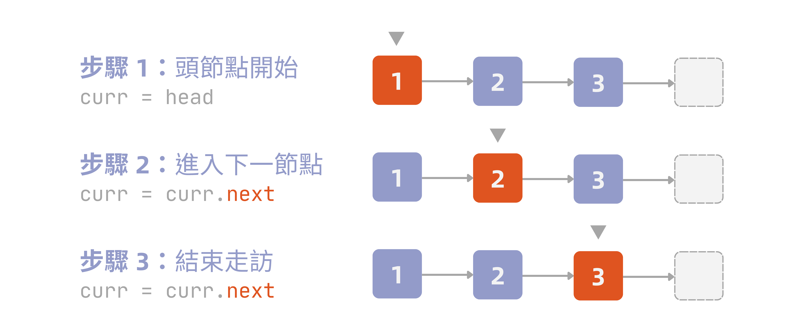
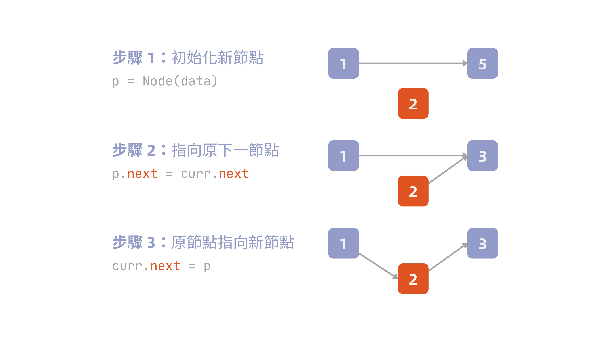
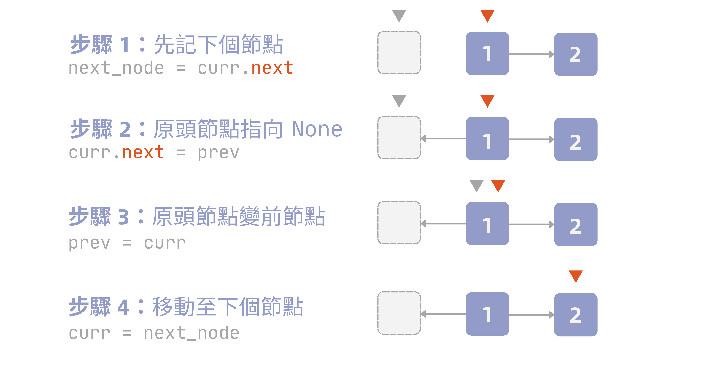

[陣列](/dsa/array/)雖然存取快，但插入、刪除常常得搬動一大票元素，代價不小；**鏈結串列 (linked list)** 正好反過來——捨棄連續記憶體，換取插入、刪除的彈性。元素不再靠索引定位，而是靠每個節點自己存的指標，一個接一個串起來。這篇要從鏈結串列的基本結構出發，理解它與陣列之間的取捨，以及各種操作背後真正的複雜度。

!!! info "定義：鏈結串列 (linked list)"
    鏈結串列是一種以線性順序排列物件的資料結構。與陣列不同，陣列的線性順序由索引值決定，而鏈結串列的順序則由每個物件中的指標決定。串列由一連串**節點 (node)** 組成，每個節點包含兩個欄位：

    - **資料欄位 (data field)**：儲存節點實際存放的資料
    - **指標欄位 (link field)**：指向下一個節點的指標

由於鏈結串列的元素通常含有可供搜尋的鍵值，因此鏈結串列有時也稱為**搜尋串列 (search list)**；作為一種資料結構，它也常用來實作**動態集合 (dynamic set)**——支援頻繁插入、刪除的集合。這也是鏈結串列與陣列最核心的取捨所在：陣列犧牲插入、刪除的彈性換取隨機存取，鏈結串列則反過來。

## 單向鏈結串列

誠如前述所提到的，鏈結串列較為特殊的地方在於，其是將一個個節點串在一起，每個節點都有資料與指標。

本節提及的鏈結串列是單向鏈結串列，稍後會提及雙向鏈結串列，兩者各有其目的所在。

### 初始化鏈結串列

初始化鏈結串列前，首先需要定義節點：

```python
class Node:
    def __init__(self, data: int):
        self.data: int = data
        self.next: Node | None = None
```

而一個串列好比攤開的珍珠向量，必定有頭尾，頭部稱為**頭節點 (head)**，尾部則稱為**尾節點 (tail)**。因此我們可以嘗試建立一個串列如下：

::: {#fig-linked-list-basic}
{width=550}
:::

用 Python 實作則是：

```python
head = Node(1)
head.next = Node(2)
head.next.next = Node(3)
```

注意到因為 `3` 是串列最尾端，因此下一個節點為 `None`。

### 走訪節點

**走訪 (traversal)** 節點是從頭節點出發，依靠 `next` 屬性一個個往後移動，直到碰到 `None` 為止——代表已走到串列尾端，沒有下一個節點了。

通常在走訪節點時，我們會使用 `curr` 記錄目前走到哪，並用迴圈把節點往後挪動：

::: {#fig-linked-list-traverse}
{width=600}
:::

程式碼實作如下：

```python
def traverse(head: Node | None) -> None:
    curr = head     # 起始節點為頭節點
    while curr is not None:
        print(curr.data)
        curr = curr.next

traverse(head)
# 1
# 2
# 3
```

不過需要注意的是，迴圈條件**不可寫成** `curr.next is not None`——若這樣寫會在尾節點時停下（因其下一個為 `None`）。不過這樣印出來有點難以閱讀，所以我們可以將 `traverse` 函式修改一下

```python
def traverse(head: Node | None) -> str:
    if head is None:
        return ''

    result: list[int] = []
    curr = head
    while curr is not None:
        result.append(str(curr.data))
        curr = curr.next
    return " -> ".join(result)
```

印出來就會是

```plaintext
'1 -> 2 -> 3'
```

另外，如果想要計算串列的長度，可以在走訪時透過 `count` 計數：

```python
def length(head: Node | None) -> int:
    count: int = 0
    curr = head
    while curr is not None:
        curr = curr.next
        count += 1
    return count

print(length(head))     # 3
```

### 插入節點

插入節點可以分為三種情境：**插入至頭部**、**插入至某節點後**，以及**插入至尾部**。

#### 插入至頭部

新的節點要變成新的頭節點，因此順序上應該是：

1. 讓新節點接住舊的 `head`
2. 將頭節點換成新節點

以前面的串列為例，假設要在最前面加入節點 `0`，我們可以先定義函數：

```python
def insert_at_head(head: Node | None, data: int) -> Node:
    p = Node(data)
    p.next = head
    return p
```

接著插入：

```python
head = insert_at_head(head, 0)
traverse(head)

# 0 -> 1 -> 2 -> 3
```

#### 插入至某節點後

跟 `delete_at`（下面會教）採同一套 `k` 的定義：插入後，新節點自己要變成索引 `k`。因此得先走訪到**索引 $k-1$ 的節點**，把新節點接在它後面：

```python
def insert_at(head: Node | None, k: int, data: int) -> Node:
    if k == 0:
        return insert_at_head(head, data)

    curr = head
    i = 0
    while curr is not None and i < k - 1:
        curr = curr.next
        i += 1
    if curr is None:
        raise ValueError("k 超出串列長度")

    p = Node(data)
    p.next = curr.next
    curr.next = p
    return head
```

::: {#fig-linked-list-insert-at-k}

:::

`k = 0` 要另外處理，因為索引 `0`（也就是新的頭節點）沒有前一個節點可以走訪，直接交給 `insert_at_head` 處理；`k >= 1` 才用走訪找前驅的方式插入。

假設要讓節點 `4` 變成索引 `1`（原本 `1 -> 2 -> 3`，`4` 插在 `1` 後面）：

```python
head = insert_at(head, 1, 4)
traverse(head)

# 1 -> 4 -> 2 -> 3
```

#### 插入至尾部

跟插入頭部是相反的情況。由於尾節點沒有下一個指標，因此僅能靠走訪把 `curr` 移到最後一個節點——判斷**這是最後一個**的依據是 `curr.next` 是 `None`。

```python
def insert_at_tail(head: Node | None, data: int) -> Node:
    p = Node(data)
    
    if head is None:
        return p
    
    curr = head
    while curr.next is not None:
        curr = curr.next

    curr.next = p
    return p

_ = insert_at_tail(head, 5)
traverse(head)

# '1 -> 2 -> 3 -> 5'
```

### 刪除節點

若要刪除串列中的某節點，首先必須先找到該節點的前一個節點，然後直接跳過目標節點，到原本欲刪除節點的下一個節點。與插入節點一樣，分為三種情況：**刪除頭節點**、**刪除特定節點**，以及**刪除尾節點**。

#### 刪除頭節點

最簡單的情況，因為頭節點沒有前一個節點，因此僅需將 `head` 變成當前第二個節點即可：

```python
def delete_at_head(head: Node | None) -> Node | None:
    if head is None:
        return None
    return head.next

head = delete_at_head(head)
traverse(head)

# '2 -> 3'
```

原本的節點 `1` 已經沒有任何指標指向它了，Python 會自動回收該塊記憶體，省去手動釋放的步驟。

#### 刪除特定節點

若要刪除第 $k$ 個節點，則需要先走訪到 $k - 1$ 個節點並停在該處（因此記為 `curr`），再讓 `curr.next` 跳過欲刪除節點，直接連到原本的 `x.next`。

```python
def delete_at(head: Node | None, k: int) -> Node | None:
    if k == 0:
        return delete_at_head(head)

    curr = head
    i = 0
    while curr is not None and i < k - 1:
        curr = curr.next
        i += 1
    
    if curr is None or curr.next is None:
        raise ValueError("k 超出串列長度")

    curr.next = curr.next.next
    return head
```

例如刪除節點 `2`，從索引來看，它是 `1`，因此：

```python
node = delete_at(head, 1)
traverse(head)

# '1 -> 3'
```

#### 刪除尾節點

刪除尾節點與刪除中間節點是相同邏輯，只是走訪目標換成倒數第二個節點（尾節點前一個），再將該節點的 `next` 換成 `None` 而已。

```python
def delete_at_tail(head: Node | None) -> Node | None:
    if head is None or head.next is None:
        return head

    curr = head
    while curr.next.next is not None:
        curr = curr.next

    curr.next = None
    return head

node = delete_at_tail(head)
traverse(head)

# '1 -> 2'
```

### 查詢節點

查詢節點相較插入、刪除節點容易地多，分為兩種情境：**查詢第 $k$ 個節點**與**根據資料查詢節點**。

#### 查詢第 $k$ 個節點

跟走訪的邏輯幾乎一樣，只是額外用一個索引 `i` 記錄走了幾步，走到第 $k$ 步就停下，回傳當下的節點：

```python
def query_at(head: Node | None, k: int) -> Node | None:
    curr = head
    i = 0
    while curr and i < k:
        curr = curr.next
        i += 1
    return curr
```

以先前的串列 `1 -> 2 -> 3` 為例，查詢索引 `1`（也就是節點 `2`）：

```python
node = query_at(head, 1)
print(node.data)

# 2
```

若 `k` 超出串列長度，`curr` 會在走到 `None` 後讓迴圈條件不成立而提早停下，因此回傳 `None`，代表查無此節點。

#### 根據資料查詢節點

若不知道節點的位置，只知道要找的資料值，則需要逐一比對每個節點的 `data`，直到找到相符的節點，或走到串列尾端仍未找到為止：

```python
def query_by(head: Node | None, data: int) -> Node | None:
    curr = head
    while curr and curr.data != data:
        curr = curr.next
    return curr
```

同樣以 `1 -> 2 -> 3` 為例，查詢資料為 `2` 的節點：

```python
node = query_by(head, 2)
print(node.data)

# 2
```

若串列中不存在該資料，`curr` 會一路走到 `None`，迴圈條件隨之不成立，回傳 `None`。

### 實作單向鏈結串列

前面每個操作都是獨立的函式，各自接收 `head` 當參數；這裡把它們整理成一個 `LinkedList` 類別，`head` 變成物件內部管理的狀態，每個操作也改寫成方法：

```python
class Node:
    def __init__(self, data: int):
        self.data: int = data
        self.next: Node | None = None

class LinkedList:
    def __init__(self, head: Node | None = None):
        self.head: Node | None = head

    def traverse(self) -> str:
        result: list[str] = []
        curr = self.head
        while curr is not None:
            result.append(str(curr.data))
            curr = curr.next
        return " -> ".join(result)

    def length(self) -> int:
        count = 0
        curr = self.head
        while curr is not None:
            curr = curr.next
            count += 1
        return count

    def insert_at_head(self, data: int) -> None:
        p = Node(data)
        p.next = self.head
        self.head = p

    def insert_at(self, k: int, data: int) -> None:
        if k == 0:
            self.insert_at_head(data)
            return
        curr = self.head
        i = 0
        while curr is not None and i < k - 1:
            curr = curr.next
            i += 1
        if curr is None:
            raise ValueError("k 超出串列長度")

        p = Node(data)
        p.next = curr.next
        curr.next = p

    def insert_at_tail(self, data: int) -> None:
        p = Node(data)
        if self.head is None:
            self.head = p
            return
        curr = self.head
        while curr.next is not None:
            curr = curr.next
        curr.next = p

    def delete_at_head(self) -> None:
        if self.head is None:
            return
        self.head = self.head.next

    def delete_at(self, k: int) -> None:
        if k == 0:
            self.delete_at_head()
            return
        curr = self.head
        i = 0
        while curr is not None and i < k - 1:
            curr = curr.next
            i += 1
        if curr is None or curr.next is None:
            raise ValueError("k 超出串列長度")
        curr.next = curr.next.next

    def delete_at_tail(self) -> None:
        if self.head is None or self.head.next is None:
            self.head = None
            return
        curr = self.head
        while curr.next.next is not None:
            curr = curr.next
        curr.next = None

    def query_at(self, k: int) -> Node | None:
        curr = self.head
        i = 0
        while curr and i < k:
            curr = curr.next
            i += 1
        return curr

    def query_by(self, data: int) -> Node | None:
        curr = self.head
        while curr and curr.data != data:
            curr = curr.next
        return curr
```

跟原本的函式版本相比，內容其實一模一樣，差別只在 `head` 從每次呼叫都要手動傳入、手動接回傳值變成 `self.head`，物件自己記得目前的狀態，呼叫端不用再操心要不要接回傳值——這剛好解決了前面 `insert_at_head` 忘記接回傳值的那個坑，因為方法內部直接改的就是 `self.head` 本身。

實際串起來操作一次：

```python
ll = LinkedList(Node(1))
ll.head.next = Node(2)
ll.head.next.next = Node(3)
print(ll.traverse())   # 1 -> 2 -> 3

ll.insert_at_head(0)
print(ll.traverse())   # 0 -> 1 -> 2 -> 3

ll.insert_at(2, 4)
print(ll.traverse())   # 0 -> 1 -> 4 -> 2 -> 3

ll.insert_at_tail(5)
print(ll.traverse())   # 0 -> 1 -> 4 -> 2 -> 3 -> 5

ll.delete_at_head()
print(ll.traverse())   # 1 -> 4 -> 2 -> 3 -> 5

ll.delete_at(1)
print(ll.traverse())   # 1 -> 2 -> 3 -> 5

ll.delete_at_tail()
print(ll.traverse())   # 1 -> 2 -> 3

print(ll.query_at(1).data)   # 2
print(ll.query_by(3).data)   # 3
```

### 各項操作時間複雜度

| 操作 | 最佳情況 | 最差情況 | 說明 |
| --- | --- | --- | --- |
| 初始化 | $O(1)$ | $O(1)$ | 建立節點、接指標皆為常數步驟 |
| 走訪節點 | $O(n)$ | $O(n)$ | 得逐一走過所有節點，沒有捷徑 |
| 插入節點 | $O(1)$ | $O(n)$ | 插在頭部免走訪；插在中間或尾部要先走訪找位置 |
| 刪除節點 | $O(1)$ | $O(n)$ | 刪頭部免走訪；刪中間或尾部要先走訪找前節點節點 |
| 查詢節點 | $O(1)$ | $O(n)$ | 索引小或資料在越前面越快；最差要走到底 |

回顧單向鏈結串列，雖然插入、刪除節點都是常數時間，但是走訪節點是 $O(n)$，等於拖累了整體變成 $O(n)$，原因在於鏈結串列不若陣列一般有公式可以計算位址。 

## 雙向鏈結串列

不同於單向鏈結串列，雙向鏈結串列在節點中新增了前、後兩個指標，對於在特定節點前後進行插入刪除會比較方便。

首先可以定義雙向鏈結串列的節點：

```python
class Node:
    def __init__(self, data: int):
        self.data: int = data
        self.prev: Node | None = None
        self.next: Node | None = None
```

跟單向鏈結串列一樣，把各項操作整理成一個 `DoublyLinkedList` 類別，差別在插入、刪除時，`prev` 跟 `next` 兩條指標都要顧到：

```python
class DoublyLinkedList:
    def __init__(self, head: Node | None = None):
        self.head: Node | None = head

    def traverse(self) -> str:
        result: list[str] = []
        curr = self.head
        while curr is not None:
            result.append(str(curr.data))
            curr = curr.next
        return " -> ".join(result)

    def length(self) -> int:
        count = 0
        curr = self.head
        while curr is not None:
            curr = curr.next
            count += 1
        return count

    def insert_at_head(self, data: int) -> None:
        p = Node(data)
        p.next = self.head          # 接住舊 head
        if self.head is not None:
            self.head.prev = p      # 舊 head 回指 p
        self.head = p               # 換成新 head

    def insert_at(self, k: int, data: int) -> None:
        if k == 0:
            self.insert_at_head(data)
            return

        curr = self.head
        i = 0
        while curr is not None and i < k - 1:
            curr = curr.next
            i += 1
        if curr is None:
            raise ValueError("k 超出串列長度")

        p = Node(data)
        p.next = curr.next           # 接住 curr 原本的下一個
        p.prev = curr                # p 回指 curr
        if curr.next is not None:
            curr.next.prev = p       # 下一個節點回指 p
        curr.next = p                # curr 改指向 p

    def insert_at_tail(self, data: int) -> None:
        p = Node(data)
        if self.head is None:
            self.head = p
            return

        curr = self.head
        while curr.next is not None:
            curr = curr.next

        curr.next = p                # 尾節點指向 p
        p.prev = curr                # p 回指原尾節點

    def delete_at_head(self) -> None:
        if self.head is None:
            return
        self.head = self.head.next
        if self.head is not None:
            self.head.prev = None    # 新 head 無前節點

    def delete_at(self, k: int) -> None:
        if k == 0:
            self.delete_at_head()
            return

        curr = self.head
        i = 0
        while curr is not None and i < k:
            curr = curr.next
            i += 1
        if curr is None:
            raise ValueError("k 超出串列長度")

        if curr.prev is not None:
            curr.prev.next = curr.next   # 前節點跳過 curr
        if curr.next is not None:
            curr.next.prev = curr.prev   # 後繼跳過 curr

    def delete_at_tail(self) -> None:
        if self.head is None:
            return
        if self.head.next is None:       # 只剩一個節點
            self.head = None
            return

        curr = self.head
        while curr.next is not None:
            curr = curr.next

        curr.prev.next = None            # 斷開前一個節點的 next

    def query_at(self, k: int) -> Node | None:
        curr = self.head
        i = 0
        while curr and i < k:
            curr = curr.next
            i += 1
        return curr

    def query_by(self, data: int) -> Node | None:
        curr = self.head
        while curr and curr.data != data:
            curr = curr.next
        return curr
```

注意到 `delete_at` 這裡跟單向鏈結串列的版本不一樣：單向版本得先走到**前一個節點**，因為單向節點不知道自己的前節點是誰；雙向版本可以直接走到**目標節點本身**，因為有 `prev`，就毋需像單向那樣多繞一步。

## 環狀鏈結串列

前面提到的單向、雙向鏈結串列的尾節點都是指向 `None`，然後，環狀鏈結串列則否——尾節點會重新指向頭節點——從而將串列變成一個環（把攤平的項鍊接回）。以上面的串列為例，如果將其轉換為環狀鏈結串列，則會變成 `1 -> 2 -> 3 -> 1`，實作上即為

```python
head = Node(1)
head.next = Node(2)
head.next.next = Node(3)
head.next.next.next = head
```

不過從這邊就可以發現，原先的走訪函式 `traverse` 會陷入無限迴圈，理由很簡單：因為尾節點現在指向的並非 `None` 而是頭節點，`while curr is not None` 永遠無法跳出，最終陷入無限迴圈。

### 走訪節點

為了解決陷入無限迴圈的問題，我們可以換個思路：既然尾節點現在會重新指回頭節點，那麼迴圈結束的條件就變成重新碰到頭節點。

```python
def traverse(head: Node | None) -> str:
    if head is None:
        return ''
    result: list[int] = [str(head.data)]
    curr = head.next
    while curr is not head:
        result.append(str(curr.data))
        curr = curr.next
    return " -> ".join(result)
```

結果也會是 `1 -> 2 -> 3`。

若要計算環狀鏈結串列長度，一樣也需要特別處理：

```python
def length(head: Node | None) -> int:
    if head is None:
        return 0
    
    count: int = 1
    curr = head.next
    while curr is not head:
        count += 1
        curr = curr.next
    return count
```

### 插入節點

插入至頭部要另外處理：因為循環串列的尾節點會指回頭節點，新節點變成頭節點後，尾節點也得改指向它，但尾節點是誰沒有現成指標，只能走一圈找到它：

```python
def insert_at_head(head: Node | None, data: int) -> Node:
    p = Node(data)
    if head is None:
        p.next = p      # 串列只有自己一個，自己指向自己
        return p

    p.next = head
    curr = head
    while curr.next is not head:   # 走一圈找到尾節點
        curr = curr.next
    curr.next = p                   # 尾節點改指向新 head
    return p
```

其餘位置的插入，環狀鏈結串列並無**超出範圍**這回事——因為結構本身是一個閉環——索引本來就會重複循環，因此插入用 `length` 計算出總長度，把 $k$ 利用取餘正規化到 $[0, n)$ 範圍內：

```python
def insert_at(head: Node | None, k: int, data: int) -> Node:
    if head is None:
        return insert_at_head(head, data)

    n = length(head)
    k = k % n       # 正規化

    if k == 0:
        return insert_at_head(head, data)
    
    curr = head
    for _ in range(k - 1):
        curr = curr.next

    p = Node(data)
    p.next = curr.next
    curr.next = p
    return head
```

以前述串列為例，假設 $k = 100$，因為僅有三個節點，因此 $100 \bmod 3 = 1$，又會回到 $k = 1$ 的節點。

### 刪除節點

刪除頭節點的邏輯跟插入至頭部對稱，一樣得走一圈找到尾節點，改指向新的頭節點；只剩一個節點時刪除，串列就變空了：

```python
def delete_at_head(head: Node | None) -> Node | None:
    if head is None:
        return None
    if head.next is head:          # 只剩一個節點
        return None
    curr = head
    while curr.next is not head:   # 走一圈找到尾節點
        curr = curr.next
    curr.next = head.next          # 尾節點改指向新 head
    return head.next
```

其餘位置的刪除，邏輯也是類似，一樣先用 `length` 正規化 `k`：

```python
def delete_at(head: Node | None, k: int) -> Node | None:
    if head is None:
        return None

    n = length(head)
    k = k % n       # 正規化

    if k == 0:
        return delete_at_head(head)
    
    curr = head
    for _ in range(k - 1):
        curr = curr.next
    curr.next = curr.next.next
    return head
```

### 查詢節點

查詢節點也是類似。以下為程式碼實作：

```python
def query_at(head: Node | None, k: int) -> Node | None:
    if head is None:
        return None

    n = length(head)
    k = k % n

    curr = head
    for _ in range(k):
        curr = curr.next
    return curr
```

如果是根據資料進行查詢，需要限制迴圈僅走一圈（利用 `length` 控制）：

```python
def query_by(head: Node | None, data: int) -> Node | None:
    if head is None:
        return None
        
    curr = head
    for _ in range(length(head)):
        if curr.data == data:
            return curr
        curr = curr.next
    return None
```

## 鏈結串列相關議題

### Dummy 節點

前面我們在操作插入與刪除節點時，每次都會需要額外判定頭節點，原因是因為頭節點沒有前一個節點，所以才會需要判斷 `if k == 0` 以及 `if head is None`。

而 Dummy 節點真正的想法是：既然頭節點缺一個前節點，那就憑空造一個接在它前面，不過該節點不會存真正的資料，只是佔位罷了：

```python
dummy = Node(0)     # 可隨意填寫
dummy.next = head
```

現在串列變成從 `dummy` 這個節點開始算，真正第一筆資料為 `dummy.next`。此時插入、刪除就可以統一用一套邏輯處理，以刪除為例：

```python
def delete_at(dummy: Node, k: int) -> None:
    curr = dummy
    for _ in range(k):
        curr = curr.next
    curr.next = curr.next.next
```

正如前面提到的，因為 `dummy.next` 才是真正的資料（也就是原本的 `head`），回傳時需要回傳 `dummy.next` 而非 `dummy` 本身。

### 反轉鏈結串列

假設今天給定一個串列為 `1 -> 2 -> 3`，我們的目標是將其反轉，也就是變成 `3 -> 2 -> 1`，此時該怎麼做呢？

其實核心概念很簡單，如果要反轉的話，原本的 `head` 會變成 `tail`、`tail` 會變成 `head`，隱含原本 `head.next` 會變成 `None`，`tail.next` 則變成原本倒數第二個節點。

@fig-linked-list-reverse 將串列簡化為兩個節點圖解：

::: {#fig-linked-list-reverse}
{width=600}
:::

程式碼實作如下：

```python
def reverse(head: Node | None) -> Node | None:
    prev = None
    curr = head
    while curr is not None:
        next_node = curr.next
        curr.next = prev
        prev = curr
        curr = next_node
    return prev

head = reverse(head)
traverse(head)

# '3 -> 2 -> 1'
```
