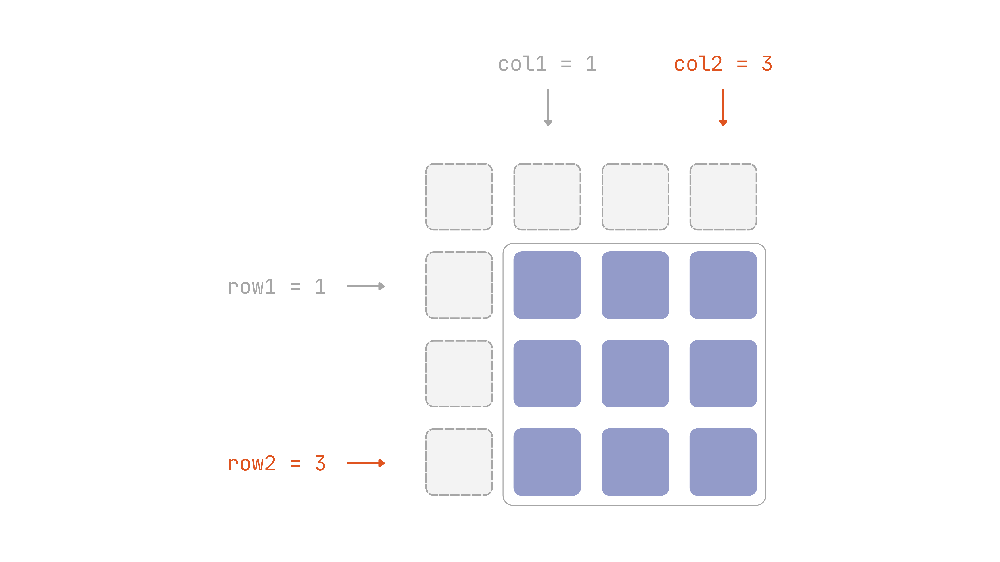
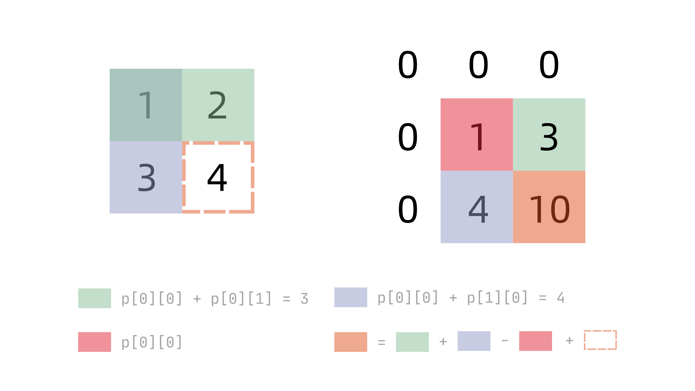

**區間**在陣列相關的題目中十分常見，例如查某段的和、對某段做更新。如果每次都從頭掃過一遍該區間，複雜度會隨著操作次數線性疊加上去，很容易從 $O(n)$ 累積到 $O(n^2)$ 甚至更糟。

此處介紹的**前綴和 (prefix sum)** 與**差分陣列 (difference array)**正是為了處理上述問題——用一次 $O(n)$ 預處理，換掉之後每次操作都需要付出的代價——查詢區間和的操作被壓到 $O(1)$，區間更新的操作也被壓到 $O(1)$。是最基本的**空間換時間**手法之一，大致上只要看到**多次查詢區間和**與**多次區間更新**就該想到使用這兩個技巧。

## 前綴和

首先來看題目（參見 [LeetCode 303](https://leetcode.com/problems/range-sum-query-immutable/)）：給定一個整數陣列，並給予多次查詢，每次查詢為一組 `[l, r]`，需求回傳 `nums[l]` 至 `nums[r]`（含兩端）的總和。例如：

```plaintext
nums = [1, 3, 5, 7, 9, 11]
```

查詢範例如下：

- `query(1, 3)`：`3 + 5 + 7 = 15`
- `query(0, 5)`：`1 + 3 + 5 + 7 + 9 + 11 = 36`
- `query(2, 2)`：`5 = 5`

直觀的解法是用 Python 的**切片 (slicce)**：

```python
class NumArray:

    def __init__(self, nums: List[int]):
        self.nums = nums

    def sumRange(self, left: int, right: int) -> int:
        return sum(self.nums[left:right + 1])
```

不過會碰到一個問題：如果判題時，`sumRange` 被呼叫了 $q$ 次，小一點還好辦，但是題目已給定至多會到 $10^{4}$ 次，此時時間複雜度會被拉到 $O(n \times q)$，很有可能會超時。

現在一步步拆解一下上述問題，既然已知題目會呼叫查詢，並且範圍為 `[l, r]`，何不先把前 `i` 項加起來，存成一個陣列呢？上述的前 `i` 項總和可以變成：

```plaintext
prefix = [0, 1, 4, 9, 16, 25, 36]
```

假設現在要計算 `query(1, 3)`，已知答案為 `15`，此值可由 `16 - 1` 得來，即 `prefix[4] - prefix[1]`。如果把 `query(l, r)` 的通式寫出，就是：

```plaintext
query(l, r) = prefix[r + 1] - prefix[l]
```

證明如下所示：

!!!- quote "證明"
    首先定義原本的 `nums` 為 $a$，`prefix` 則為 $p$，求出兩個 `prefix` 的式子：

    $$
    p_{r + 1} = \sum_{k = 0}^{r} a_{k}, \qquad p_{\ell} = \sum_{k = 0}^{\ell - 1} a_{k}
    $$

    兩者相減可得

    $$
    \begin{aligned}
        p_{r + 1} - p_{\ell} &= \sum_{k = 0}^{r} a_{k} - \sum_{k = 0}^{\ell - 1} a_{k}\\
        &= \left(\sum_{k = 0}^{\ell - 1} a_{k} + \sum_{k = \ell}^{r} a_{k}\right) - \sum_{k = 0}^{\ell - 1} a_{k}\\
        &= \sum_{k = \ell}^{r} a_{k}
    \end{aligned}
    $$

    所求即為 `query(l, r)`。

    <p style="text-align:right;">$\square$</p>

整理成通用寫法：

```plaintext
BuildPrefixSum(A)
    prefix[0] = 0
    for i = 1 to A.length do
        prefix[i] = prefix[i - 1] + A[i - 1]
    end for
    return prefix
```

```plaintext
RangeSum(prefix, l, r)
    return prefix[r + 1] - prefix[l]
```

`Algorithm 1` 花 $O(n)$ 建表，`Algorithm 2` 每次查詢是 $O(1)$，兩者合起來就是完整的前綴和套路。

實作如下：

```python
class NumArray:
    def __init__(self, nums: List[int]):
        n = len(nums)
        self.prefix = [0] * (n + 1)
        for i, num in enumerate(nums):
            self.prefix[i + 1] = self.prefix[i] + num

    def sumRange(self, left: int, right: int) -> int:
        return self.prefix[right + 1] - self.prefix[left]
```

## 後綴和

前綴和做的事情是從頭到某個位置之和，而**後綴和 (suffix sum)** 則是反過來，從某位置到陣列尾端之和，因此模式只是與前綴和相反。

常見的情況並非後綴和單獨使用，而是與前綴和共同作用。比如找一個位置，不包含自身，讓左右邊之和相等，也就是找**樞紐 (pivot)**。

題目（參見 [LeetCode 724](https://leetcode.com/problems/find-pivot-index/)）如下：給定一個整數陣列，找出一個索引 `i`，使得 `nums[0]` 到 `nums[i - 1]` 的總和，等於 `nums[i + 1]` 到最後的總和，找不到就回傳 `-1`。

暴力解法為：

```python
class Solution:
    def pivotIndex(self, nums: List[int]) -> int:
        for i in range(len(nums)):
            if sum(nums[:i]) == sum(nums[i + 1:]):
                return i
        return -1
```

因為呼叫了兩次 `sum`，時間複雜度為 $O(n^{2})$，容易超時。

既然要找樞紐，那麼前綴和與後綴和就變得非常直觀：開兩個陣列，一個從前面累加，另一個從後面累加，然後從頭跑到尾，回傳第一個累加數值相同的索引即可。實作如下：

```python
class Solution:
    def pivotIndex(self, nums: List[int]) -> int:
        n = len(nums)
        prefix = [0] * (n + 1)
        suffix = [0] * (n + 1)

        for i, num in enumerate(nums):
            prefix[i + 1] = prefix[i] + num
        for i in range(n - 1, -1, -1):
            suffix[i] = suffix[i + 1] + nums[i]

        for i in range(n):
            if prefix[i] == suffix[i + 1]:
                return i
        return -1
```

## 差分陣列

前綴和處理的是大量的查詢，而差分陣列處理的則是相反情境：同一個陣列被執行區間更新，即 `[l, r]` 區間中每個元素都加上 `v`，並且僅需做完全部更新後看最終結果即可。

同樣先來看題目，給定以下整數陣列：

```plaintext
nums = [0, 0, 0, 0, 0]
```

依序做以下更新：

- `update(0, 2, 5)`：索引 `0` 至 `2` 都加 5 → `[5, 5, 5, 0, 0]`
- `update(1, 3, 3)`：索引 `1` 至 `3` 都加 3 → `[5, 8, 8, 3, 0]`
- `update(2, 4, 2)`：索引 `2` 至 `4` 都加 2 → `[5, 8, 10, 5, 2]`

最終結果為 `[5, 8, 10, 5, 2]`。

同理，先寫直觀的做法：

```python
class NumArray:
    def __init__(self, nums: list[int]):
        self.nums = nums

    def update(self, left: int, right: int, value: int) -> list[int]:
        for i in range(left, right + 1):
            self.nums[i] += value
        return self.nums
```

每次更新都要跑迴圈改 `r - l + 1` 個元素，最糟是 $O(n)$，若要做 $m$ 次更新，則需要 $O(n \times m)$。

其實差分陣列就是前綴和的延伸，僅需修改 `left` 與 `right + 1` 即可：

!!!- quote "證明"
    設原陣列為 $a$，做一次 `update(l, r, v)` 後得到新陣列 $a^{\prime}$：

    $$
    a^{\prime}_{i} =
    \begin{cases}
        a_{i} + v, & \ell \le i \le r \\
        a_{i}, & \text{otherwise}
    \end{cases}
    $$

    定義某個陣列 $c$ 的**差分陣列**為 $d\_{i} = c\_{i} - c\_{i-1}$（約定 $c\_{-1} = 0$）。此即前綴和的逆運算——$c$ 可以由 $d$ 取前綴和還原：

    $$
        c_{i} = \sum_{k=0}^{i} d_{k}
    $$

    現在檢查 $a$ 換成 $a^{\prime}$ 之後，差分陣列從 $d$ 變成 $d^{\prime}$，哪些位置改變了：

    | 位置 | $a^{\prime}\_{i}$ | $a^{\prime}\_{i-1}$ | 結果 |
    | --- | --- | --- | --- |
    | $i < \ell$ | $a\_{i}$（不受影響） | $a\_{i-1}$（不受影響） | $d^{\prime}\_{i} = d\_{i}$ |
    | $i = \ell$ | $a\_{\ell} + v$ | $a\_{\ell-1}$（不受影響） | $d^{\prime}\_{\ell} = d\_{\ell} + v$ |
    | $\ell < i \le r$ | $a\_{i} + v$ | $a\_{i-1} + v$ | $d^{\prime}\_{i} = d\_{i}$（抵銷） |
    | $i = r + 1$ | $a\_{r+1}$（不受影響） | $a\_{r} + v$ | $d^{\prime}\_{r+1} = d\_{r+1} - v$ |
    | $i > r + 1$ | $a\_{i}$（不受影響） | $a\_{i-1}$（不受影響） | $d^{\prime}\_{i} = d\_{i}$ |

    整段區間更新，只讓差分陣列的兩個位置改變：$d\_{\ell}$ 多 $v$，$d\_{r+1}$ 少 $v$，其餘全部不變。

    <p style="text-align:right;">$\square$</p>

整理成通用寫法：

```plaintext
RangeUpdate(diff, l, r, v)
    diff[l] = diff[l] + v
    if r + 1 < diff.length then
        diff[r + 1] = diff[r + 1] - v
    end if
```

```plaintext
Reconstruct(diff)
    result[0] = diff[0]
    for i = 1 to diff.length - 1 do
        result[i] = result[i - 1] + diff[i]
    end for
    return result
```

`Algorithm 3` 每次更新是 $O(1)$，`Algorithm 4` 在所有更新做完後**只呼叫一次**，花 $O(n)$ 還原整個陣列，兩者合起來就是完整的差分陣列套路。

實作如下：

```python
class NumArray:
    def __init__(self, nums: list[int]):
        n = len(nums)
        self.nums = nums
        self.diff = [0] * n

    def update(self, left: int, right: int, value: int) -> list[int]:
        self.diff[left] += value
        if right + 1 < len(self.diff):
            self.diff[right + 1] -= value

    def result(self) -> list[int]:
        result = [0] * len(self.diff)
        result[0] = self.diff[0]
        for i in range(1, len(self.diff)):
            result[i] = result[i - 1] + self.diff[i]
        return result
```

## 二維前綴和

前綴和僅能處理一維陣列的區間和，若換成二維矩陣，轉換為查詢**任意矩形區域總和**，則需要處理多次。因此，可以將前綴和的思路直接套用——一次 $O(r \times c)$ 預處理（$r$ 列、$c$ 行），之後便可以每次都壓到 $O(1)$。

直接先看題目（參考 [LeetCode 304](https://leetcode.com/problems/range-sum-query-2d-immutable/)）。給定一個二維矩陣，會呼叫多次 `sumRegion(row1, col1, row2, col2)`，回傳左上角 `(row1, col1)`、右下角 `(row2, col2)` 矩形內所有元素的總和。

::: {#fig-2d-region-query}

:::

直覺很簡單，只要做兩層迴圈即可：

```python
class NumMatrix:

    def __init__(self, matrix: List[List[int]]):
        self.matrix = matrix

    def sumRegion(self, row1: int, col1: int, row2: int, col2: int) -> int:
        total = 0
        for i in range(row1, row2 + 1):
            for j in range(col1, col2 + 1):
               total += self.matrix[i][j]
        return total
```

但也正是因為兩層迴圈，很輕易地就會超時，時間複雜度在呼叫 $q$ 次下為 $O(r \times c \times q)$。

同樣把想法套用到二維上：建立一個跟 `matrix` 同大小、但外圍多一列一行的 `prefix` 陣列（原因跟一維前綴和的 `prefix[0] = 0` 一樣，讓邊界查詢不用特判），`prefix[i][j]` 定義成**左上角 `(0, 0)` 到 `(i - 1, j - 1)` 這塊矩形的總和**。

以下方矩陣為例：

```plaintext
matrix = [
    [3, 0, 1, 4, 2],
    [5, 6, 3, 2, 1],
    [1, 2, 0, 1, 5],
    [4, 1, 0, 1, 7],
    [1, 0, 3, 0, 5],
]
```

假設已經算出：

```plaintext
prefix[1][2] = 3
prefix[2][1] = 8
prefix[2][2] = 14
```

要建 `prefix[2][3]`、`prefix[3][2]` 這類已經算過的值不難，但如果要建 `prefix[3][3]`，能否僅用**上面**跟**左邊**已算好的 `prefix` 值湊出？答案是：`prefix[i-1][j] + prefix[i][j-1]` 會把左上角那塊 `prefix[i-1][j-1]` 重複算一次，扣掉一次之後，再加上新加入的那一格 `matrix[i-1][j-1]`：

```plaintext
prefix[i][j] = prefix[i - 1][j] + prefix[i][j - 1] 
               - prefix[i - 1][j - 1] + matrix[i - 1][j - 1]
```

為了更加簡化與解釋，考慮以下二維陣列/矩陣：

<div style="display:flex; justify-content:center; align-items:center; gap:2.5em; flex-wrap:wrap;">
```python
matrix = [
    [1, 2], [3, 4]
]
```

或寫成矩陣的形式：
<span>$\begin{pmatrix} 1 & 2 \\ 3 & 4 \end{pmatrix}$</span>
</div>

我們可以透過下圖得知二維前綴表是如何得來的。事實上，無論是上述公式或是下圖，背後的邏輯就是**排容原理 (inclusion–exclusion principle)**。

::: {#fig-2d-prefix-build}

:::

!!!- quote "證明"
    設矩陣為 $A$，二維前綴和為 $P$，定義：

    $$
    P_{i,j} = \sum_{x=0}^{i-1} \sum_{y=0}^{j-1} A_{x,y}
    $$

    現在檢查 $P\_{i-1,j} + P\_{i,j-1}$ 這兩塊各自涵蓋的範圍：

    $$
    P_{i-1,j} = \sum_{x=0}^{i-2} \sum_{y=0}^{j-1} A_{x,y}, \qquad P_{i,j-1} = \sum_{x=0}^{i-1} \sum_{y=0}^{j-2} A_{x,y}
    $$

    兩者相加，$x \in [0, i-2]$、$y \in [0, j-2]$ 這塊左上角區域同時出現在兩邊，被算了兩次：

    $$
    P_{i-1,j} + P_{i,j-1} = \underbrace{\sum_{x=0}^{i-2} \sum_{y=0}^{j-2} A_{x,y}}_{\text{算了兩次}} + \sum_{x=0}^{i-2} A_{x,j-1} + \sum_{y=0}^{j-2} A_{i-1,y}
    $$

    而 $P\_{i-1,j-1} = \sum\_{x=0}^{i-2} \sum\_{y=0}^{j-2} A\_{x,y}$ 剛好就是那塊多算的左上角，扣掉一次：

    $$
    P_{i-1,j} + P_{i,j-1} - P_{i-1,j-1} = \sum_{x=0}^{i-2} \sum_{y=0}^{j-1} A_{x,y} + \sum_{y=0}^{j-2} A_{i-1,y}
    $$

    這正是 $P\_{i,j} = \sum\_{x=0}^{i-1} \sum\_{y=0}^{j-1} A\_{x,y}$ 扣掉最後一格 $A\_{i-1,j-1}$，補回這一格即可：

    $$
    P_{i,j} = P_{i-1,j} + P_{i,j-1} - P_{i-1,j-1} + A_{i-1,j-1}
    $$

    <p style="text-align:right;">$\square$</p>

有了 `prefix`，查詢時同樣用容斥處理：`sumRegion(row1, col1, row2, col2)` 先取左上角到 `(row2, col2)` 的整塊大矩形 `prefix[row2+1][col2+1]`，扣掉左邊那條長條 `prefix[row2+1][col1]`、扣掉上面那條長條 `prefix[row1][col2+1]`，這兩條長條的左上角重疊了一次（`prefix[row1][col1]`），扣了兩次，加回來一次：

```plaintext
sumRegion(row1, col1, row2, col2)
        = prefix[row2 + 1][col2 + 1] - prefix[row1][col2 + 1]
          - prefix[row2 + 1][col1] + prefix[row1][col1]
```

整理成通用寫法：

```plaintext
Build2DPrefixSum(M)
    for i = 1 to M.rows do
        for j = 1 to M.cols do
            prefix[i][j] = prefix[i - 1][j] + prefix[i][j - 1]
                         - prefix[i - 1][j - 1] + M[i - 1][j - 1]
        end for
    end for
    return prefix
```

```plaintext
RangeSum2D(prefix, row1, col1, row2, col2)
    return prefix[row2 + 1][col2 + 1] - prefix[row1][col2 + 1]
         - prefix[row2 + 1][col1] + prefix[row1][col1]
```

`Algorithm 5` 花 $O(r \times c)$ 建表，`Algorithm 6` 每次查詢是 $O(1)$，兩者合起來就是完整的二維前綴和套路。

實作如下：

```python
class NumMatrix:
    def __init__(self, matrix: List[List[int]]):
        rows, cols = len(matrix), len(matrix[0])
        self.prefix = [[0] * (cols + 1) for _ in range(rows + 1)]
        for i in range(rows):
            for j in range(cols):
                self.prefix[i + 1][j + 1] = (
                    self.prefix[i][j + 1] + self.prefix[i + 1][j]
                    - self.prefix[i][j] + matrix[i][j]
                )

    def sumRegion(self, row1: int, col1: int, row2: int, col2: int) -> int:
        return (
            self.prefix[row2 + 1][col2 + 1]
            - self.prefix[row1][col2 + 1]
            - self.prefix[row2 + 1][col1]
            + self.prefix[row1][col1]
        )
```

## 實作

### [LeetCode 1732：找到最高海拔](https://leetcode.com/problems/find-the-highest-altitude/)

::: {.problem}
給定一個長度為 `n` 的整數陣列 `gain`，代表從第 `i` 個點走到第 `i + 1` 個點時，海拔的變化量。起點（第 `0` 個點）的海拔為 `0`，回傳整趟旅程中到達過的最高海拔。

#### 範例

```plaintext
輸入：gain = [-5,1,5,0,-7]
輸出：1
```
:::

這題是很基本套用前綴和的題目，實作如下：

```python
class Solution:
    def largestAltitude(self, gain: List[int]) -> int:
        n = len(gain)
        prefix = [0] * (n + 1)
        
        for i, num in enumerate(gain):
            prefix[i + 1] = prefix[i] + gain[i]

        return max(prefix)
```

但事實上不需要真的開一個 `prefix` 陣列存下每一步的結果，用一個變數邊走邊累加，同時更新最大值即可，空間壓到 $O(1)$：

```python
class Solution:
    def largestAltitude(self, gain: List[int]) -> int:
        altitude = 0
        highest = 0
        for g in gain:
            altitude += g
            highest = max(highest, altitude)
        return highest
```

### [LeetCode 238：除自身以外陣列的乘積](https://leetcode.com/problems/product-of-array-except-self/)

::: {.problem}
給定一個整數陣列 `nums`，回傳一個陣列 `answer`，其中 `answer[i]` 等於 `nums` 中除了 `nums[i]` 以外所有元素的乘積，且不能使用除法，需在 $O(n)$ 時間內完成。

#### 範例

```plaintext
輸入：nums = [1,2,3,4]
輸出：[24,12,8,6]
```
:::

這題與找樞紐一樣，因為**不含自身**，所以我們得先從頭掃過一遍，將每個位置**左邊**所有元素的乘積先存進 `result[i]`；再從尾端反向掃一遍，把**右邊**所有元素的乘積累乘上去。左右兩次都只用一個變數（`prefix`、`suffix`）邊走邊算，不用真的開兩個陣列存下來：

```python
class Solution:
    def productExceptSelf(self, nums: List[int]) -> List[int]:
        n = len(nums)
        result = [1] * n

        prefix = 1
        for i, num in enumerate(nums):
            result[i] = prefix
            prefix *= num

        suffix = 1
        for i in reversed(range(n)):
            result[i] *= suffix
            suffix *= nums[i]

        return result
```


### [LeetCode 1109：航班預訂統計](https://leetcode.com/problems/corporate-flight-bookings/)

::: {.problem}
有 `n` 個航班，編號從 `1` 到 `n`。給定一個二維陣列 `bookings`，其中 `bookings[i] = [first, last, seats]` 代表在編號 `first` 到 `last`（含兩端）的每個航班上都要預訂 `seats` 個座位。回傳一個長度為 `n` 的陣列，代表每個航班總共被預訂的座位數。

#### 範例

```plaintext
輸入：bookings = [[1,2,10],[2,3,20],[2,5,25]], n = 5
輸出：[10,55,45,25,25]
```
:::

這題與前面差分陣列的例子很相似，幾乎直接套用即可，但注意，因為編號從 1 開始，因此在處理 `left` 時要減 1。

```python
class Solution:
    def corpFlightBookings(self, bookings: List[List[int]], n: int) -> List[int]:
        diff = [0] * n
        result = [0] * n

        for booking in bookings:
            left, right, value = booking[0], booking[1], booking[2]
            diff[left - 1] += value
            if right < n:
                diff[right] -= value

        result[0] = diff[0]
        for i in range(1, len(diff)):
            result[i] = result[i - 1] + diff[i]

        return result
```

<!-- TODO: LeetCode 1314 矩陣區域和 -- 2D 還不熟，先跳過，之後回頭補
### [LeetCode 1314：矩陣區域和](https://leetcode.com/problems/matrix-block-sum/)

::: {.problem}
給定一個矩陣 `mat` 與整數 `k`，回傳一個同大小的矩陣 `answer`，其中 `answer[i][j]` 是 `mat` 中以 `(i - k, j - k)` 為左上角、`(i + k, j + k)` 為右下角這塊區域內所有元素的總和（超出矩陣邊界的部分自動忽略）。

#### 範例

```plaintext
輸入：mat = [[1,2,3],[4,5,6],[7,8,9]], k = 1
輸出：[[12,21,16],[27,45,33],[24,39,28]]
```
:::
-->

