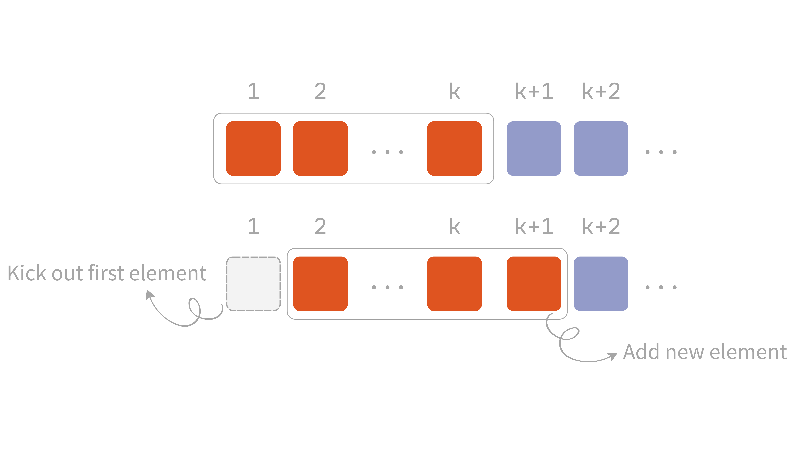

The point of [two pointers](../two-pointers-en/) is to use the ordered nature of indices to cut out unnecessary repeated comparisons -- turning an exhaustive scan of every combination into a single one-directional pass, discarding combinations that can't possibly be the answer, and bringing a higher time complexity down to $O(n)$.

The **sliding window** technique, on the other hand, takes advantage of the fact that when an **interval** shifts to the right[^1], only the newly-added element and the one that just left change -- everything else in between stays exactly the same. That means there's no need to rescan the whole structure every time, bringing $O(n \times k)$ or even $O(n^{2})$ down to $O(n)$. The most common use case for sliding window is checking some condition over a **contiguous interval**.

For example: given an arbitrary integer array and a `k`, find the maximum sum of any `k` consecutive elements. Say we're given this array and `k`:

```
nums = [2, 1, 5, 1, 3, 2], k = 3
```

One way to write this:

```python
def findMaxThree(nums: list[int], k: int) -> int:
    sum: int = 0
    n = len(nums)

    for i in range(n - k + 1):
        tmp_sum = 0
        for j in range(i, i + k):
            tmp_sum += nums[j]
        sum = max(sum, tmp_sum)
    return sum
```

But in the code above, consecutive intervals end up **overlapping**:

::: {#fig-brute-force-windows}

:::

- The first interval `[2, 1, 5]` and the second `[1, 5, 1]` overlap on `[1, 5]`
- The second interval `[1, 5, 1]` and the third `[5, 1, 3]` overlap on `[5, 1]`

And so on. Since we have to visit every element in the array, and at each one we additionally walk `k` steps to sum up the window, the time complexity is $O(n \times k)$.

The whole point of sliding window is bringing that time complexity down to $O(n)$!

## Fixed-size Window

Given an array or string, set up an interval with a **fixed length**, and keep sliding it to the right, updating the value inside it on the fly -- this is called a **fixed window**.

As mentioned, two adjacent windows share $k - 1$ overlapping elements, and those overlapping elements get reprocessed in both calculations -- completely wasted work. Since the sum of those $k - 1$ shared elements never changes, the only real difference between the two windows is **the element that just left** and **the element that just entered**.

In other words, once you know the previous window's sum, the new window's sum can be computed directly as **the previous sum, minus the element that left, plus the element that entered** -- no need to re-sum the window's contents at all. That's exactly why fixed-size windows bring the per-step cost down from $O(k)$ to $O(1)$: the outer loop still has to pass through $n$ positions, but each one only does constant work, so overall it's $O(n)$.

```plaintext
Algorithm 1 Fixed-size Sliding Window
    procedure FixedWindow(A, k)
        for i = 1 to k do
            ▷ Add A[i] to the window
        end for
        ▷ Process the first window

        for i = k + 1 to A.length do
            ▷ Remove A[i - k] from the window
            ▷ Add A[i] to the window
            ▷ Process the current window
        end for
end procedure
```

To keep the explanation simple, @fig-window-slide-mechanics uses 1-indexed arrays:

::: {#fig-window-slide-mechanics}
{width=600}
:::

## Variable-size Window

One of the assumptions behind fixed-size windows is that the window size `k` is a given constant. But flip that around: given an array, find the length of the longest/shortest contiguous subarray satisfying some condition. In that case, there's no way to know the window size in advance -- the window size *is* the answer we're looking for -- so the window needs to be able to grow and shrink dynamically.

Similar to fixed-size windows, moving to the next interval still means kicking out an existing element and bringing in a new one. The difference, as mentioned, is that the window size itself needs to change based on the condition.

As for how it changes, picture the two ends of the window as movable handles: the **right handle** grows the window by pulling in a new element that hasn't been included yet; the **left handle** shrinks the window by kicking out an element that's no longer needed.

Both handles only ever move in the same direction (right) -- never backward. The only thing that changes is which handle gets pulled, and when: the right handle keeps expanding until the window's contents satisfy the condition; once it does, the left handle takes over and shrinks the window, checking and updating the answer at each step, until the window no longer satisfies the condition; then the right handle takes over again and keeps expanding. This repeats until the right handle reaches the end of the array.

```plaintext
Algorithm 2 Variable-size Sliding Window
    procedure VariableWindow(A)
        left = 1
        right = 1
        while right ≤ A.length do
            ▷ Add A[right] to the window
            right = right + 1

            while ▷ the window satisfies the shrink condition do
                ▷ Process the current window
                ▷ Remove A[left] from the window
                left = left + 1
            end while
        end while
end procedure
```

As shown in the animation below: the right handle expands the window first, until it satisfies the condition; then the left handle takes over and shrinks it, until the window no longer satisfies the condition; this repeats until the right handle reaches the end of the array.

::: {#fig-variable-window-handles}

:::

## Solutions

### [LeetCode 643: Maximum Average Subarray I](https://leetcode.com/problems/maximum-average-subarray-i/)

::: {.problem}
You're given an integer array `nums` of length `n`, along with an integer `k`. Find a contiguous subarray of length exactly `k` whose average value is maximum, and return that maximum average.

#### Example 1

```plaintext
Input: nums = [1,12,-5,-6,50,3], k = 4
Output: 12.75000
```

#### Example 2

```plaintext
Input: nums = [5], k = 1
Output: 5.00000
```
:::

This is essentially the same as the example at the very top of this post, just asking for an average instead of a sum. But since `k` stays fixed, whichever window has the largest sum also has the largest average -- find the maximum sum first, then divide by `k` at the end.

The brute-force solution, matching the style shown earlier in this post:

```python
class Solution:
    def findMaxAverage(self, nums: list[int], k: int) -> float:
        n = len(nums)
        max_sum = float('-inf')

        for i in range(n - k + 1):
            tmp_sum = 0
            for j in range(i, i + k):
                tmp_sum += nums[j]
            max_sum = max(max_sum, tmp_sum)

        return max_sum / k
```

Same overlap, same $O(n \times k)$ -- optimize it with a fixed-size window instead:

```python
class Solution:
    def findMaxAverage(self, nums: list[int], k: int) -> float:
        n = len(nums)
        window_sum = sum(nums[:k])
        max_sum = window_sum

        for i in range(k, n):
            window_sum = window_sum - nums[i - k] + nums[i]
            max_sum = max(max_sum, window_sum)

        return max_sum / k
```

### [LeetCode 209: Minimum Size Subarray Sum](https://leetcode.com/problems/minimum-size-subarray-sum/)

::: {.problem}
You're given an array `nums` made up of **positive integers**, along with a positive integer `target`. Find the **shortest** contiguous subarray whose sum is greater than or equal to `target`, and return its length; if no such subarray exists, return `0`.

#### Example 1

```plaintext
Input: target = 7, nums = [2,3,1,2,4,3]
Output: 2
```

#### Example 2

```plaintext
Input: target = 4, nums = [1,4,4]
Output: 1
```

#### Example 3

```plaintext
Input: target = 11, nums = [1,1,1,1,1,1,1,1]
Output: 0
```
:::

The window size here isn't given -- it's the answer we're looking for, so this is a variable-size window problem. The brute-force approach expands to the right from each starting point until the sum reaches `target`:

```python
class Solution:
    def minSubArrayLen(self, target: int, nums: list[int]) -> int:
        n = len(nums)
        min_length = n + 1

        for i in range(n):
            k = 0
            tmp_sum = 0
            while tmp_sum < target and i + k < n:
                tmp_sum += nums[i + k]
                k += 1
            if tmp_sum >= target:
                min_length = min(min_length, k)

        return min_length if min_length <= n else 0
```

The problem is that every starting point re-scans to the right from scratch, giving $O(n^{2})$. Switch to the two handles instead -- `right` only ever expands, `left` only ever shrinks, each moving at most `n` steps total:

```python
class Solution:
    def minSubArrayLen(self, target: int, nums: list[int]) -> int:
        n = len(nums)
        left, right = 0, 0
        min_length = n + 1
        window_sum = 0

        while right < n:
            window_sum += nums[right]
            right += 1

            while window_sum >= target:
                min_length = min(min_length, right - left)
                window_sum -= nums[left]
                left += 1

        return min_length if min_length <= n else 0
```

### [LeetCode 1343: Number of Sub-arrays of Size K and Average Greater than or Equal to Threshold](https://leetcode.com/problems/number-of-sub-arrays-of-size-k-and-average-greater-than-or-equal-to-threshold/)

::: {.problem}
You're given an integer array `arr`, along with two integers `k` and `threshold`. Return the number of subarrays of length `k` whose average is greater than or equal to `threshold`.

#### Example 1

```plaintext
Input: arr = [2,2,2,2,5,5,5,8], k = 3, threshold = 4
Output: 3
```

#### Example 2

```plaintext
Input: arr = [11,13,17,23,29,31,7,5,2,3], k = 3, threshold = 5
Output: 6
```
:::

This is really just a variant of [LeetCode 643](https://leetcode.com/problems/maximum-average-subarray-i/description/) -- you just need to set up a counter `count` at the start, checking whether the very first window's average already meets the threshold and initializing `count` to `1` or `0` accordingly. That covers the first window (indices `0` through `k - 1`), which the loop below never checks on its own:

```python
class Solution:
    def numOfSubarrays(self, arr: List[int], k: int, threshold: int) -> int:
        n = len(arr)
        window_sum = sum(arr[:k])
        count = 1 if (window_sum // k) >= threshold else 0

        for i in range(k, n):
            window_sum = window_sum - arr[i - k] + arr[i]
            if window_sum // k >= threshold:
                count += 1
        return count
```

### [LeetCode 1004: Max Consecutive Ones III](https://leetcode.com/problems/max-consecutive-ones-iii/)

::: {.problem}
You're given an array `nums` containing only `0`s and `1`s, along with an integer `k`. You may flip at most `k` zeros to ones -- return the length of the longest run of consecutive `1`s you can get after flipping.

#### Example 1

```plaintext
Input: nums = [1,1,1,0,0,0,1,1,1,1,0], k = 2
Output: 6
```

#### Example 2

```plaintext
Input: nums = [0,0,1,1,0,0,1,1,1,0,1,1,0,0,0,1,1,1,1], k = 3
Output: 10
```
:::

This problem is really asking for the longest contiguous subarray -- even though it's phrased as the longest run of 1s, you can flip the framing around: use a variable-size window and just track how many 0s are inside it:

- Every step, the right pointer unconditionally expands the window; if the newly-added element is `0`, increment the count of zeros in the window
- Then check whether that zero count exceeds `k` (the maximum number of flips allowed); if it does, shrink the left pointer, kicking out the leftmost element, until the count no longer exceeds `k`

```python
class Solution:
    def longestOnes(self, nums: List[int], k: int) -> int:
        n = len(nums)
        left, right = 0, 0
        zero_count = 0
        max_length = 0

        while right < n:
            if nums[right] == 0:
                zero_count += 1
            right += 1

            while zero_count > k:
                if nums[left] == 0:
                    zero_count -= 1
                left += 1

            max_length = max(max_length, right - left)

        return max_length
```

[^1]: This interval is exactly the contiguous range bounded by two same-direction left/right pointers -- different from the opposite-direction behavior left/right pointers usually have in two pointers.
