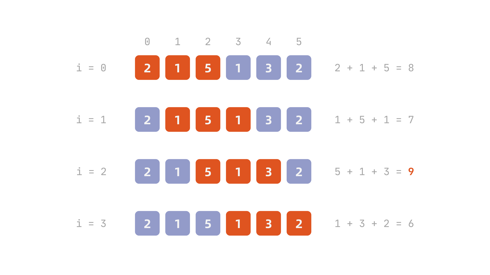
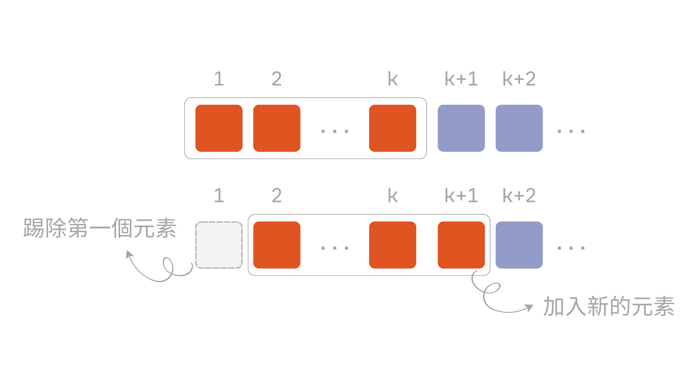

[雙指標](../two-pointers/)使用的目的，是為了利用索引的順序性減少不必要的重複比較，把窮舉所有組合變成單向掃過一次，捨棄掉不可能是答案的組合，從而將較高的時間複雜度降到 $O(n)$。

而**滑動視窗 (sliding window)** 則是利用**區間**向右移動時[^1]，內部新加入的元素與剛移出的元素改變，其餘完全不動的特性，便毋需每次都重新掃過整個資料結構，把 $O(n \times k)$ 甚至是 $O(n^{2})$ 降至 $O(n)$。而滑動視窗最常被應用的場景，大多都是**連續區間內符合多少條件**。

舉例來說，假設給定任意整數陣列與 `k`，找出連續 `k` 個元素的最大總和。例如給定以下陣列與 `k`：

```
nums = [2, 1, 5, 1, 3, 2], k = 3
```

我們可以這樣寫：

```python
def findMaxThree(nums: list[int], k: int) -> int:
    sum: int = 0
    N = len(nums)

    for i in range(N - k + 1):
        tmp_sum = 0
        for j in range(i, i + k):
            tmp_sum += nums[j]
        sum = max(sum, tmp_sum)
    return sum
```

但是在上述撰寫的程式碼中，前後兩個區間會出現**重疊 (overlap)** 的情況：

::: {#fig-brute-force-windows}

:::

- 第一個區間 `[2, 1, 5]` 與第二個區間 `[1, 5, 1]` 在 `[1, 5]` 重疊
- 第二個區間 `[1, 5, 1]` 與第三個區間 `[5, 1, 3]` 在 `[5, 1]` 重疊

以此類推。因為除了需要走訪陣列中所有元素外，尚需在每個元素停留時，走 `k` 次並加總，時間複雜度為 $O(n \times k)$。

滑動視窗的目的就是為了讓時間複雜度降低到 $O(n)$！

## 固定視窗

給定一個陣列/字串，設定一個**長度固定**的區間，透過不斷向右滑動該區間，即時更新區間內的值，稱為**固定視窗 (fixed window)**。

前面提到，相鄰兩個窗口之間會有 $k - 1$ 個元素重疊，重疊元素在兩次計算裡都被重新處理，完全是白工。既然這 $k - 1$ 個重疊元素的總和不會變，兩個窗口之間唯一真正的差異，只有**被移出窗口的那個元素**跟**新加入窗口的那個元素**。

換句話說，只要知道上一個窗口的總和，新窗口的總和就能直接用**上一個總和減去移出的元素、加上新加入的元素**算出來，完全不需要把窗口內容重新加總一遍。這也是為什麼固定視窗能把每一步的複雜度從 $O(k)$ 壓到 $O(1)$——外層依然要走過 $n$ 個位置，但每個位置只做常數次運算，整體就是 $O(n)$。

```plaintext
Algorithm 1 Fixed-size Sliding Window
    procedure FixedWindow(A, k)
        for i = 1 to k do
            ▷ 將 A[i] 加入窗口
        end for
        ▷ 處理第一個窗口

        for i = k + 1 to A.length do
            ▷ 將 A[i - k] 移出窗口
            ▷ 將 A[i] 加入窗口
            ▷ 處理目前窗口
        end for
end procedure
```

為了方便解釋，@fig-window-slide-mechanics 將陣列設定為索引從 1 開始：

::: {#fig-window-slide-mechanics}
{width=600}
:::

## 可變大小視窗

前面提到的固定視窗使用的前提之一是：視窗大小 `k` 是給定的常數。但若反過來，給定一個陣列，求出裡面滿足條件的最長/短的連續子陣列之長度。這種情況下，根本無法得知視窗大小為何，因為視窗大小正是要找的答案，所以這時視窗就必須可以動態變大、變小。

與固定視窗大小相似，在處理下一個區間時，需要踢除既有的元素，然後加入新的元素。不同的地方如前面所言，視窗大小需根據條件變動。

至於如何變動，我們可以想像成視窗兩頭是可以移動的把手，而**右邊的把手**負責讓視窗變大——把還沒被納入的新元素收進視窗；**左邊的把手**負責讓視窗變小——把不再需要的元素踢出視窗。

兩支把手都只會往同一個方向（右邊）移動，不會往回拉，差別只在於什麼時候該拉哪一支：右邊把手一路往右擴張，直到視窗內容符合條件為止；一旦符合條件，換左邊把手開始往右收縮，收縮的同時檢查、更新答案，直到視窗不再符合條件為止；接著再換回右邊把手繼續擴張，如此往復，直到右邊把手走到陣列尾端為止。

```plaintext
Algorithm 2 Variable-size Sliding Window
    procedure VariableWindow(A)
        left = 1
        right = 1
        while right ≤ A.length do
            ▷ 將 A[right] 加入窗口
            right = right + 1

            while ▷ 窗口內容符合收縮條件 do
                ▷ 處理目前窗口
                ▷ 將 A[left] 移出窗口
                left = left + 1
            end while
        end while
end procedure
```

如下方動畫所示：右邊把手先往右擴張視窗，直到視窗內容符合條件；接著換左邊把手往右收縮，直到視窗不再符合條件為止；如此反覆進行，直到右邊把手走到陣列尾端。

::: {#fig-variable-window-handles}

:::

## 實作

### [LeetCode 643：最大平均數子陣列 I](https://leetcode.com/problems/maximum-average-subarray-i/)

::: {.problem}
給定一個長度為 `n` 的整數陣列 `nums`，以及一個整數 `k`。找出一個長度恰好為 `k` 的連續子陣列，使其平均值最大，並回傳這個最大平均值。

#### 範例 1

```plaintext
輸入：nums = [1,12,-5,-6,50,3], k = 4
輸出：12.75000
```

#### 範例 2

```plaintext
輸入：nums = [5], k = 1
輸出：5.00000
```
:::

這題本質上跟本文最前面的例子一樣，只是求的是平均值，不是總和。但 `k` 固定不變，總和最大的窗口，平均值也一定最大——先求出最大總和，最後除以 `k` 即可。

暴力解，跟本文一開始示範的寫法一致：

```python
class Solution:
    def findMaxAverage(self, nums: list[int], k: int) -> float:
        N = len(nums)
        max_sum = float('-inf')

        for i in range(N - k + 1):
            tmp_sum = 0
            for j in range(i, i + k):
                tmp_sum += nums[j]
            max_sum = max(max_sum, tmp_sum)

        return max_sum / k
```

一樣有重疊、一樣是 $O(n \times k)$，改用固定視窗優化：

```python
class Solution:
    def findMaxAverage(self, nums: list[int], k: int) -> float:
        N = len(nums)
        window_sum = sum(nums[:k])
        max_sum = window_sum

        for i in range(k, N):
            window_sum = window_sum - nums[i - k] + nums[i]
            max_sum = max(max_sum, window_sum)

        return max_sum / k
```

### [LeetCode 209：長度最小的子陣列](https://leetcode.com/problems/minimum-size-subarray-sum/)

::: {.problem}
給定一個由**正整數**組成的陣列 `nums`，以及一個正整數 `target`。找出陣列中總和大於等於 `target` 的**最短**連續子陣列，並回傳其長度；不存在則回傳 `0`。

#### 範例 1

```plaintext
輸入：target = 7, nums = [2,3,1,2,4,3]
輸出：2
```

#### 範例 2

```plaintext
輸入：target = 4, nums = [1,4,4]
輸出：1
```

#### 範例 3

```plaintext
輸入：target = 11, nums = [1,1,1,1,1,1,1,1]
輸出：0
```
:::

這題視窗大小不是給定的，是要找的答案本身，屬於可變大小視窗。暴力解對每個起點，不斷往右擴大範圍直到總和大於等於 `target`：

```python
class Solution:
    def minSubArrayLen(self, target: int, nums: list[int]) -> int:
        N = len(nums)
        min_length = N + 1

        for i in range(N):
            k = 0
            tmp_sum = 0
            while tmp_sum < target and i + k < N:
                tmp_sum += nums[i + k]
                k += 1
            if tmp_sum >= target:
                min_length = min(min_length, k)

        return min_length if min_length <= N else 0
```

問題出在每個起點都要重新掃一次右邊，複雜度是 $O(n^{2})$。改用左右把手，`right` 只往右擴張、`left` 只往右收縮，全程各自最多走 `n` 步：

```python
class Solution:
    def minSubArrayLen(self, target: int, nums: list[int]) -> int:
        N = len(nums)
        left, right = 0, 0
        min_length = N + 1
        window_sum = 0

        while right < N:
            window_sum += nums[right]
            right += 1

            while window_sum >= target:
                min_length = min(min_length, right - left)
                window_sum -= nums[left]
                left += 1

        return min_length if min_length <= N else 0
```

### [LeetCode 1343：大小為 K 且平均值大於等於閾值的子陣列數目](https://leetcode.com/problems/number-of-sub-arrays-of-size-k-and-average-greater-than-or-equal-to-threshold/)

::: {.problem}
給定一個整數陣列 `arr`，以及兩個整數 `k`、`threshold`。回傳陣列中長度為 `k`、且平均值大於等於 `threshold` 的子陣列個數。

#### 範例 1

```plaintext
輸入：arr = [2,2,2,2,5,5,5,8], k = 3, threshold = 4
輸出：3
```

#### 範例 2

```plaintext
輸入：arr = [11,13,17,23,29,31,7,5,2,3], k = 3, threshold = 5
輸出：6
```
:::

這題其實就是 [LeetCode 643](https://leetcode.com/problems/maximum-average-subarray-i/description/) 的變形，只是需要在一開始先建立一個計數器 `count`，並判斷最初的視窗平均是否大於等於閾值，若符合條件則設定為 1，否則就為 0，這樣就可以判斷 `0` 至 `k - 1` 之間的第一個視窗：

```python
class Solution:
    def numOfSubarrays(self, arr: List[int], k: int, threshold: int) -> int:
        N = len(arr)
        window_sum = sum(arr[:k])
        count = 1 if (window_sum // k) >= threshold else 0

        for i in range(k, N):
            window_sum = window_sum - arr[i - k] + arr[i]
            if window_sum // k >= threshold:
                count += 1
        return count
```

### [LeetCode 1004：最大連續 1 的個數 III](https://leetcode.com/problems/max-consecutive-ones-iii/)

::: {.problem}
給定一個只包含 `0`、`1` 的陣列 `nums`，以及一個整數 `k`。最多可以把 `k` 個 `0` 翻轉成 `1`，回傳翻轉後陣列中最長連續 `1` 的個數。

#### 範例 1

```plaintext
輸入：nums = [1,1,1,0,0,0,1,1,1,1,0], k = 2
輸出：6
```

#### 範例 2

```plaintext
輸入：nums = [0,0,1,1,0,0,1,1,1,0,1,1,0,0,0,1,1,1,1], k = 3
輸出：10
```
:::

此題要求的是最大的連續子陣列，雖然題目問的是最大連續 1 的個數，但其實可以反向思考——用一個可變大小視窗，計算裡面有多少個 0 即可：

- 每一步先讓右指標無條件往右擴張視窗；若新加入的元素是 `0`，則計數（窗口內 0 的個數）加一
- 接著檢查窗口內 0 的個數是否超過 `k`（也就是可以翻轉的最大次數）；若超過，則收縮左指標，把最左邊元素踢除，直到不再超過 `k` 為止

```python
class Solution:
    def longestOnes(self, nums: List[int], k: int) -> int:
        N = len(nums)
        left, right = 0, 0
        zero_count = 0
        max_length = 0
        
        while right < N:
            if nums[right] == 0:
                zero_count += 1    
            right += 1

            while zero_count > k:
                if nums[left] == 0:
                    zero_count -= 1
                left += 1
            
            max_length = max(max_length, right - left)

        return max_length
```

[^1]: 此區間正是由左、右兩同向指標圈出的連續區間，與雙指標常見左右指標反向的行為不同。