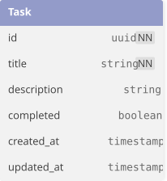

[上一篇](../init/init.qmd)已經初始化了專案，接下來就要開始建構模型。

模型就是把一筆資料的「長相」寫成程式碼——包含資料有哪些欄位、每個欄位都是什麼型別。

以本專案為例，每個任務的欄位如[介紹頁的任務資料表](../intro/intro.qmd#tbl-task-fields)所示，現在大多數的框架都有支援[物件關聯對映 (object-relational mapper, ORM)](https://zh.wikipedia.org/wiki/物件關聯對映)，只需將程式碼定義好，便可以自動生成 SQL 指令並建表，省去手搓 SQL 指令的步驟。

**FastAPI** 通常搭配 SQLAlchemy，繼承 `Base` 的 `class`，欄位則用 `Mapped` 標記型別[^sqlalchemy]。

## 資料表結構圖 

為了更清楚我們每個欄位定義了什麼、型別為何，通常我們會偏好繪製一張資料表結構圖，幫助我們更好理解[^dbdiagram]。

本專案僅需一張表，也就是任務表，如下所示：



其中 `NN` 代表 `not null`（非空），對應的 SQL 指令為：

```sql
CREATE TABLE tasks (
    id TEXT PRIMARY KEY,
    title VARCHAR(100) NOT NULL,
    description VARCHAR(500),
    completed BOOLEAN NOT NULL DEFAULT FALSE,
    created_at TIMESTAMP NOT NULL DEFAULT CURRENT_TIMESTAMP,
    updated_at TIMESTAMP NOT NULL DEFAULT CURRENT_TIMESTAMP
);
```

## 程式碼實作 

根據上述的資料表，接下來就可以將程式碼實際寫出。

#### 建立資料庫 

首先，我們需要建立一個可以建立連線的資料庫。我們在根目錄建立 `database.py`

```bash
touch database.py
```

接下來就需要在裡面定義資料庫的一些屬性，具體如下：

```python
from sqlalchemy import create_engine
from sqlalchemy.orm import sessionmaker, DeclarativeBase

# 使用 SQLite 並定義資料庫存放位置
DATABASE_URL = "sqlite:///./todo.db"

# 建立連線池
engine = create_engine(
    url=DATABASE_URL,
    connect_args={
        "check_same_thread": False, # 僅准建立連線者使用
        "uri": True,                # 視為 URI 解析方能加參數
        "timeout": 30               # 連線逾時放棄連線
    }
)

# 建立 Session 工具
SessionLocal = sessionmaker(
    bind=engine,    # 僅准連線上述定義的 engine
    autoflush=False # 送出未執行的 SQL 指令
)

# 所有模型都要繼承的基底
class Base(DeclarativeBase):
    pass
```

#### 定義資料庫 

接著建立 `models.py`：

```bash
touch models.py
```

然後將資料表中的欄位設定全部都放入該檔中：

```python
import datetime
from uuid import UUID, uuid4

from sqlalchemy import DateTime, String, func
from sqlalchemy.orm import Mapped, mapped_column

from database import Base


class Task(Base):
    __tablename__ = "tasks"
    id: Mapped[UUID] = mapped_column(primary_key=True, default=uuid4)
    title: Mapped[str] = mapped_column(String(100), nullable=False)
    description: Mapped[str] = mapped_column(String(500), nullable=True)
    completed: Mapped[bool] = mapped_column(default=False)
    created_at: Mapped[datetime.datetime] = mapped_column(
        DateTime(timezone=True), server_default=func.now()
    )
    updated_at: Mapped[datetime.datetime] = mapped_column(
        DateTime(timezone=True), server_default=func.now(), onupdate=func.now()
    )
```

其中需要注意的是：

- `mapped_column`：用於設定欄位，例如主/外鍵、可不可為空、預設值等
- `server_default`：資料庫端預設值，無論透過 ORM 或是其他工具直接寫入，資料庫都會自動補上[^default]

#### 連接資料庫 

最後我們需要將上述建立的資料庫放入入口，才能夠在主程式啟動時建立/連線資料庫：

```python
from database import SessionLocal, engine, Base
from fastapi import FastAPI

app = FastAPI()

# 創建資料表
Base.metadata.create_all(bind=engine)

# 資料庫依賴
def get_db():
    # 建立連線
    db = SessionLocal()
    try:
        yield db
    finally:
        # 必須關閉連線
        db.close()

@app.get("/")
def home():
    return "Todo API 建立成功"
```

啟動後會看到資料庫出現 `todo.db`，就代表資料庫建立成功！。

[^sqlalchemy]: SQLAlchemy 2.0 起[推薦](https://docs.sqlalchemy.org/en/20/orm/declarative_tables.html#declarative-table-with-mapped-column)用 `Mapped[...]` 標記型別、搭配 `mapped_column()` 宣告欄位，例如 `id: Mapped[int] = mapped_column(primary_key=True)`，取代舊版單純用 `Column()` 的寫法。舊寫法仍可運作（向後相容），但新式對靜態型別檢查如[mypy](https://mypy-lang.org/)、[pyright](https://github.com/microsoft/pyright) 等更友善，也是官方目前建議的寫法。

[^dbdiagram]: 推薦 [dbdiagram.io](https://dbdiagram.io/)，用簡單的文字語法就能畫出資料表結構圖，也能直接匯出/匯入 SQL，方便跟實際的建表語法對照。

[^default]: `server_default` 與 `default` 不同，後者是 Python 端預設值，僅有透過 SQLAlchemy ORM 新增資料時才會算，繞過 ORM 直接下 SQL 指令就不會生效。
